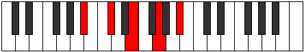

# Mode CSharpPhrynic

## Links

- [Documentation](index.md)
- [Scales Index](Scales.md)
- [Modes Index](Modes.md)
- [Chords Index](Chords.md)

## Scale

[Phrynic](ScalePhrynic.md)

## Mode

[CSharpPhrynic](ModeCSharpPhrynic.md)

## Tonic

C#

## Signature

[CNaturalMajor]

## Perfection

 - 0 Perfect Notes

 - 4 Imperfect Notes

## Notes

- C# (Imperfect)
- E (Imperfect)
- G (Imperfect)
- A# (Imperfect)
- C# (Imperfect)

## Illustration

## Relative Modes

| Number | Mode | Tonic | Notes | Illustration |
|--------|------|-------|-------|--------------|
| [585](https://ianring.com/musictheory/scales/585) | [Phrynic](ModePhrynic.md) | C# | C#, E, G, A#, C# |  |
| [585](https://ianring.com/musictheory/scales/585) | [Phrynic](ModePhrynic.md) | E | E, G, A#, C#, E |  |
| [585](https://ianring.com/musictheory/scales/585) | [Phrynic](ModePhrynic.md) | G | G, A#, C#, E, G |  |
| [585](https://ianring.com/musictheory/scales/585) | [Phrynic](ModePhrynic.md) | A# | A#, C#, E, G, A# |  |

## Chords

### C#

| Number | Root | Name | Notes | Illustration | Audio |
|--------|------|------|-------|--------------|-------|

### E

| Number | Root | Name | Notes | Illustration | Audio |
|--------|------|------|-------|--------------|-------|
| 1168 | E | [Eo](ChordENaturalDiminished.md) | E, G, Bb |  | [midi](ChordENaturalDiminishedRootPosition.mid) |
| 1170 | E | [Eo7](ChordENaturalFullDiminishedSeventh.md) | E, G, Bb, Db |  | [midi](ChordENaturalFullDiminishedSeventhRootPosition.mid) |

### G

| Number | Root | Name | Notes | Illustration | Audio |
|--------|------|------|-------|--------------|-------|
| 1154 | G | [Go](ChordGNaturalDiminished.md) | G, Bb, Db |  | [midi](ChordGNaturalDiminishedRootPosition.mid) |
| 1170 | G | [Go7](ChordGNaturalFullDiminishedSeventh.md) | G, Bb, Db, Fb |  | [midi](ChordGNaturalFullDiminishedSeventhRootPosition.mid) |

### A#

| Number | Root | Name | Notes | Illustration | Audio |
|--------|------|------|-------|--------------|-------|

