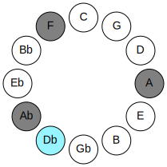
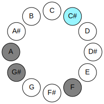
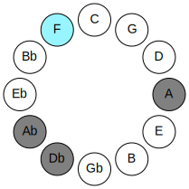
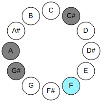
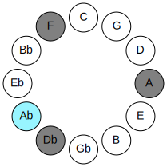
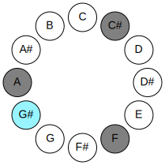
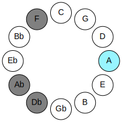
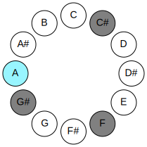

# Mode DFlatEpogic

## Links

- [Documentation](README.md)
- [Scales Index](Scales.md)
- [Modes Index](Modes.md)
- [Chords Index](Chords.md)

## Parent Scale

[Zyphic](ScaleZyphic.md)

## Mode

[DFlatEpogic](ModeDFlatEpogic.md)

## Number

401

## Luminosity

4

## Tonic

Db

## Signature

C

## Transposition

4, 3, 1, 4

## Chord Pattern

## Perfection

 - 1 Perfect Notes

 - 3 Imperfect Notes

 - Perfection Profile - true, false, false, false

## Notes

- Db
- F (Imperfect)
- Ab (Imperfect)
- A (Imperfect)
- Db

## Illustration

## Diagram

| Circle of Fifth | Chromatic Circle |
|-----------------|------------------|
|  |  |
## Relative Modes

| Number | Mode | Luminosity | Tonic | Notes | Illustration |
|--------|------|------------|-------|-------|--------------|
| [401](https://ianring.com/musictheory/scales/401) | [Epogic](ModeEpogic.md) | 4 | C# | C#, F, G#, A, C# |  |
| [401](https://ianring.com/musictheory/scales/401) | [Epogic](ModeEpogic.md) | 4 | Db | Db, F, Ab, A, Db |  |
| [281](https://ianring.com/musictheory/scales/281) | [Lanic](ModeLanic.md) | -1 | F | F, G#, A, C#, F |  |
| [547](https://ianring.com/musictheory/scales/547) | [Pyrric](ModePyrric.md) | 3 | G# | G#, A, C#, F, G# |  |
| [547](https://ianring.com/musictheory/scales/547) | [Pyrric](ModePyrric.md) | 3 | Ab | Ab, A, Db, F, Ab |  |
| [2321](https://ianring.com/musictheory/scales/2321) | [Zyphic](ModeZyphic.md) | -1 | A | A, C#, F, G#, A |  |
## Relative Brightness

| Number | Mode | Luminosity | Tonic | Notes | Circle Of Fifth | Chromatic Circle |
|--------|------|------------|-------|-------|-----------------|------------------|
| [401](https://ianring.com/musictheory/scales/401) | [Epogic](ModeEpogic.md) | 4 | C# | C#, F, G#, A, C# |  |  |
| [401](https://ianring.com/musictheory/scales/401) | [Epogic](ModeEpogic.md) | 4 | Db | Db, F, Ab, A, Db |  |  |
| [281](https://ianring.com/musictheory/scales/281) | [Lanic](ModeLanic.md) | -1 | F | F, G#, A, C#, F |  |  |
| [547](https://ianring.com/musictheory/scales/547) | [Pyrric](ModePyrric.md) | 3 | G# | G#, A, C#, F, G# |  |  |
| [547](https://ianring.com/musictheory/scales/547) | [Pyrric](ModePyrric.md) | 3 | Ab | Ab, A, Db, F, Ab |  |  |
| [2321](https://ianring.com/musictheory/scales/2321) | [Zyphic](ModeZyphic.md) | -1 | A | A, C#, F, G#, A |  |  |

## Chords

### Db

| Number | Root | Name | Notes | Illustration | Audio |
|--------|------|------|-------|--------------|-------|
| 258 | Db | [C#5](ChordCSharpPowerChord.md) | C#, G# |  | [midi](ChordCSharpPowerChordRootPosition.mid) |
| 258 | Db | [Db5](ChordDFlatPowerChord.md) | Db, Ab |  | [midi](ChordDFlatPowerChordRootPosition.mid) |
| 290 | Db | [C#M](ChordCSharpMajor.md) | C#, E#, G# |  | [midi](ChordCSharpMajorRootPosition.mid) |
| 290 | Db | [DbM](ChordDFlatMajor.md) | Db, F, Ab |  | [midi](ChordDFlatMajorRootPosition.mid) |
| 546 | Db | [C#+](ChordCSharpAugmented.md) | C#, E#, G## |  | [midi](ChordCSharpAugmentedRootPosition.mid) |
| 546 | Db | [C#+7](ChordCSharpAugmentedAugmentedSeventh.md) | C#, E#, G##, B## |  | [midi](ChordCSharpAugmentedAugmentedSeventhRootPosition.mid) |
| 546 | Db | [Db+](ChordDFlatAugmented.md) | Db, F, A |  | [midi](ChordDFlatAugmentedRootPosition.mid) |
| 546 | Db | [Db+7](ChordDFlatAugmentedAugmentedSeventh.md) | Db, F, A, C# |  | [midi](ChordDFlatAugmentedAugmentedSeventhRootPosition.mid) |

### F

| Number | Root | Name | Notes | Illustration | Audio |
|--------|------|------|-------|--------------|-------|
| 290 | F | [Fm#5](ChordFNaturalMinorSharpFifth.md) | F, Ab, Db |  | [midi](ChordFNaturalMinorSharpFifthRootPosition.mid) |
| 546 | F | [F+](ChordFNaturalAugmented.md) | F, A, C# |  | [midi](ChordFNaturalAugmentedRootPosition.mid) |
| 546 | F | [F+7](ChordFNaturalAugmentedAugmentedSeventh.md) | F, A, C#, E# |  | [midi](ChordFNaturalAugmentedAugmentedSeventhRootPosition.mid) |

### Ab

| Number | Root | Name | Notes | Illustration | Audio |
|--------|------|------|-------|--------------|-------|
| 290 | Ab | [G#sus4##5](ChordGSharpSuspendedFourthDoubleSharpFifth.md) | G#, C#, E# |  | [midi](ChordGSharpSuspendedFourthDoubleSharpFifthRootPosition.mid) |
| 290 | Ab | [Absus4##5](ChordAFlatSuspendedFourthDoubleSharpFifth.md) | Ab, Db, F |  | [midi](ChordAFlatSuspendedFourthDoubleSharpFifthRootPosition.mid) |

### A

| Number | Root | Name | Notes | Illustration | Audio |
|--------|------|------|-------|--------------|-------|
| 546 | A | [A+](ChordANaturalAugmented.md) | A, C#, E# |  | [midi](ChordANaturalAugmentedRootPosition.mid) |
| 546 | A | [A+7](ChordANaturalAugmentedAugmentedSeventh.md) | A, C#, E#, G## |  | [midi](ChordANaturalAugmentedAugmentedSeventhRootPosition.mid) |
| 802 | A | [A+(M7)](ChordANaturalAugmentedMajorSeventh.md) | A, C#, E#, G# |  | [midi](ChordANaturalAugmentedMajorSeventhRootPosition.mid) |

