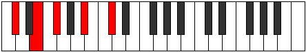
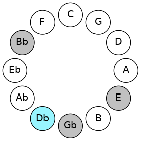
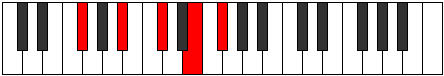
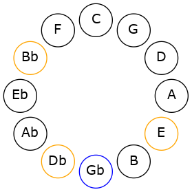

# Mode DFlatPhradic

## Links

- [Documentation](README.md)
- [Scales Index](Scales.md)
- [Modes Index](Modes.md)
- [Chords Index](Chords.md)

## Scale

[Daric](ScaleDaric.md)

## Mode

[DFlatPhradic](ModeDFlatPhradic.md)

## Tonic

Db

## Signature

[CNaturalMajor]

## Transposition

3, 2, 4, 3

## Chord Pattern

## Perfection

 - 1 Perfect Notes

 - 3 Imperfect Notes

## Notes

- Db (Imperfect)
- E (Imperfect)
- Gb
- Bb (Imperfect)
- Db (Imperfect)

## Illustration

## Diagram

## Relative Modes

| Number | Mode | Tonic | Notes | Illustration |
|--------|------|-------|-------|--------------|
| [553](https://ianring.com/musictheory/scales/553) | [Phradic](ModePhradic.md) | Db | Db, E, Gb, Bb, Db |  |
| [581](https://ianring.com/musictheory/scales/581) | [Bolic](ModeBolic.md) | E | E, F#, A#, C#, E |  |
| [1169](https://ianring.com/musictheory/scales/1169) | [Daric](ModeDaric.md) | Gb | Gb, Bb, Db, E, Gb |  |
| [329](https://ianring.com/musictheory/scales/329) | [Lonic](ModeLonic.md) | Bb | Bb, Db, E, Gb, Bb |  |
## Relative Brightness

| Number | Mode | Tonic | Notes | Illustration |
|--------|------|-------|-------|--------------|
| [553](https://ianring.com/musictheory/scales/553) | [Phradic](ModePhradic.md) | Db | Db, E, Gb, Bb, Db |  |
| [581](https://ianring.com/musictheory/scales/581) | [Bolic](ModeBolic.md) | E | E, F#, A#, C#, E |  |
| [1169](https://ianring.com/musictheory/scales/1169) | [Daric](ModeDaric.md) | Gb | Gb, Bb, Db, E, Gb |  |
| [329](https://ianring.com/musictheory/scales/329) | [Lonic](ModeLonic.md) | Bb | Bb, Db, E, Gb, Bb |  |

## Chords

### Db

| Number | Root | Name | Notes | Illustration | Audio |
|--------|------|------|-------|--------------|-------|
| 82 | Db | [Dbmbb5](ChordDFlatMinorDoubleFlatFifth.md) | Db, Fb, Gb |  | [midi](ChordDFlatMinorDoubleFlatFifthRootPosition.mid) |
| 1090 | Db | [Dbsus4##5](ChordDFlatSuspendedFourthDoubleSharpFifth.md) | Db, Gb, Bb |  | [midi](ChordDFlatSuspendedFourthDoubleSharpFifthRootPosition.mid) |

### E

| Number | Root | Name | Notes | Illustration | Audio |
|--------|------|------|-------|--------------|-------|
| 1104 | E | [E](ChordENaturalDiminishedFlatThird.md) | E, Gb, Bb |  | [midi](ChordENaturalDiminishedFlatThirdRootPosition.mid) |
| 1104 | E | [Esus2b5](ChordENaturalSuspendedSecondFlatFifth.md) | E, F#, Bb |  | [midi](ChordENaturalSuspendedSecondFlatFifthRootPosition.mid) |
| 1106 | E | [EM6sus2b5](ChordENaturalMajorSixthSuspendedSecondFlatFifth.md) | E, F#, Bb, C# |  | [midi](ChordENaturalMajorSixthSuspendedSecondFlatFifthRootPosition.mid) |

### Gb

| Number | Root | Name | Notes | Illustration | Audio |
|--------|------|------|-------|--------------|-------|
| 66 | Gb | [Gb5](ChordGFlatPowerChord.md) | Gb, Db |  | [midi](ChordGFlatPowerChordRootPosition.mid) |
| 1090 | Gb | [GbM](ChordGFlatMajor.md) | Gb, Bb, Db |  | [midi](ChordGFlatMajorRootPosition.mid) |
| 1106 | Gb | [Gb7](ChordGFlatDominantSeventh.md) | Gb, Bb, Db, Fb |  | [midi](ChordGFlatDominantSeventhRootPosition.mid) |

### Bb

| Number | Root | Name | Notes | Illustration | Audio |
|--------|------|------|-------|--------------|-------|
| 1042 | Bb | [Bbo](ChordBFlatDiminished.md) | Bb, Db, Fb |  | [midi](ChordBFlatDiminishedRootPosition.mid) |
| 1090 | Bb | [Bbm#5](ChordBFlatMinorSharpFifth.md) | Bb, Db, Gb |  | [midi](ChordBFlatMinorSharpFifthRootPosition.mid) |

