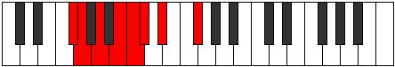

# Mode DSharpKorian

## Links

- [Documentation](index.md)
- [Scales Index](Scales.md)
- [Modes Index](Modes.md)
- [Chords Index](Chords.md)

## Scale

[Korian](ScaleKorian.md)

## Mode

[DSharpKorian](ModeDSharpKorian.md)

## Tonic

D#

## Signature

[CNaturalMajor]

## Perfection

 - 3 Perfect Notes

 - 4 Imperfect Notes

## Notes

- D# (Imperfect)
- E##
- F## (Imperfect)
- G## (Imperfect)
- A##
- B#
- C# (Imperfect)
- D# (Imperfect)

## Illustration

## Relative Modes

| Number | Mode | Tonic | Notes | Illustration |
|--------|------|-------|-------|--------------|
| [747](https://ianring.com/musictheory/scales/747) | [Lynian](ModeLynian.md) | F# | F#, G, A, B, C, Db, Eb, F# |  |
| [747](https://ianring.com/musictheory/scales/747) | [Lynian](ModeLynian.md) | Gb | Gb, Abb, Bbb, Cb, Dbb, Ebbb, Fbb, Gb |  |
| [1431](https://ianring.com/musictheory/scales/1431) | [Phragian](ModePhragian.md) | B | B, C, Db, Eb, F#, G, A, B |  |
| [1629](https://ianring.com/musictheory/scales/1629) | [Synian](ModeSynian.md) | A | A, B, C, Db, Eb, F#, G, A |  |
| [1881](https://ianring.com/musictheory/scales/1881) | [Korian](ModeKorian.md) | D# | D#, E##, F##, G##, A##, B#, C#, D# |  |
| [1881](https://ianring.com/musictheory/scales/1881) | [Korian](ModeKorian.md) | Eb | Eb, F#, G, A, B, C, Db, Eb |  |
| [2421](https://ianring.com/musictheory/scales/2421) | [Malian](ModeMalian.md) | G | G, A, B, C, Db, Eb, F#, G |  |
| [2763](https://ianring.com/musictheory/scales/2763) | [Manian](ModeManian.md) | C | C, Db, Eb, F#, G, A, B, C |  |
| [3429](https://ianring.com/musictheory/scales/3429) | [Marian](ModeMarian.md) | C# | C#, D#, E##, F##, G##, A##, B#, C# |  |
| [3429](https://ianring.com/musictheory/scales/3429) | [Marian](ModeMarian.md) | Db | Db, Eb, F#, G, A, B, C, Db |  |

## Chords

### D#

| Number | Root | Name | Notes | Illustration | Audio |
|--------|------|------|-------|--------------|-------|

### E##

| Number | Root | Name | Notes | Illustration | Audio |
|--------|------|------|-------|--------------|-------|

### F##

| Number | Root | Name | Notes | Illustration | Audio |
|--------|------|------|-------|--------------|-------|

### G##

| Number | Root | Name | Notes | Illustration | Audio |
|--------|------|------|-------|--------------|-------|

### A##

| Number | Root | Name | Notes | Illustration | Audio |
|--------|------|------|-------|--------------|-------|

### B#

| Number | Root | Name | Notes | Illustration | Audio |
|--------|------|------|-------|--------------|-------|

### C#

| Number | Root | Name | Notes | Illustration | Audio |
|--------|------|------|-------|--------------|-------|

