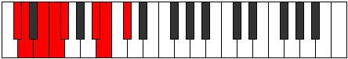

# Mode Dacrian

## Links

- [Documentation](index.md)
- [Scales Index](Scales.md)
- [Modes Index](Modes.md)
- [Chords Index](Chords.md)

## Parent Scale

[Stygian](ScaleStygian.md)

## Number

[1595](https://ianring.com/musictheory/scales/1595)

## Perfection

- 4 Perfect notes
- 3 Perfect notes

## Perfection Profile

[false false true false true true true]

## Permutations

| Tonic | Notes | Signature | Illustration | Audio |
|-------|-------|-----------|--------------|-------|
| [C](ModeCNaturalDacrian.md) | **C**, **Db**, Eb, **Fb**, Gbb, A, Bb, **C** | C |  | [midi](ModeCNaturalDacrian.mid) [ogg](ModeCNaturalDacrian.ogg) |
| [C#](ModeCSharpDacrian.md) | **C#**, **D**, E, **F**, Gb, A#, B, **C#** | C |  | [midi](ModeCSharpDacrian.mid) [ogg](ModeCSharpDacrian.ogg) |
| [Db](ModeDFlatDacrian.md) | **Db**, **Ebb**, Fb, **Gbb**, Abbb, Bb, Cb, **Db** | C |  | [midi](ModeDFlatDacrian.mid) [ogg](ModeDFlatDacrian.ogg) |
| [D](ModeDNaturalDacrian.md) | **D**, **Eb**, F, **Gb**, Abb, B, C, **D** | C |  | [midi](ModeDNaturalDacrian.mid) [ogg](ModeDNaturalDacrian.ogg) |
| [D#](ModeDSharpDacrian.md) | **D#**, **E**, F#, **G**, Ab, B#, C#, **D#** | C |  | [midi](ModeDSharpDacrian.mid) [ogg](ModeDSharpDacrian.ogg) |
| [Eb](ModeEFlatDacrian.md) | **Eb**, **Fb**, Gb, **Abb**, Bbbb, C, Db, **Eb** | C |  | [midi](ModeEFlatDacrian.mid) [ogg](ModeEFlatDacrian.ogg) |
| [E](ModeENaturalDacrian.md) | **E**, **F**, G, **Ab**, Bbb, C#, D, **E** | C |  | [midi](ModeENaturalDacrian.mid) [ogg](ModeENaturalDacrian.ogg) |
| [F](ModeFNaturalDacrian.md) | **F**, **Gb**, Ab, **Bbb**, Cbb, D, Eb, **F** | C |  | [midi](ModeFNaturalDacrian.mid) [ogg](ModeFNaturalDacrian.ogg) |
| [F#](ModeFSharpDacrian.md) | **F#**, **G**, A, **Bb**, Cb, D#, E, **F#** | C |  | [midi](ModeFSharpDacrian.mid) [ogg](ModeFSharpDacrian.ogg) |
| [Gb](ModeGFlatDacrian.md) | **Gb**, **Abb**, Bbb, **Cbb**, Dbbb, Eb, Fb, **Gb** | C |  | [midi](ModeGFlatDacrian.mid) [ogg](ModeGFlatDacrian.ogg) |
| [G](ModeGNaturalDacrian.md) | **G**, **Ab**, Bb, **Cb**, Dbb, E, F, **G** | C |  | [midi](ModeGNaturalDacrian.mid) [ogg](ModeGNaturalDacrian.ogg) |
| [G#](ModeGSharpDacrian.md) | **G#**, **A**, B, **C**, Db, E#, F#, **G#** | C |  | [midi](ModeGSharpDacrian.mid) [ogg](ModeGSharpDacrian.ogg) |
| [Ab](ModeAFlatDacrian.md) | **Ab**, **Bbb**, Cb, **Dbb**, Ebbb, F, Gb, **Ab** | C |  | [midi](ModeAFlatDacrian.mid) [ogg](ModeAFlatDacrian.ogg) |
| [A](ModeANaturalDacrian.md) | **A**, **Bb**, C, **Db**, Ebb, F#, G, **A** | C |  | [midi](ModeANaturalDacrian.mid) [ogg](ModeANaturalDacrian.ogg) |
| [A#](ModeASharpDacrian.md) | **A#**, **B**, C#, **D**, Eb, F##, G#, **A#** | C |  | [midi](ModeASharpDacrian.mid) [ogg](ModeASharpDacrian.ogg) |
| [Bb](ModeBFlatDacrian.md) | **Bb**, **Cb**, Db, **Ebb**, Fbb, G, Ab, **Bb** | C |  | [midi](ModeBFlatDacrian.mid) [ogg](ModeBFlatDacrian.ogg) |
| [B](ModeBNaturalDacrian.md) | **B**, **C**, D, **Eb**, Fb, G#, A, **B** | C |  | [midi](ModeBNaturalDacrian.mid) [ogg](ModeBNaturalDacrian.ogg) |
