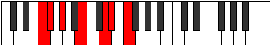
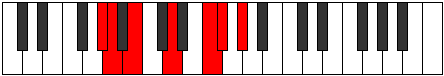

# Mode Dacrimic

## Links

- [Documentation](index.md)
- [Scales Index](Scales.md)
- [Modes Index](Modes.md)
- [Chords Index](Chords.md)

## Parent Scale

[Thalimic](ScaleThalimic.md)

## Number

[1611](https://ianring.com/musictheory/scales/1611)

## Perfection

- 2 Perfect notes
- 4 Perfect notes

## Perfection Profile

[false false true true false false]

## Permutations

| Tonic | Notes | Signature | Illustration | Audio |
|-------|-------|-----------|--------------|-------|
| [C](ModeCNaturalDacrimic.md) | **C**, **Db**, Eb, F#, **G##**, **A#**, **C** | C |  | [midi](ModeCNaturalDacrimic.mid) [ogg](ModeCNaturalDacrimic.ogg) |
| [C#](ModeCSharpDacrimic.md) | **C#**, **D**, E, F##, **G###**, **A##**, **C#** | C |  | [midi](ModeCSharpDacrimic.mid) [ogg](ModeCSharpDacrimic.ogg) |
| [Db](ModeDFlatDacrimic.md) | **Db**, **Ebb**, Fb, G, **A#**, **B**, **Db** | C |  | [midi](ModeDFlatDacrimic.mid) [ogg](ModeDFlatDacrimic.ogg) |
| [D](ModeDNaturalDacrimic.md) | **D**, **Eb**, F, G#, **A##**, **B#**, **D** | C |  | [midi](ModeDNaturalDacrimic.mid) [ogg](ModeDNaturalDacrimic.ogg) |
| [D#](ModeDSharpDacrimic.md) | **D#**, **E**, F#, G##, **A###**, **B##**, **D#** | C |  | [midi](ModeDSharpDacrimic.mid) [ogg](ModeDSharpDacrimic.ogg) |
| [Eb](ModeEFlatDacrimic.md) | **Eb**, **Fb**, Gb, A, **B#**, **C#**, **Eb** | C |  | [midi](ModeEFlatDacrimic.mid) [ogg](ModeEFlatDacrimic.ogg) |
| [E](ModeENaturalDacrimic.md) | **E**, **F**, G, A#, **B##**, **C##**, **E** | C |  | [midi](ModeENaturalDacrimic.mid) [ogg](ModeENaturalDacrimic.ogg) |
| [F](ModeFNaturalDacrimic.md) | **F**, **Gb**, Ab, B, **C##**, **D#**, **F** | C |  | [midi](ModeFNaturalDacrimic.mid) [ogg](ModeFNaturalDacrimic.ogg) |
| [F#](ModeFSharpDacrimic.md) | **F#**, **G**, A, B#, **C###**, **D##**, **F#** | C |  | [midi](ModeFSharpDacrimic.mid) [ogg](ModeFSharpDacrimic.ogg) |
| [Gb](ModeGFlatDacrimic.md) | **Gb**, **Abb**, Bbb, C, **D#**, **E**, **Gb** | C |  | [midi](ModeGFlatDacrimic.mid) [ogg](ModeGFlatDacrimic.ogg) |
| [G](ModeGNaturalDacrimic.md) | **G**, **Ab**, Bb, C#, **D##**, **E#**, **G** | C |  | [midi](ModeGNaturalDacrimic.mid) [ogg](ModeGNaturalDacrimic.ogg) |
| [G#](ModeGSharpDacrimic.md) | **G#**, **A**, B, C##, **D###**, **E##**, **G#** | C |  | [midi](ModeGSharpDacrimic.mid) [ogg](ModeGSharpDacrimic.ogg) |
| [Ab](ModeAFlatDacrimic.md) | **Ab**, **Bbb**, Cb, D, **E#**, **F#**, **Ab** | C |  | [midi](ModeAFlatDacrimic.mid) [ogg](ModeAFlatDacrimic.ogg) |
| [A](ModeANaturalDacrimic.md) | **A**, **Bb**, C, D#, **E##**, **F##**, **A** | C |  | [midi](ModeANaturalDacrimic.mid) [ogg](ModeANaturalDacrimic.ogg) |
| [A#](ModeASharpDacrimic.md) | **A#**, **B**, C#, D##, **E###**, **F###**, **A#** | C |  | [midi](ModeASharpDacrimic.mid) [ogg](ModeASharpDacrimic.ogg) |
| [Bb](ModeBFlatDacrimic.md) | **Bb**, **Cb**, Db, E, **F##**, **G#**, **Bb** | C |  | [midi](ModeBFlatDacrimic.mid) [ogg](ModeBFlatDacrimic.ogg) |
| [B](ModeBNaturalDacrimic.md) | **B**, **C**, D, E#, **F###**, **G##**, **B** | C |  | [midi](ModeBNaturalDacrimic.mid) [ogg](ModeBNaturalDacrimic.ogg) |
