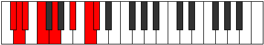

# Mode Dadian

## Links

- [Documentation](index.md)
- [Scales Index](Scales.md)
- [Modes Index](Modes.md)
- [Chords Index](Chords.md)

## Parent Scale

[Stathian](ScaleStathian.md)

## Number

[2647](https://ianring.com/musictheory/scales/2647)

## Perfection

- 5 Perfect notes
- 2 Perfect notes

## Interval Pattern

1, 1, 2, 2, 3, 2, 1

## Perfection Profile

[false false true true true true true]

## Permutations

| Tonic | Notes | Signature | Illustration | Audio |
|-------|-------|-----------|--------------|-------|
| [C](ModeCNaturalDadian.md) | **C**, **Db**, Ebb, Fb, Gb, A, B, **C** | C |  | [midi](https://github.com/edipermadi/music/blob/main/docs/ModeCNaturalDadian.mid?raw=true) |
| [C#](ModeCSharpDadian.md) | **C#**, **D**, Eb, F, G, A#, B#, **C#** | C |  | [midi](https://github.com/edipermadi/music/blob/main/docs/ModeCSharpDadian.mid?raw=true) |
| [Db](ModeDFlatDadian.md) | **Db**, **Ebb**, Fbb, Gbb, Abb, Bb, C, **Db** | C |  | [midi](https://github.com/edipermadi/music/blob/main/docs/ModeDFlatDadian.mid?raw=true) |
| [D](ModeDNaturalDadian.md) | **D**, **Eb**, Fb, Gb, Ab, B, C#, **D** | C |  | [midi](https://github.com/edipermadi/music/blob/main/docs/ModeDNaturalDadian.mid?raw=true) |
| [D#](ModeDSharpDadian.md) | **D#**, **E**, F, G, A, B#, C##, **D#** | C |  | [midi](https://github.com/edipermadi/music/blob/main/docs/ModeDSharpDadian.mid?raw=true) |
| [Eb](ModeEFlatDadian.md) | **Eb**, **Fb**, Gbb, Abb, Bbb, C, D, **Eb** | C |  | [midi](https://github.com/edipermadi/music/blob/main/docs/ModeEFlatDadian.mid?raw=true) |
| [E](ModeENaturalDadian.md) | **E**, **F**, Gb, Ab, Bb, C#, D#, **E** | C |  | [midi](https://github.com/edipermadi/music/blob/main/docs/ModeENaturalDadian.mid?raw=true) |
| [F](ModeFNaturalDadian.md) | **F**, **Gb**, Abb, Bbb, Cb, D, E, **F** | C |  | [midi](https://github.com/edipermadi/music/blob/main/docs/ModeFNaturalDadian.mid?raw=true) |
| [F#](ModeFSharpDadian.md) | **F#**, **G**, Ab, Bb, C, D#, E#, **F#** | C |  | [midi](https://github.com/edipermadi/music/blob/main/docs/ModeFSharpDadian.mid?raw=true) |
| [Gb](ModeGFlatDadian.md) | **Gb**, **Abb**, Bbbb, Cbb, Dbb, Eb, F, **Gb** | C |  | [midi](https://github.com/edipermadi/music/blob/main/docs/ModeGFlatDadian.mid?raw=true) |
| [G](ModeGNaturalDadian.md) | **G**, **Ab**, Bbb, Cb, Db, E, F#, **G** | C |  | [midi](https://github.com/edipermadi/music/blob/main/docs/ModeGNaturalDadian.mid?raw=true) |
| [G#](ModeGSharpDadian.md) | **G#**, **A**, Bb, C, D, E#, F##, **G#** | C |  | [midi](https://github.com/edipermadi/music/blob/main/docs/ModeGSharpDadian.mid?raw=true) |
| [Ab](ModeAFlatDadian.md) | **Ab**, **Bbb**, Cbb, Dbb, Ebb, F, G, **Ab** | C |  | [midi](https://github.com/edipermadi/music/blob/main/docs/ModeAFlatDadian.mid?raw=true) |
| [A](ModeANaturalDadian.md) | **A**, **Bb**, Cb, Db, Eb, F#, G#, **A** | C |  | [midi](https://github.com/edipermadi/music/blob/main/docs/ModeANaturalDadian.mid?raw=true) |
| [A#](ModeASharpDadian.md) | **A#**, **B**, C, D, E, F##, G##, **A#** | C |  | [midi](https://github.com/edipermadi/music/blob/main/docs/ModeASharpDadian.mid?raw=true) |
| [Bb](ModeBFlatDadian.md) | **Bb**, **Cb**, Dbb, Ebb, Fb, G, A, **Bb** | C |  | [midi](https://github.com/edipermadi/music/blob/main/docs/ModeBFlatDadian.mid?raw=true) |
| [B](ModeBNaturalDadian.md) | **B**, **C**, Db, Eb, F, G#, A#, **B** | C |  | [midi](https://github.com/edipermadi/music/blob/main/docs/ModeBNaturalDadian.mid?raw=true) |
