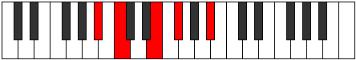

# Mode Dadic

## Links

- [Documentation](index.md)
- [Scales Index](Scales.md)
- [Modes Index](Modes.md)
- [Chords Index](Chords.md)

## Parent Scale

[Stathic](ScaleStathic.md)

## Number

[325](https://ianring.com/musictheory/scales/325)

## Perfection

- 0 Perfect notes
- 4 Perfect notes

## Interval Pattern

2, 4, 2, 4

## Perfection Profile

[false false false false]

## Permutations

| Tonic | Notes | Signature | Illustration | Audio |
|-------|-------|-----------|--------------|-------|
| [C](ModeCNaturalDadic.md) | **C**, **D**, **F#**, **G#**, **C** | C |  | [midi](https://github.com/edipermadi/music/blob/main/docs/ModeCNaturalDadic.mid?raw=true) |
| [C#](ModeCSharpDadic.md) | **C#**, **D#**, **G**, **A**, **C#** | C |  | [midi](https://github.com/edipermadi/music/blob/main/docs/ModeCSharpDadic.mid?raw=true) |
| [Db](ModeDFlatDadic.md) | **Db**, **Eb**, **G**, **A**, **Db** | C |  | [midi](https://github.com/edipermadi/music/blob/main/docs/ModeDFlatDadic.mid?raw=true) |
| [D](ModeDNaturalDadic.md) | **D**, **E**, **G#**, **A#**, **D** | C |  | [midi](https://github.com/edipermadi/music/blob/main/docs/ModeDNaturalDadic.mid?raw=true) |
| [D#](ModeDSharpDadic.md) | **D#**, **F**, **A**, **B**, **D#** | C |  | [midi](https://github.com/edipermadi/music/blob/main/docs/ModeDSharpDadic.mid?raw=true) |
| [Eb](ModeEFlatDadic.md) | **Eb**, **F**, **A**, **B**, **Eb** | C |  | [midi](https://github.com/edipermadi/music/blob/main/docs/ModeEFlatDadic.mid?raw=true) |
| [E](ModeENaturalDadic.md) | **E**, **F#**, **A#**, **C**, **E** | C |  | [midi](https://github.com/edipermadi/music/blob/main/docs/ModeENaturalDadic.mid?raw=true) |
| [F](ModeFNaturalDadic.md) | **F**, **G**, **B**, **C#**, **F** | C |  | [midi](https://github.com/edipermadi/music/blob/main/docs/ModeFNaturalDadic.mid?raw=true) |
| [F#](ModeFSharpDadic.md) | **F#**, **G#**, **C**, **D**, **F#** | C |  | [midi](https://github.com/edipermadi/music/blob/main/docs/ModeFSharpDadic.mid?raw=true) |
| [Gb](ModeGFlatDadic.md) | **Gb**, **Ab**, **C**, **D**, **Gb** | C |  | [midi](https://github.com/edipermadi/music/blob/main/docs/ModeGFlatDadic.mid?raw=true) |
| [G](ModeGNaturalDadic.md) | **G**, **A**, **C#**, **D#**, **G** | C |  | [midi](https://github.com/edipermadi/music/blob/main/docs/ModeGNaturalDadic.mid?raw=true) |
| [G#](ModeGSharpDadic.md) | **G#**, **A#**, **D**, **E**, **G#** | C |  | [midi](https://github.com/edipermadi/music/blob/main/docs/ModeGSharpDadic.mid?raw=true) |
| [Ab](ModeAFlatDadic.md) | **Ab**, **Bb**, **D**, **E**, **Ab** | C |  | [midi](https://github.com/edipermadi/music/blob/main/docs/ModeAFlatDadic.mid?raw=true) |
| [A](ModeANaturalDadic.md) | **A**, **B**, **D#**, **F**, **A** | C |  | [midi](https://github.com/edipermadi/music/blob/main/docs/ModeANaturalDadic.mid?raw=true) |
| [A#](ModeASharpDadic.md) | **A#**, **C**, **E**, **F#**, **A#** | C |  | [midi](https://github.com/edipermadi/music/blob/main/docs/ModeASharpDadic.mid?raw=true) |
| [Bb](ModeBFlatDadic.md) | **Bb**, **C**, **E**, **Gb**, **Bb** | C |  | [midi](https://github.com/edipermadi/music/blob/main/docs/ModeBFlatDadic.mid?raw=true) |
| [B](ModeBNaturalDadic.md) | **B**, **C#**, **F**, **G**, **B** | C |  | [midi](https://github.com/edipermadi/music/blob/main/docs/ModeBNaturalDadic.mid?raw=true) |
