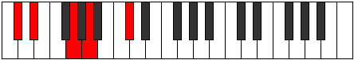

# Mode Dadic

## Links

- [Documentation](index.md)
- [Scales Index](Scales.md)
- [Modes Index](Modes.md)
- [Chords Index](Chords.md)

## Parent Scale

[Stathic](ScaleStathic.md)

## Number

[325](https://ianring.com/musictheory/scales/325)

## Perfection

- 0 Perfect notes
- 4 Perfect notes

## Perfection Profile

[false false false false]

## Permutations

| Tonic | Notes | Signature | Illustration | Audio |
|-------|-------|-----------|--------------|-------|
| [C](ModeCNaturalDadic.md) | **C**, **D**, **F#**, **G#**, **C** | C |  | [midi](ModeCNaturalDadic.mid) [ogg](ModeCNaturalDadic.ogg) |
| [C#](ModeCSharpDadic.md) | **C#**, **D#**, **G**, **A**, **C#** | C |  | [midi](ModeCSharpDadic.mid) [ogg](ModeCSharpDadic.ogg) |
| [Db](ModeDFlatDadic.md) | **Db**, **Eb**, **G**, **A**, **Db** | C |  | [midi](ModeDFlatDadic.mid) [ogg](ModeDFlatDadic.ogg) |
| [D](ModeDNaturalDadic.md) | **D**, **E**, **G#**, **A#**, **D** | C |  | [midi](ModeDNaturalDadic.mid) [ogg](ModeDNaturalDadic.ogg) |
| [D#](ModeDSharpDadic.md) | **D#**, **F**, **A**, **B**, **D#** | C |  | [midi](ModeDSharpDadic.mid) [ogg](ModeDSharpDadic.ogg) |
| [Eb](ModeEFlatDadic.md) | **Eb**, **F**, **A**, **B**, **Eb** | C |  | [midi](ModeEFlatDadic.mid) [ogg](ModeEFlatDadic.ogg) |
| [E](ModeENaturalDadic.md) | **E**, **F#**, **A#**, **C**, **E** | C |  | [midi](ModeENaturalDadic.mid) [ogg](ModeENaturalDadic.ogg) |
| [F](ModeFNaturalDadic.md) | **F**, **G**, **B**, **C#**, **F** | C |  | [midi](ModeFNaturalDadic.mid) [ogg](ModeFNaturalDadic.ogg) |
| [F#](ModeFSharpDadic.md) | **F#**, **G#**, **C**, **D**, **F#** | C |  | [midi](ModeFSharpDadic.mid) [ogg](ModeFSharpDadic.ogg) |
| [Gb](ModeGFlatDadic.md) | **Gb**, **Ab**, **C**, **D**, **Gb** | C |  | [midi](ModeGFlatDadic.mid) [ogg](ModeGFlatDadic.ogg) |
| [G](ModeGNaturalDadic.md) | **G**, **A**, **C#**, **D#**, **G** | C |  | [midi](ModeGNaturalDadic.mid) [ogg](ModeGNaturalDadic.ogg) |
| [G#](ModeGSharpDadic.md) | **G#**, **A#**, **D**, **E**, **G#** | C |  | [midi](ModeGSharpDadic.mid) [ogg](ModeGSharpDadic.ogg) |
| [Ab](ModeAFlatDadic.md) | **Ab**, **Bb**, **D**, **E**, **Ab** | C |  | [midi](ModeAFlatDadic.mid) [ogg](ModeAFlatDadic.ogg) |
| [A](ModeANaturalDadic.md) | **A**, **B**, **D#**, **F**, **A** | C |  | [midi](ModeANaturalDadic.mid) [ogg](ModeANaturalDadic.ogg) |
| [A#](ModeASharpDadic.md) | **A#**, **C**, **E**, **F#**, **A#** | C |  | [midi](ModeASharpDadic.mid) [ogg](ModeASharpDadic.ogg) |
| [Bb](ModeBFlatDadic.md) | **Bb**, **C**, **E**, **Gb**, **Bb** | C |  | [midi](ModeBFlatDadic.mid) [ogg](ModeBFlatDadic.ogg) |
| [B](ModeBNaturalDadic.md) | **B**, **C#**, **F**, **G**, **B** | C |  | [midi](ModeBNaturalDadic.mid) [ogg](ModeBNaturalDadic.ogg) |
