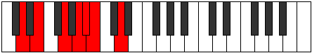
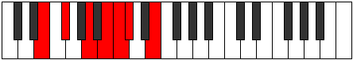

# Mode Dadimic

## Links

- [Documentation](index.md)
- [Scales Index](Scales.md)
- [Modes Index](Modes.md)
- [Chords Index](Chords.md)

## Parent Scale

[Mixolimic](ScaleMixolimic.md)

## Number

[933](https://ianring.com/musictheory/scales/933)

## Perfection

- 4 Perfect notes
- 2 Perfect notes

## Perfection Profile

[true true true true false false]

## Permutations

| Tonic | Notes | Signature | Illustration | Audio |
|-------|-------|-----------|--------------|-------|
| [C](ModeCNaturalDadimic.md) | C, D, E#, F##, **G#**, **A**, C | C |  | [midi](ModeCNaturalDadimic.mid) [ogg](ModeCNaturalDadimic.ogg) |
| [C#](ModeCSharpDadimic.md) | C#, D#, E##, F###, **G##**, **A#**, C# | C |  | [midi](ModeCSharpDadimic.mid) [ogg](ModeCSharpDadimic.ogg) |
| [Db](ModeDFlatDadimic.md) | Db, Eb, F#, G#, **A**, **Bb**, Db | C |  | [midi](ModeDFlatDadimic.mid) [ogg](ModeDFlatDadimic.ogg) |
| [D](ModeDNaturalDadimic.md) | D, E, F##, G##, **A#**, **B**, D | C |  | [midi](ModeDNaturalDadimic.mid) [ogg](ModeDNaturalDadimic.ogg) |
| [D#](ModeDSharpDadimic.md) | D#, E#, F###, G###, **A##**, **B#**, D# | C |  | [midi](ModeDSharpDadimic.mid) [ogg](ModeDSharpDadimic.ogg) |
| [Eb](ModeEFlatDadimic.md) | Eb, F, G#, A#, **B**, **C**, Eb | C |  | [midi](ModeEFlatDadimic.mid) [ogg](ModeEFlatDadimic.ogg) |
| [E](ModeENaturalDadimic.md) | E, F#, G##, A##, **B#**, **C#**, E | C |  | [midi](ModeENaturalDadimic.mid) [ogg](ModeENaturalDadimic.ogg) |
| [F](ModeFNaturalDadimic.md) | F, G, A#, B#, **C#**, **D**, F | C |  | [midi](ModeFNaturalDadimic.mid) [ogg](ModeFNaturalDadimic.ogg) |
| [F#](ModeFSharpDadimic.md) | F#, G#, A##, B##, **C##**, **D#**, F# | C |  | [midi](ModeFSharpDadimic.mid) [ogg](ModeFSharpDadimic.ogg) |
| [Gb](ModeGFlatDadimic.md) | Gb, Ab, B, C#, **D**, **Eb**, Gb | C |  | [midi](ModeGFlatDadimic.mid) [ogg](ModeGFlatDadimic.ogg) |
| [G](ModeGNaturalDadimic.md) | G, A, B#, C##, **D#**, **E**, G | C |  | [midi](ModeGNaturalDadimic.mid) [ogg](ModeGNaturalDadimic.ogg) |
| [G#](ModeGSharpDadimic.md) | G#, A#, B##, C###, **D##**, **E#**, G# | C |  | [midi](ModeGSharpDadimic.mid) [ogg](ModeGSharpDadimic.ogg) |
| [Ab](ModeAFlatDadimic.md) | Ab, Bb, C#, D#, **E**, **F**, Ab | C |  | [midi](ModeAFlatDadimic.mid) [ogg](ModeAFlatDadimic.ogg) |
| [A](ModeANaturalDadimic.md) | A, B, C##, D##, **E#**, **F#**, A | C |  | [midi](ModeANaturalDadimic.mid) [ogg](ModeANaturalDadimic.ogg) |
| [A#](ModeASharpDadimic.md) | A#, B#, C###, D###, **E##**, **F##**, A# | C |  | [midi](ModeASharpDadimic.mid) [ogg](ModeASharpDadimic.ogg) |
| [Bb](ModeBFlatDadimic.md) | Bb, C, D#, E#, **F#**, **G**, Bb | C |  | [midi](ModeBFlatDadimic.mid) [ogg](ModeBFlatDadimic.ogg) |
| [B](ModeBNaturalDadimic.md) | B, C#, D##, E##, **F##**, **G#**, B | C |  | [midi](ModeBNaturalDadimic.mid) [ogg](ModeBNaturalDadimic.ogg) |
