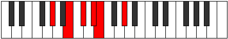
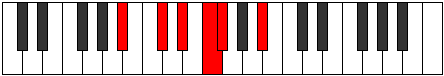

# Mode Daditonic

## Links

- [Documentation](index.md)
- [Scales Index](Scales.md)
- [Modes Index](Modes.md)
- [Chords Index](Chords.md)

## Parent Scale

[Magitonic](ScaleMagitonic.md)

## Number

[425](https://ianring.com/musictheory/scales/425)

## Perfection

- 3 Perfect notes
- 2 Perfect notes

## Perfection Profile

[true false true false true]

## Permutations

| Tonic | Notes | Signature | Illustration | Audio |
|-------|-------|-----------|--------------|-------|
| [C](ModeCNaturalDaditonic.md) | C, **D#**, F, **G**, G#, C | C |  | [midi](ModeCNaturalDaditonic.mid) [ogg](ModeCNaturalDaditonic.ogg) |
| [C#](ModeCSharpDaditonic.md) | C#, **E**, F#, **G#**, A, C# | C |  | [midi](ModeCSharpDaditonic.mid) [ogg](ModeCSharpDaditonic.ogg) |
| [Db](ModeDFlatDaditonic.md) | Db, **E**, Gb, **Ab**, A, Db | C |  | [midi](ModeDFlatDaditonic.mid) [ogg](ModeDFlatDaditonic.ogg) |
| [D](ModeDNaturalDaditonic.md) | D, **F**, G, **A**, A#, D | C |  | [midi](ModeDNaturalDaditonic.mid) [ogg](ModeDNaturalDaditonic.ogg) |
| [D#](ModeDSharpDaditonic.md) | D#, **F#**, G#, **A#**, B, D# | C |  | [midi](ModeDSharpDaditonic.mid) [ogg](ModeDSharpDaditonic.ogg) |
| [Eb](ModeEFlatDaditonic.md) | Eb, **Gb**, Ab, **Bb**, B, Eb | C |  | [midi](ModeEFlatDaditonic.mid) [ogg](ModeEFlatDaditonic.ogg) |
| [E](ModeENaturalDaditonic.md) | E, **G**, A, **B**, C, E | C |  | [midi](ModeENaturalDaditonic.mid) [ogg](ModeENaturalDaditonic.ogg) |
| [F](ModeFNaturalDaditonic.md) | F, **G#**, A#, **C**, C#, F | C |  | [midi](ModeFNaturalDaditonic.mid) [ogg](ModeFNaturalDaditonic.ogg) |
| [F#](ModeFSharpDaditonic.md) | F#, **A**, B, **C#**, D, F# | C |  | [midi](ModeFSharpDaditonic.mid) [ogg](ModeFSharpDaditonic.ogg) |
| [Gb](ModeGFlatDaditonic.md) | Gb, **A**, B, **Db**, D, Gb | C |  | [midi](ModeGFlatDaditonic.mid) [ogg](ModeGFlatDaditonic.ogg) |
| [G](ModeGNaturalDaditonic.md) | G, **A#**, C, **D**, D#, G | C |  | [midi](ModeGNaturalDaditonic.mid) [ogg](ModeGNaturalDaditonic.ogg) |
| [G#](ModeGSharpDaditonic.md) | G#, **B**, C#, **D#**, E, G# | C |  | [midi](ModeGSharpDaditonic.mid) [ogg](ModeGSharpDaditonic.ogg) |
| [Ab](ModeAFlatDaditonic.md) | Ab, **B**, Db, **Eb**, E, Ab | C |  | [midi](ModeAFlatDaditonic.mid) [ogg](ModeAFlatDaditonic.ogg) |
| [A](ModeANaturalDaditonic.md) | A, **C**, D, **E**, F, A | C |  | [midi](ModeANaturalDaditonic.mid) [ogg](ModeANaturalDaditonic.ogg) |
| [A#](ModeASharpDaditonic.md) | A#, **C#**, D#, **F**, F#, A# | C |  | [midi](ModeASharpDaditonic.mid) [ogg](ModeASharpDaditonic.ogg) |
| [Bb](ModeBFlatDaditonic.md) | Bb, **Db**, Eb, **F**, Gb, Bb | C |  | [midi](ModeBFlatDaditonic.mid) [ogg](ModeBFlatDaditonic.ogg) |
| [B](ModeBNaturalDaditonic.md) | B, **D**, E, **F#**, G, B | C |  | [midi](ModeBNaturalDaditonic.mid) [ogg](ModeBNaturalDaditonic.ogg) |
