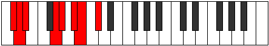

# Mode Dagian

## Links

- [Documentation](index.md)
- [Scales Index](Scales.md)
- [Modes Index](Modes.md)
- [Chords Index](Chords.md)

## Parent Scale

[Stygian](ScaleStygian.md)

## Number

[1735](https://ianring.com/musictheory/scales/1735)

## Perfection

- 4 Perfect notes
- 3 Perfect notes

## Perfection Profile

[true false true true true false false]

## Permutations

| Tonic | Notes | Signature | Illustration | Audio |
|-------|-------|-----------|--------------|-------|
| [C](ModeCNaturalDagian.md) | C, **Db**, Ebb, F#, G, **A**, **Bb**, C | C |  | [midi](ModeCNaturalDagian.mid) [ogg](ModeCNaturalDagian.ogg) |
| [C#](ModeCSharpDagian.md) | C#, **D**, Eb, F##, G#, **A#**, **B**, C# | C |  | [midi](ModeCSharpDagian.mid) [ogg](ModeCSharpDagian.ogg) |
| [Db](ModeDFlatDagian.md) | Db, **Ebb**, Fbb, G, Ab, **Bb**, **Cb**, Db | C |  | [midi](ModeDFlatDagian.mid) [ogg](ModeDFlatDagian.ogg) |
| [D](ModeDNaturalDagian.md) | D, **Eb**, Fb, G#, A, **B**, **C**, D | C |  | [midi](ModeDNaturalDagian.mid) [ogg](ModeDNaturalDagian.ogg) |
| [D#](ModeDSharpDagian.md) | D#, **E**, F, G##, A#, **B#**, **C#**, D# | C |  | [midi](ModeDSharpDagian.mid) [ogg](ModeDSharpDagian.ogg) |
| [Eb](ModeEFlatDagian.md) | Eb, **Fb**, Gbb, A, Bb, **C**, **Db**, Eb | C |  | [midi](ModeEFlatDagian.mid) [ogg](ModeEFlatDagian.ogg) |
| [E](ModeENaturalDagian.md) | E, **F**, Gb, A#, B, **C#**, **D**, E | C |  | [midi](ModeENaturalDagian.mid) [ogg](ModeENaturalDagian.ogg) |
| [F](ModeFNaturalDagian.md) | F, **Gb**, Abb, B, C, **D**, **Eb**, F | C |  | [midi](ModeFNaturalDagian.mid) [ogg](ModeFNaturalDagian.ogg) |
| [F#](ModeFSharpDagian.md) | F#, **G**, Ab, B#, C#, **D#**, **E**, F# | C |  | [midi](ModeFSharpDagian.mid) [ogg](ModeFSharpDagian.ogg) |
| [Gb](ModeGFlatDagian.md) | Gb, **Abb**, Bbbb, C, Db, **Eb**, **Fb**, Gb | C |  | [midi](ModeGFlatDagian.mid) [ogg](ModeGFlatDagian.ogg) |
| [G](ModeGNaturalDagian.md) | G, **Ab**, Bbb, C#, D, **E**, **F**, G | C |  | [midi](ModeGNaturalDagian.mid) [ogg](ModeGNaturalDagian.ogg) |
| [G#](ModeGSharpDagian.md) | G#, **A**, Bb, C##, D#, **E#**, **F#**, G# | C |  | [midi](ModeGSharpDagian.mid) [ogg](ModeGSharpDagian.ogg) |
| [Ab](ModeAFlatDagian.md) | Ab, **Bbb**, Cbb, D, Eb, **F**, **Gb**, Ab | C |  | [midi](ModeAFlatDagian.mid) [ogg](ModeAFlatDagian.ogg) |
| [A](ModeANaturalDagian.md) | A, **Bb**, Cb, D#, E, **F#**, **G**, A | C |  | [midi](ModeANaturalDagian.mid) [ogg](ModeANaturalDagian.ogg) |
| [A#](ModeASharpDagian.md) | A#, **B**, C, D##, E#, **F##**, **G#**, A# | C |  | [midi](ModeASharpDagian.mid) [ogg](ModeASharpDagian.ogg) |
| [Bb](ModeBFlatDagian.md) | Bb, **Cb**, Dbb, E, F, **G**, **Ab**, Bb | C |  | [midi](ModeBFlatDagian.mid) [ogg](ModeBFlatDagian.ogg) |
| [B](ModeBNaturalDagian.md) | B, **C**, Db, E#, F#, **G#**, **A**, B | C |  | [midi](ModeBNaturalDagian.mid) [ogg](ModeBNaturalDagian.ogg) |
