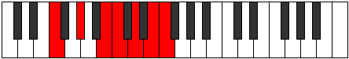

# Mode Dagimic

## Links

- [Documentation](index.md)
- [Scales Index](Scales.md)
- [Modes Index](Modes.md)
- [Chords Index](Chords.md)

## Parent Scale

[Dagimic](ScaleDagimic.md)

## Number

[2761](https://ianring.com/musictheory/scales/2761)

## Interval Pattern

3, 3, 1, 2, 2, 1

## Chord Pattern

II⁺, iii⁰, IV⁺, VI⁺

## Perfection

- 2 Perfect notes
- 4 Perfect notes

## Perfection Profile

[true false false false false true]

## Permutations

| Tonic | Notes | Signature | Illustration | Audio |
|-------|-------|-----------|--------------|-------|
| [C](ModeCNaturalDagimic.md) | C, **D#**, **E##**, **F##**, **G##**, A##, C | C |  | [midi](https://github.com/edipermadi/music/blob/main/docs/ModeCNaturalDagimic.mid?raw=true) |
| [C#](ModeCSharpDagimic.md) | C#, **D##**, **E###**, **F###**, **G###**, A###, C# | C |  | [midi](https://github.com/edipermadi/music/blob/main/docs/ModeCSharpDagimic.mid?raw=true) |
| [Db](ModeDFlatDagimic.md) | Db, **E**, **F##**, **G#**, **A#**, B#, Db | C |  | [midi](https://github.com/edipermadi/music/blob/main/docs/ModeDFlatDagimic.mid?raw=true) |
| [D](ModeDNaturalDagimic.md) | D, **E#**, **F###**, **G##**, **A##**, B##, D | C |  | [midi](https://github.com/edipermadi/music/blob/main/docs/ModeDNaturalDagimic.mid?raw=true) |
| [D#](ModeDSharpDagimic.md) | D#, **E##**, **Cbbb**, **Cbb**, **Dbb**, Ebb, D# | C |  | [midi](https://github.com/edipermadi/music/blob/main/docs/ModeDSharpDagimic.mid?raw=true) |
| [Eb](ModeEFlatDagimic.md) | Eb, **F#**, **G##**, **A#**, **B#**, C##, Eb | C |  | [midi](https://github.com/edipermadi/music/blob/main/docs/ModeEFlatDagimic.mid?raw=true) |
| [E](ModeENaturalDagimic.md) | E, **F##**, **G###**, **A##**, **B##**, C###, E | C |  | [midi](https://github.com/edipermadi/music/blob/main/docs/ModeENaturalDagimic.mid?raw=true) |
| [F](ModeFNaturalDagimic.md) | F, **G#**, **A##**, **B#**, **C##**, D##, F | C |  | [midi](https://github.com/edipermadi/music/blob/main/docs/ModeFNaturalDagimic.mid?raw=true) |
| [F#](ModeFSharpDagimic.md) | F#, **G##**, **A###**, **B##**, **C###**, D###, F# | C |  | [midi](https://github.com/edipermadi/music/blob/main/docs/ModeFSharpDagimic.mid?raw=true) |
| [Gb](ModeGFlatDagimic.md) | Gb, **A**, **B#**, **C#**, **D#**, E#, Gb | C |  | [midi](https://github.com/edipermadi/music/blob/main/docs/ModeGFlatDagimic.mid?raw=true) |
| [G](ModeGNaturalDagimic.md) | G, **A#**, **B##**, **C##**, **D##**, E##, G | C |  | [midi](https://github.com/edipermadi/music/blob/main/docs/ModeGNaturalDagimic.mid?raw=true) |
| [G#](ModeGSharpDagimic.md) | G#, **A##**, **B###**, **C###**, **D###**, E###, G# | C |  | [midi](https://github.com/edipermadi/music/blob/main/docs/ModeGSharpDagimic.mid?raw=true) |
| [Ab](ModeAFlatDagimic.md) | Ab, **B**, **C##**, **D#**, **E#**, F##, Ab | C |  | [midi](https://github.com/edipermadi/music/blob/main/docs/ModeAFlatDagimic.mid?raw=true) |
| [A](ModeANaturalDagimic.md) | A, **B#**, **C###**, **D##**, **E##**, F###, A | C |  | [midi](https://github.com/edipermadi/music/blob/main/docs/ModeANaturalDagimic.mid?raw=true) |
| [A#](ModeASharpDagimic.md) | A#, **B##**, **D##**, **E#**, **F##**, G##, A# | C |  | [midi](https://github.com/edipermadi/music/blob/main/docs/ModeASharpDagimic.mid?raw=true) |
| [Bb](ModeBFlatDagimic.md) | Bb, **C#**, **D##**, **E#**, **F##**, G##, Bb | C |  | [midi](https://github.com/edipermadi/music/blob/main/docs/ModeBFlatDagimic.mid?raw=true) |
| [B](ModeBNaturalDagimic.md) | B, **C##**, **D###**, **E##**, **F###**, G###, B | C |  | [midi](https://github.com/edipermadi/music/blob/main/docs/ModeBNaturalDagimic.mid?raw=true) |
