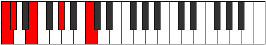
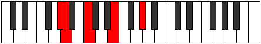

# Mode Dalic

## Links

- [Documentation](index.md)
- [Scales Index](Scales.md)
- [Modes Index](Modes.md)
- [Chords Index](Chords.md)

## Parent Scale

[Aeoloric](ScaleAeoloric.md)

## Number

[275](https://ianring.com/musictheory/scales/275)

## Perfection

- 1 Perfect notes
- 3 Perfect notes

## Perfection Profile

[false true false false]

## Permutations

| Tonic | Notes | Signature | Illustration | Audio |
|-------|-------|-----------|--------------|-------|
| [C](ModeCNaturalDalic.md) | **C**, C#, **E**, **G#**, **C** | C |  | [midi](ModeCNaturalDalic.mid) [ogg](ModeCNaturalDalic.ogg) |
| [C#](ModeCSharpDalic.md) | **C#**, D, **F**, **A**, **C#** | C |  | [midi](ModeCSharpDalic.mid) [ogg](ModeCSharpDalic.ogg) |
| [Db](ModeDFlatDalic.md) | **Db**, D, **F**, **A**, **Db** | C |  | [midi](ModeDFlatDalic.mid) [ogg](ModeDFlatDalic.ogg) |
| [D](ModeDNaturalDalic.md) | **D**, D#, **F#**, **A#**, **D** | C |  | [midi](ModeDNaturalDalic.mid) [ogg](ModeDNaturalDalic.ogg) |
| [D#](ModeDSharpDalic.md) | **D#**, E, **G**, **B**, **D#** | C |  | [midi](ModeDSharpDalic.mid) [ogg](ModeDSharpDalic.ogg) |
| [Eb](ModeEFlatDalic.md) | **Eb**, E, **G**, **B**, **Eb** | C |  | [midi](ModeEFlatDalic.mid) [ogg](ModeEFlatDalic.ogg) |
| [E](ModeENaturalDalic.md) | **E**, F, **G#**, **C**, **E** | C |  | [midi](ModeENaturalDalic.mid) [ogg](ModeENaturalDalic.ogg) |
| [F](ModeFNaturalDalic.md) | **F**, F#, **A**, **C#**, **F** | C |  | [midi](ModeFNaturalDalic.mid) [ogg](ModeFNaturalDalic.ogg) |
| [F#](ModeFSharpDalic.md) | **F#**, G, **A#**, **D**, **F#** | C |  | [midi](ModeFSharpDalic.mid) [ogg](ModeFSharpDalic.ogg) |
| [Gb](ModeGFlatDalic.md) | **Gb**, G, **Bb**, **D**, **Gb** | C |  | [midi](ModeGFlatDalic.mid) [ogg](ModeGFlatDalic.ogg) |
| [G](ModeGNaturalDalic.md) | **G**, G#, **B**, **D#**, **G** | C |  | [midi](ModeGNaturalDalic.mid) [ogg](ModeGNaturalDalic.ogg) |
| [G#](ModeGSharpDalic.md) | **G#**, A, **C**, **E**, **G#** | C |  | [midi](ModeGSharpDalic.mid) [ogg](ModeGSharpDalic.ogg) |
| [Ab](ModeAFlatDalic.md) | **Ab**, A, **C**, **E**, **Ab** | C |  | [midi](ModeAFlatDalic.mid) [ogg](ModeAFlatDalic.ogg) |
| [A](ModeANaturalDalic.md) | **A**, A#, **C#**, **F**, **A** | C |  | [midi](ModeANaturalDalic.mid) [ogg](ModeANaturalDalic.ogg) |
| [A#](ModeASharpDalic.md) | **A#**, B, **D**, **F#**, **A#** | C |  | [midi](ModeASharpDalic.mid) [ogg](ModeASharpDalic.ogg) |
| [Bb](ModeBFlatDalic.md) | **Bb**, B, **D**, **Gb**, **Bb** | C |  | [midi](ModeBFlatDalic.mid) [ogg](ModeBFlatDalic.ogg) |
| [B](ModeBNaturalDalic.md) | **B**, C, **D#**, **G**, **B** | C |  | [midi](ModeBNaturalDalic.mid) [ogg](ModeBNaturalDalic.ogg) |
