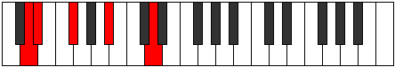

# Mode Dalic

## Links

- [Documentation](README.md)
- [Scales Index](Scales.md)
- [Modes Index](Modes.md)
- [Chords Index](Chords.md)

## Parent Scale

[Aeoloric](ScaleAeoloric.md)

## Number

[275](https://ianring.com/musictheory/scales/275)

## Interval Pattern

1, 3, 4, 4

## Chord Pattern

## Perfection

- 1 Perfect notes
- 3 Perfect notes

## Perfection Profile

[false true false false]

## Permutations

| Tonic | Notes | Signature | Illustration | Audio |
|-------|-------|-----------|--------------|-------|
| [C](ModeCNaturalDalic.md) | **C**, C#, **E**, **G#**, **C** | C |  | [midi](https://github.com/edipermadi/music/blob/main/docs/ModeCNaturalDalic.mid?raw=true) |
| [C#](ModeCSharpDalic.md) | **C#**, D, **F**, **A**, **C#** | C |  | [midi](https://github.com/edipermadi/music/blob/main/docs/ModeCSharpDalic.mid?raw=true) |
| [Db](ModeDFlatDalic.md) | **Db**, D, **F**, **A**, **Db** | C |  | [midi](https://github.com/edipermadi/music/blob/main/docs/ModeDFlatDalic.mid?raw=true) |
| [D](ModeDNaturalDalic.md) | **D**, D#, **F#**, **A#**, **D** | C |  | [midi](https://github.com/edipermadi/music/blob/main/docs/ModeDNaturalDalic.mid?raw=true) |
| [D#](ModeDSharpDalic.md) | **D#**, E, **G**, **B**, **D#** | C |  | [midi](https://github.com/edipermadi/music/blob/main/docs/ModeDSharpDalic.mid?raw=true) |
| [Eb](ModeEFlatDalic.md) | **Eb**, E, **G**, **B**, **Eb** | C |  | [midi](https://github.com/edipermadi/music/blob/main/docs/ModeEFlatDalic.mid?raw=true) |
| [E](ModeENaturalDalic.md) | **E**, F, **G#**, **C**, **E** | C |  | [midi](https://github.com/edipermadi/music/blob/main/docs/ModeENaturalDalic.mid?raw=true) |
| [F](ModeFNaturalDalic.md) | **F**, F#, **A**, **C#**, **F** | C |  | [midi](https://github.com/edipermadi/music/blob/main/docs/ModeFNaturalDalic.mid?raw=true) |
| [F#](ModeFSharpDalic.md) | **F#**, G, **A#**, **D**, **F#** | C |  | [midi](https://github.com/edipermadi/music/blob/main/docs/ModeFSharpDalic.mid?raw=true) |
| [Gb](ModeGFlatDalic.md) | **Gb**, G, **Bb**, **D**, **Gb** | C |  | [midi](https://github.com/edipermadi/music/blob/main/docs/ModeGFlatDalic.mid?raw=true) |
| [G](ModeGNaturalDalic.md) | **G**, G#, **B**, **D#**, **G** | C |  | [midi](https://github.com/edipermadi/music/blob/main/docs/ModeGNaturalDalic.mid?raw=true) |
| [G#](ModeGSharpDalic.md) | **G#**, A, **C**, **E**, **G#** | C |  | [midi](https://github.com/edipermadi/music/blob/main/docs/ModeGSharpDalic.mid?raw=true) |
| [Ab](ModeAFlatDalic.md) | **Ab**, A, **C**, **E**, **Ab** | C |  | [midi](https://github.com/edipermadi/music/blob/main/docs/ModeAFlatDalic.mid?raw=true) |
| [A](ModeANaturalDalic.md) | **A**, A#, **C#**, **F**, **A** | C |  | [midi](https://github.com/edipermadi/music/blob/main/docs/ModeANaturalDalic.mid?raw=true) |
| [A#](ModeASharpDalic.md) | **A#**, B, **D**, **F#**, **A#** | C |  | [midi](https://github.com/edipermadi/music/blob/main/docs/ModeASharpDalic.mid?raw=true) |
| [Bb](ModeBFlatDalic.md) | **Bb**, B, **D**, **Gb**, **Bb** | C |  | [midi](https://github.com/edipermadi/music/blob/main/docs/ModeBFlatDalic.mid?raw=true) |
| [B](ModeBNaturalDalic.md) | **B**, C, **D#**, **G**, **B** | C |  | [midi](https://github.com/edipermadi/music/blob/main/docs/ModeBNaturalDalic.mid?raw=true) |
