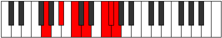
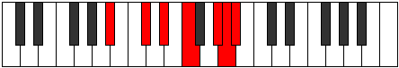

# Mode Dalimic

## Links

- [Documentation](README.md)
- [Scales Index](Scales.md)
- [Modes Index](Modes.md)
- [Chords Index](Chords.md)

## Parent Scale

[Dalimic](ScaleDalimic.md)

## Number

[3241](https://ianring.com/musictheory/scales/3241)

## Transposition

3, 2, 2, 3, 1, 1

## Chord Pattern

II⁺, IV⁺, VI⁺

## Perfection

- 4 Perfect notes
- 2 Perfect notes

## Perfection Profile

[true true true false true false]

## Permutations

| Tonic | Notes | Signature | Illustration | Audio |
|-------|-------|-----------|--------------|-------|
| [C](ModeCNaturalDalimic.md) | C, D#, E#, **F##**, G###, **A##**, C | C |  | [midi](https://github.com/edipermadi/music/blob/main/docs/ModeCNaturalDalimic.mid?raw=true) |
| [C#](ModeCSharpDalimic.md) | C#, D##, E##, **F###**, Cb, **Dbb**, C# | C |  | [midi](https://github.com/edipermadi/music/blob/main/docs/ModeCSharpDalimic.mid?raw=true) |
| [Db](ModeDFlatDalimic.md) | Db, E, F#, **G#**, A##, **B#**, Db | C |  | [midi](https://github.com/edipermadi/music/blob/main/docs/ModeDFlatDalimic.mid?raw=true) |
| [D](ModeDNaturalDalimic.md) | D, E#, F##, **G##**, A###, **B##**, D | C |  | [midi](https://github.com/edipermadi/music/blob/main/docs/ModeDNaturalDalimic.mid?raw=true) |
| [D#](ModeDSharpDalimic.md) | D#, E##, F###, **G###**, Db, **Ebb**, D# | C |  | [midi](https://github.com/edipermadi/music/blob/main/docs/ModeDSharpDalimic.mid?raw=true) |
| [Eb](ModeEFlatDalimic.md) | Eb, F#, G#, **A#**, B##, **C##**, Eb | C |  | [midi](https://github.com/edipermadi/music/blob/main/docs/ModeEFlatDalimic.mid?raw=true) |
| [E](ModeENaturalDalimic.md) | E, F##, G##, **A##**, B###, **C###**, E | C |  | [midi](https://github.com/edipermadi/music/blob/main/docs/ModeENaturalDalimic.mid?raw=true) |
| [F](ModeFNaturalDalimic.md) | F, G#, A#, **B#**, C###, **D##**, F | C |  | [midi](https://github.com/edipermadi/music/blob/main/docs/ModeFNaturalDalimic.mid?raw=true) |
| [F#](ModeFSharpDalimic.md) | F#, G##, A##, **B##**, D##, **E#**, F# | C |  | [midi](https://github.com/edipermadi/music/blob/main/docs/ModeFSharpDalimic.mid?raw=true) |
| [Gb](ModeGFlatDalimic.md) | Gb, A, B, **C#**, D##, **E#**, Gb | C |  | [midi](https://github.com/edipermadi/music/blob/main/docs/ModeGFlatDalimic.mid?raw=true) |
| [G](ModeGNaturalDalimic.md) | G, A#, B#, **C##**, D###, **E##**, G | C |  | [midi](https://github.com/edipermadi/music/blob/main/docs/ModeGNaturalDalimic.mid?raw=true) |
| [G#](ModeGSharpDalimic.md) | G#, A##, B##, **C###**, E##, **F##**, G# | C |  | [midi](https://github.com/edipermadi/music/blob/main/docs/ModeGSharpDalimic.mid?raw=true) |
| [Ab](ModeAFlatDalimic.md) | Ab, B, C#, **D#**, E##, **F##**, Ab | C |  | [midi](https://github.com/edipermadi/music/blob/main/docs/ModeAFlatDalimic.mid?raw=true) |
| [A](ModeANaturalDalimic.md) | A, B#, C##, **D##**, E###, **F###**, A | C |  | [midi](https://github.com/edipermadi/music/blob/main/docs/ModeANaturalDalimic.mid?raw=true) |
| [A#](ModeASharpDalimic.md) | A#, B##, C###, **D###**, F###, **G##**, A# | C |  | [midi](https://github.com/edipermadi/music/blob/main/docs/ModeASharpDalimic.mid?raw=true) |
| [Bb](ModeBFlatDalimic.md) | Bb, C#, D#, **E#**, F###, **G##**, Bb | C |  | [midi](https://github.com/edipermadi/music/blob/main/docs/ModeBFlatDalimic.mid?raw=true) |
| [B](ModeBNaturalDalimic.md) | B, C##, D##, **E##**, Cbbb, **Cbb**, B | C |  | [midi](https://github.com/edipermadi/music/blob/main/docs/ModeBNaturalDalimic.mid?raw=true) |
