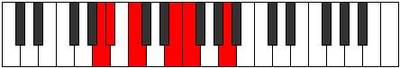

# Mode Dalitonic

## Links

- [Documentation](index.md)
- [Scales Index](Scales.md)
- [Modes Index](Modes.md)
- [Chords Index](Chords.md)

## Parent Scale

[Phraditonic](ScalePhraditonic.md)

## Number

[395](https://ianring.com/musictheory/scales/395)

## Perfection

- 3 Perfect notes
- 2 Perfect notes

## Perfection Profile

[true true false false true]

## Permutations

| Tonic | Notes | Signature | Illustration | Audio |
|-------|-------|-----------|--------------|-------|
| [C](ModeCNaturalDalitonic.md) | C, C#, **D#**, **G**, G#, C | C |  | [midi](ModeCNaturalDalitonic.mid) [ogg](ModeCNaturalDalitonic.ogg) |
| [C#](ModeCSharpDalitonic.md) | C#, D, **E**, **G#**, A, C# | C |  | [midi](ModeCSharpDalitonic.mid) [ogg](ModeCSharpDalitonic.ogg) |
| [Db](ModeDFlatDalitonic.md) | Db, D, **E**, **Ab**, A, Db | C |  | [midi](ModeDFlatDalitonic.mid) [ogg](ModeDFlatDalitonic.ogg) |
| [D](ModeDNaturalDalitonic.md) | D, D#, **F**, **A**, A#, D | C |  | [midi](ModeDNaturalDalitonic.mid) [ogg](ModeDNaturalDalitonic.ogg) |
| [D#](ModeDSharpDalitonic.md) | D#, E, **F#**, **A#**, B, D# | C |  | [midi](ModeDSharpDalitonic.mid) [ogg](ModeDSharpDalitonic.ogg) |
| [Eb](ModeEFlatDalitonic.md) | Eb, E, **Gb**, **Bb**, B, Eb | C |  | [midi](ModeEFlatDalitonic.mid) [ogg](ModeEFlatDalitonic.ogg) |
| [E](ModeENaturalDalitonic.md) | E, F, **G**, **B**, C, E | C |  | [midi](ModeENaturalDalitonic.mid) [ogg](ModeENaturalDalitonic.ogg) |
| [F](ModeFNaturalDalitonic.md) | F, F#, **G#**, **C**, C#, F | C |  | [midi](ModeFNaturalDalitonic.mid) [ogg](ModeFNaturalDalitonic.ogg) |
| [F#](ModeFSharpDalitonic.md) | F#, G, **A**, **C#**, D, F# | C |  | [midi](ModeFSharpDalitonic.mid) [ogg](ModeFSharpDalitonic.ogg) |
| [Gb](ModeGFlatDalitonic.md) | Gb, G, **A**, **Db**, D, Gb | C |  | [midi](ModeGFlatDalitonic.mid) [ogg](ModeGFlatDalitonic.ogg) |
| [G](ModeGNaturalDalitonic.md) | G, G#, **A#**, **D**, D#, G | C |  | [midi](ModeGNaturalDalitonic.mid) [ogg](ModeGNaturalDalitonic.ogg) |
| [G#](ModeGSharpDalitonic.md) | G#, A, **B**, **D#**, E, G# | C |  | [midi](ModeGSharpDalitonic.mid) [ogg](ModeGSharpDalitonic.ogg) |
| [Ab](ModeAFlatDalitonic.md) | Ab, A, **B**, **Eb**, E, Ab | C |  | [midi](ModeAFlatDalitonic.mid) [ogg](ModeAFlatDalitonic.ogg) |
| [A](ModeANaturalDalitonic.md) | A, A#, **C**, **E**, F, A | C |  | [midi](ModeANaturalDalitonic.mid) [ogg](ModeANaturalDalitonic.ogg) |
| [A#](ModeASharpDalitonic.md) | A#, B, **C#**, **F**, F#, A# | C |  | [midi](ModeASharpDalitonic.mid) [ogg](ModeASharpDalitonic.ogg) |
| [Bb](ModeBFlatDalitonic.md) | Bb, B, **Db**, **F**, Gb, Bb | C |  | [midi](ModeBFlatDalitonic.mid) [ogg](ModeBFlatDalitonic.ogg) |
| [B](ModeBNaturalDalitonic.md) | B, C, **D**, **F#**, G, B | C |  | [midi](ModeBNaturalDalitonic.mid) [ogg](ModeBNaturalDalitonic.ogg) |
