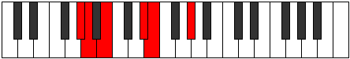
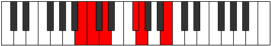

# Mode Dalitonic

## Links

- [Documentation](index.md)
- [Scales Index](Scales.md)
- [Modes Index](Modes.md)
- [Chords Index](Chords.md)

## Parent Scale

[Phraditonic](ScalePhraditonic.md)

## Number

[395](https://ianring.com/musictheory/scales/395)

## Interval Pattern

1, 2, 4, 1, 4

## Chord Pattern

## Perfection

- 3 Perfect notes
- 2 Perfect notes

## Perfection Profile

[true true false false true]

## Permutations

| Tonic | Notes | Signature | Illustration | Audio |
|-------|-------|-----------|--------------|-------|
| [C](ModeCNaturalDalitonic.md) | C, C#, **D#**, **G**, G#, C | C |  | [midi](https://github.com/edipermadi/music/blob/main/docs/ModeCNaturalDalitonic.mid?raw=true) |
| [C#](ModeCSharpDalitonic.md) | C#, D, **E**, **G#**, A, C# | C |  | [midi](https://github.com/edipermadi/music/blob/main/docs/ModeCSharpDalitonic.mid?raw=true) |
| [Db](ModeDFlatDalitonic.md) | Db, D, **E**, **Ab**, A, Db | C |  | [midi](https://github.com/edipermadi/music/blob/main/docs/ModeDFlatDalitonic.mid?raw=true) |
| [D](ModeDNaturalDalitonic.md) | D, D#, **F**, **A**, A#, D | C |  | [midi](https://github.com/edipermadi/music/blob/main/docs/ModeDNaturalDalitonic.mid?raw=true) |
| [D#](ModeDSharpDalitonic.md) | D#, E, **F#**, **A#**, B, D# | C |  | [midi](https://github.com/edipermadi/music/blob/main/docs/ModeDSharpDalitonic.mid?raw=true) |
| [Eb](ModeEFlatDalitonic.md) | Eb, E, **Gb**, **Bb**, B, Eb | C |  | [midi](https://github.com/edipermadi/music/blob/main/docs/ModeEFlatDalitonic.mid?raw=true) |
| [E](ModeENaturalDalitonic.md) | E, F, **G**, **B**, C, E | C |  | [midi](https://github.com/edipermadi/music/blob/main/docs/ModeENaturalDalitonic.mid?raw=true) |
| [F](ModeFNaturalDalitonic.md) | F, F#, **G#**, **C**, C#, F | C |  | [midi](https://github.com/edipermadi/music/blob/main/docs/ModeFNaturalDalitonic.mid?raw=true) |
| [F#](ModeFSharpDalitonic.md) | F#, G, **A**, **C#**, D, F# | C |  | [midi](https://github.com/edipermadi/music/blob/main/docs/ModeFSharpDalitonic.mid?raw=true) |
| [Gb](ModeGFlatDalitonic.md) | Gb, G, **A**, **Db**, D, Gb | C |  | [midi](https://github.com/edipermadi/music/blob/main/docs/ModeGFlatDalitonic.mid?raw=true) |
| [G](ModeGNaturalDalitonic.md) | G, G#, **A#**, **D**, D#, G | C |  | [midi](https://github.com/edipermadi/music/blob/main/docs/ModeGNaturalDalitonic.mid?raw=true) |
| [G#](ModeGSharpDalitonic.md) | G#, A, **B**, **D#**, E, G# | C |  | [midi](https://github.com/edipermadi/music/blob/main/docs/ModeGSharpDalitonic.mid?raw=true) |
| [Ab](ModeAFlatDalitonic.md) | Ab, A, **B**, **Eb**, E, Ab | C |  | [midi](https://github.com/edipermadi/music/blob/main/docs/ModeAFlatDalitonic.mid?raw=true) |
| [A](ModeANaturalDalitonic.md) | A, A#, **C**, **E**, F, A | C |  | [midi](https://github.com/edipermadi/music/blob/main/docs/ModeANaturalDalitonic.mid?raw=true) |
| [A#](ModeASharpDalitonic.md) | A#, B, **C#**, **F**, F#, A# | C |  | [midi](https://github.com/edipermadi/music/blob/main/docs/ModeASharpDalitonic.mid?raw=true) |
| [Bb](ModeBFlatDalitonic.md) | Bb, B, **Db**, **F**, Gb, Bb | C |  | [midi](https://github.com/edipermadi/music/blob/main/docs/ModeBFlatDalitonic.mid?raw=true) |
| [B](ModeBNaturalDalitonic.md) | B, C, **D**, **F#**, G, B | C |  | [midi](https://github.com/edipermadi/music/blob/main/docs/ModeBNaturalDalitonic.mid?raw=true) |
