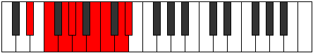

# Mode Dalyllic

## Links

- [Documentation](README.md)
- [Scales Index](Scales.md)
- [Modes Index](Modes.md)
- [Chords Index](Chords.md)

## Parent Scale

[Dalyllic](ScaleDalyllic.md)

## Number

[2933](https://ianring.com/musictheory/scales/2933)

## Luminosity

7

## Transposition

2, 2, 1, 1, 2, 1, 2, 1

## Chord Pattern

Ib5, ii⁰, iv⁰, v⁰, vi⁰, vii, viii⁰

## Perfection

- 5 Perfect notes
- 3 Perfect notes

## Perfection Profile

false, true, true, true, false, false, true, true

## Permutations

| Tonic | Notes | Signature | Illustration | Audio |
|-------|-------|-----------|--------------|-------|
| [C](ModeCNaturalDalyllic.md) | **C**, D, E, F, **F#**, **G#**, A, B, **C** | C |  | [midi](https://github.com/edipermadi/music/blob/main/docs/ModeCNaturalDalyllic.mid?raw=true) |
| [C#](ModeCSharpDalyllic.md) | **C#**, D#, F, F#, **G**, **A**, A#, C, **C#** | C |  | [midi](https://github.com/edipermadi/music/blob/main/docs/ModeCSharpDalyllic.mid?raw=true) |
| [Db](ModeDFlatDalyllic.md) | **Db**, Eb, F, Gb, **G**, **A**, Bb, C, **Db** | C |  | [midi](https://github.com/edipermadi/music/blob/main/docs/ModeDFlatDalyllic.mid?raw=true) |
| [D](ModeDNaturalDalyllic.md) | **D**, E, F#, G, **G#**, **A#**, B, C#, **D** | C |  | [midi](https://github.com/edipermadi/music/blob/main/docs/ModeDNaturalDalyllic.mid?raw=true) |
| [D#](ModeDSharpDalyllic.md) | **D#**, F, G, G#, **A**, **B**, C, D, **D#** | C |  | [midi](https://github.com/edipermadi/music/blob/main/docs/ModeDSharpDalyllic.mid?raw=true) |
| [Eb](ModeEFlatDalyllic.md) | **Eb**, F, G, Ab, **A**, **B**, C, D, **Eb** | C |  | [midi](https://github.com/edipermadi/music/blob/main/docs/ModeEFlatDalyllic.mid?raw=true) |
| [E](ModeENaturalDalyllic.md) | **E**, F#, G#, A, **A#**, **C**, C#, D#, **E** | C |  | [midi](https://github.com/edipermadi/music/blob/main/docs/ModeENaturalDalyllic.mid?raw=true) |
| [F](ModeFNaturalDalyllic.md) | **F**, G, A, A#, **B**, **C#**, D, E, **F** | C |  | [midi](https://github.com/edipermadi/music/blob/main/docs/ModeFNaturalDalyllic.mid?raw=true) |
| [F#](ModeFSharpDalyllic.md) | **F#**, G#, A#, B, **C**, **D**, D#, F, **F#** | C |  | [midi](https://github.com/edipermadi/music/blob/main/docs/ModeFSharpDalyllic.mid?raw=true) |
| [Gb](ModeGFlatDalyllic.md) | **Gb**, Ab, Bb, B, **C**, **D**, Eb, F, **Gb** | C |  | [midi](https://github.com/edipermadi/music/blob/main/docs/ModeGFlatDalyllic.mid?raw=true) |
| [G](ModeGNaturalDalyllic.md) | **G**, A, B, C, **C#**, **D#**, E, F#, **G** | C |  | [midi](https://github.com/edipermadi/music/blob/main/docs/ModeGNaturalDalyllic.mid?raw=true) |
| [G#](ModeGSharpDalyllic.md) | **G#**, A#, C, C#, **D**, **E**, F, G, **G#** | C |  | [midi](https://github.com/edipermadi/music/blob/main/docs/ModeGSharpDalyllic.mid?raw=true) |
| [Ab](ModeAFlatDalyllic.md) | **Ab**, Bb, C, Db, **D**, **E**, F, G, **Ab** | C |  | [midi](https://github.com/edipermadi/music/blob/main/docs/ModeAFlatDalyllic.mid?raw=true) |
| [A](ModeANaturalDalyllic.md) | **A**, B, C#, D, **D#**, **F**, F#, G#, **A** | C |  | [midi](https://github.com/edipermadi/music/blob/main/docs/ModeANaturalDalyllic.mid?raw=true) |
| [A#](ModeASharpDalyllic.md) | **A#**, C, D, D#, **E**, **F#**, G, A, **A#** | C |  | [midi](https://github.com/edipermadi/music/blob/main/docs/ModeASharpDalyllic.mid?raw=true) |
| [Bb](ModeBFlatDalyllic.md) | **Bb**, C, D, Eb, **E**, **Gb**, G, A, **Bb** | C |  | [midi](https://github.com/edipermadi/music/blob/main/docs/ModeBFlatDalyllic.mid?raw=true) |
| [B](ModeBNaturalDalyllic.md) | **B**, C#, D#, E, **F**, **G**, G#, A#, **B** | C |  | [midi](https://github.com/edipermadi/music/blob/main/docs/ModeBNaturalDalyllic.mid?raw=true) |
