# Mode Danian

## Links

- [Documentation](README.md)
- [Scales Index](Scales.md)
- [Modes Index](Modes.md)
- [Chords Index](Chords.md)

## Parent Scale

[Aeolacrian](ScaleAeolacrian.md)

## Number

[2531](https://ianring.com/musictheory/scales/2531)

## Interval Pattern

1, 4, 1, 1, 1, 3, 1

## Chord Pattern

iii⁰b3, iv⁰b3, Vb5

## Perfection

- 5 Perfect notes
- 2 Perfect notes

## Perfection Profile

[true true true true false false true]

## Permutations

| Tonic | Notes | Signature | Illustration | Audio |
|-------|-------|-----------|--------------|-------|
| [C](ModeCNaturalDanian.md) | C, Db, E#, F#, **G**, **Ab**, B, C | C | 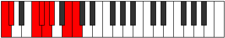 | [midi](https://github.com/edipermadi/music/blob/main/docs/ModeCNaturalDanian.mid?raw=true) |
| [C#](ModeCSharpDanian.md) | C#, D, E##, F##, **G#**, **A**, B#, C# | C | 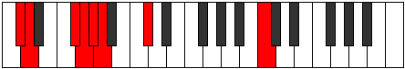 | [midi](https://github.com/edipermadi/music/blob/main/docs/ModeCSharpDanian.mid?raw=true) |
| [Db](ModeDFlatDanian.md) | Db, Ebb, F#, G, **Ab**, **Bbb**, C, Db | C | 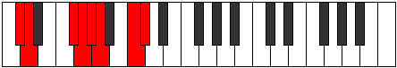 | [midi](https://github.com/edipermadi/music/blob/main/docs/ModeDFlatDanian.mid?raw=true) |
| [D](ModeDNaturalDanian.md) | D, Eb, F##, G#, **A**, **Bb**, C#, D | C | 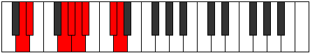 | [midi](https://github.com/edipermadi/music/blob/main/docs/ModeDNaturalDanian.mid?raw=true) |
| [D#](ModeDSharpDanian.md) | D#, E, F###, G##, **A#**, **B**, C##, D# | C | 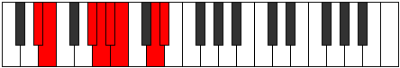 | [midi](https://github.com/edipermadi/music/blob/main/docs/ModeDSharpDanian.mid?raw=true) |
| [Eb](ModeEFlatDanian.md) | Eb, Fb, G#, A, **Bb**, **Cb**, D, Eb | C |  | [midi](https://github.com/edipermadi/music/blob/main/docs/ModeEFlatDanian.mid?raw=true) |
| [E](ModeENaturalDanian.md) | E, F, G##, A#, **B**, **C**, D#, E | C | 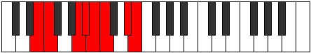 | [midi](https://github.com/edipermadi/music/blob/main/docs/ModeENaturalDanian.mid?raw=true) |
| [F](ModeFNaturalDanian.md) | F, Gb, A#, B, **C**, **Db**, E, F | C | 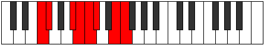 | [midi](https://github.com/edipermadi/music/blob/main/docs/ModeFNaturalDanian.mid?raw=true) |
| [F#](ModeFSharpDanian.md) | F#, G, A##, B#, **C#**, **D**, E#, F# | C | 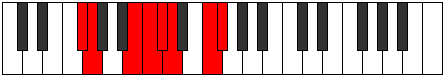 | [midi](https://github.com/edipermadi/music/blob/main/docs/ModeFSharpDanian.mid?raw=true) |
| [Gb](ModeGFlatDanian.md) | Gb, Abb, B, C, **Db**, **Ebb**, F, Gb | C |  | [midi](https://github.com/edipermadi/music/blob/main/docs/ModeGFlatDanian.mid?raw=true) |
| [G](ModeGNaturalDanian.md) | G, Ab, B#, C#, **D**, **Eb**, F#, G | C |  | [midi](https://github.com/edipermadi/music/blob/main/docs/ModeGNaturalDanian.mid?raw=true) |
| [G#](ModeGSharpDanian.md) | G#, A, B##, C##, **D#**, **E**, F##, G# | C | 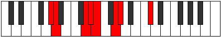 | [midi](https://github.com/edipermadi/music/blob/main/docs/ModeGSharpDanian.mid?raw=true) |
| [Ab](ModeAFlatDanian.md) | Ab, Bbb, C#, D, **Eb**, **Fb**, G, Ab | C | 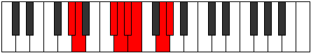 | [midi](https://github.com/edipermadi/music/blob/main/docs/ModeAFlatDanian.mid?raw=true) |
| [A](ModeANaturalDanian.md) | A, Bb, C##, D#, **E**, **F**, G#, A | C | 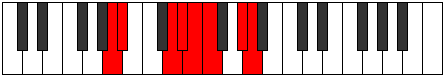 | [midi](https://github.com/edipermadi/music/blob/main/docs/ModeANaturalDanian.mid?raw=true) |
| [A#](ModeASharpDanian.md) | A#, B, C###, D##, **E#**, **F#**, G##, A# | C | 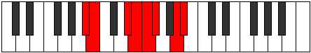 | [midi](https://github.com/edipermadi/music/blob/main/docs/ModeASharpDanian.mid?raw=true) |
| [Bb](ModeBFlatDanian.md) | Bb, Cb, D#, E, **F**, **Gb**, A, Bb | C | 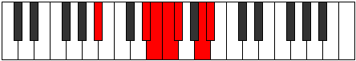 | [midi](https://github.com/edipermadi/music/blob/main/docs/ModeBFlatDanian.mid?raw=true) |
| [B](ModeBNaturalDanian.md) | B, C, D##, E#, **F#**, **G**, A#, B | C | 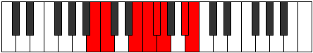 | [midi](https://github.com/edipermadi/music/blob/main/docs/ModeBNaturalDanian.mid?raw=true) |
