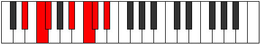

# Mode Danimic

## Links

- [Documentation](index.md)
- [Scales Index](Scales.md)
- [Modes Index](Modes.md)
- [Chords Index](Chords.md)

## Parent Scale

[Dyrimic](ScaleDyrimic.md)

## Number

[1677](https://ianring.com/musictheory/scales/1677)

## Perfection

- 4 Perfect notes
- 2 Perfect notes

## Perfection Profile

[true true true true false false]

## Permutations

| Tonic | Notes | Signature | Illustration | Audio |
|-------|-------|-----------|--------------|-------|
| [C](ModeCNaturalDanimic.md) | C, D, Eb, F##, **G##**, **A#**, C | C |  | [midi](ModeCNaturalDanimic.mid) [ogg](ModeCNaturalDanimic.ogg) |
| [C#](ModeCSharpDanimic.md) | C#, D#, E, F###, **G###**, **A##**, C# | C |  | [midi](ModeCSharpDanimic.mid) [ogg](ModeCSharpDanimic.ogg) |
| [Db](ModeDFlatDanimic.md) | Db, Eb, Fb, G#, **A#**, **B**, Db | C |  | [midi](ModeDFlatDanimic.mid) [ogg](ModeDFlatDanimic.ogg) |
| [D](ModeDNaturalDanimic.md) | D, E, F, G##, **A##**, **B#**, D | C |  | [midi](ModeDNaturalDanimic.mid) [ogg](ModeDNaturalDanimic.ogg) |
| [D#](ModeDSharpDanimic.md) | D#, E#, F#, G###, **A###**, **B##**, D# | C |  | [midi](ModeDSharpDanimic.mid) [ogg](ModeDSharpDanimic.ogg) |
| [Eb](ModeEFlatDanimic.md) | Eb, F, Gb, A#, **B#**, **C#**, Eb | C |  | [midi](ModeEFlatDanimic.mid) [ogg](ModeEFlatDanimic.ogg) |
| [E](ModeENaturalDanimic.md) | E, F#, G, A##, **B##**, **C##**, E | C |  | [midi](ModeENaturalDanimic.mid) [ogg](ModeENaturalDanimic.ogg) |
| [F](ModeFNaturalDanimic.md) | F, G, Ab, B#, **C##**, **D#**, F | C |  | [midi](ModeFNaturalDanimic.mid) [ogg](ModeFNaturalDanimic.ogg) |
| [F#](ModeFSharpDanimic.md) | F#, G#, A, B##, **C###**, **D##**, F# | C |  | [midi](ModeFSharpDanimic.mid) [ogg](ModeFSharpDanimic.ogg) |
| [Gb](ModeGFlatDanimic.md) | Gb, Ab, Bbb, C#, **D#**, **E**, Gb | C |  | [midi](ModeGFlatDanimic.mid) [ogg](ModeGFlatDanimic.ogg) |
| [G](ModeGNaturalDanimic.md) | G, A, Bb, C##, **D##**, **E#**, G | C |  | [midi](ModeGNaturalDanimic.mid) [ogg](ModeGNaturalDanimic.ogg) |
| [G#](ModeGSharpDanimic.md) | G#, A#, B, C###, **D###**, **E##**, G# | C |  | [midi](ModeGSharpDanimic.mid) [ogg](ModeGSharpDanimic.ogg) |
| [Ab](ModeAFlatDanimic.md) | Ab, Bb, Cb, D#, **E#**, **F#**, Ab | C |  | [midi](ModeAFlatDanimic.mid) [ogg](ModeAFlatDanimic.ogg) |
| [A](ModeANaturalDanimic.md) | A, B, C, D##, **E##**, **F##**, A | C |  | [midi](ModeANaturalDanimic.mid) [ogg](ModeANaturalDanimic.ogg) |
| [A#](ModeASharpDanimic.md) | A#, B#, C#, D###, **E###**, **F###**, A# | C |  | [midi](ModeASharpDanimic.mid) [ogg](ModeASharpDanimic.ogg) |
| [Bb](ModeBFlatDanimic.md) | Bb, C, Db, E#, **F##**, **G#**, Bb | C |  | [midi](ModeBFlatDanimic.mid) [ogg](ModeBFlatDanimic.ogg) |
| [B](ModeBNaturalDanimic.md) | B, C#, D, E##, **F###**, **G##**, B | C |  | [midi](ModeBNaturalDanimic.mid) [ogg](ModeBNaturalDanimic.ogg) |
