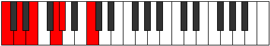

# Mode Danitonic

## Links

- [Documentation](index.md)
- [Scales Index](Scales.md)
- [Modes Index](Modes.md)
- [Chords Index](Chords.md)

## Parent Scale

[Aeolanitonic](ScaleAeolanitonic.md)

## Number

[405](https://ianring.com/musictheory/scales/405)

## Perfection

- 2 Perfect notes
- 3 Perfect notes

## Perfection Profile

[true false false true false]

## Permutations

| Tonic | Notes | Signature | Illustration | Audio |
|-------|-------|-----------|--------------|-------|
| [C](ModeCNaturalDanitonic.md) | C, **D**, **E**, G, **G#**, C | C |  | [midi](ModeCNaturalDanitonic.mid) [ogg](ModeCNaturalDanitonic.ogg) |
| [C#](ModeCSharpDanitonic.md) | C#, **D#**, **F**, G#, **A**, C# | C |  | [midi](ModeCSharpDanitonic.mid) [ogg](ModeCSharpDanitonic.ogg) |
| [Db](ModeDFlatDanitonic.md) | Db, **Eb**, **F**, Ab, **A**, Db | C |  | [midi](ModeDFlatDanitonic.mid) [ogg](ModeDFlatDanitonic.ogg) |
| [D](ModeDNaturalDanitonic.md) | D, **E**, **F#**, A, **A#**, D | C |  | [midi](ModeDNaturalDanitonic.mid) [ogg](ModeDNaturalDanitonic.ogg) |
| [D#](ModeDSharpDanitonic.md) | D#, **F**, **G**, A#, **B**, D# | C |  | [midi](ModeDSharpDanitonic.mid) [ogg](ModeDSharpDanitonic.ogg) |
| [Eb](ModeEFlatDanitonic.md) | Eb, **F**, **G**, Bb, **B**, Eb | C |  | [midi](ModeEFlatDanitonic.mid) [ogg](ModeEFlatDanitonic.ogg) |
| [E](ModeENaturalDanitonic.md) | E, **F#**, **G#**, B, **C**, E | C |  | [midi](ModeENaturalDanitonic.mid) [ogg](ModeENaturalDanitonic.ogg) |
| [F](ModeFNaturalDanitonic.md) | F, **G**, **A**, C, **C#**, F | C |  | [midi](ModeFNaturalDanitonic.mid) [ogg](ModeFNaturalDanitonic.ogg) |
| [F#](ModeFSharpDanitonic.md) | F#, **G#**, **A#**, C#, **D**, F# | C |  | [midi](ModeFSharpDanitonic.mid) [ogg](ModeFSharpDanitonic.ogg) |
| [Gb](ModeGFlatDanitonic.md) | Gb, **Ab**, **Bb**, Db, **D**, Gb | C |  | [midi](ModeGFlatDanitonic.mid) [ogg](ModeGFlatDanitonic.ogg) |
| [G](ModeGNaturalDanitonic.md) | G, **A**, **B**, D, **D#**, G | C |  | [midi](ModeGNaturalDanitonic.mid) [ogg](ModeGNaturalDanitonic.ogg) |
| [G#](ModeGSharpDanitonic.md) | G#, **A#**, **C**, D#, **E**, G# | C |  | [midi](ModeGSharpDanitonic.mid) [ogg](ModeGSharpDanitonic.ogg) |
| [Ab](ModeAFlatDanitonic.md) | Ab, **Bb**, **C**, Eb, **E**, Ab | C |  | [midi](ModeAFlatDanitonic.mid) [ogg](ModeAFlatDanitonic.ogg) |
| [A](ModeANaturalDanitonic.md) | A, **B**, **C#**, E, **F**, A | C |  | [midi](ModeANaturalDanitonic.mid) [ogg](ModeANaturalDanitonic.ogg) |
| [A#](ModeASharpDanitonic.md) | A#, **C**, **D**, F, **F#**, A# | C |  | [midi](ModeASharpDanitonic.mid) [ogg](ModeASharpDanitonic.ogg) |
| [Bb](ModeBFlatDanitonic.md) | Bb, **C**, **D**, F, **Gb**, Bb | C |  | [midi](ModeBFlatDanitonic.mid) [ogg](ModeBFlatDanitonic.ogg) |
| [B](ModeBNaturalDanitonic.md) | B, **C#**, **D#**, F#, **G**, B | C |  | [midi](ModeBNaturalDanitonic.mid) [ogg](ModeBNaturalDanitonic.ogg) |
