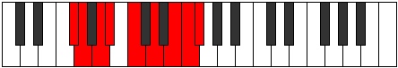

# Mode Danyllic

## Links

- [Documentation](index.md)
- [Scales Index](Scales.md)
- [Modes Index](Modes.md)
- [Chords Index](Chords.md)

## Parent Scale

[Ionocryllic](ScaleIonocryllic.md)

## Number

[3419](https://ianring.com/musictheory/scales/3419)

## Perfection

- 6 Perfect notes
- 2 Perfect notes

## Perfection Profile

[false true true true true true false true]

## Permutations

| Tonic | Notes | Signature | Illustration | Audio |
|-------|-------|-----------|--------------|-------|
| [C](ModeCNaturalDanyllic.md) | **C**, C#, D#, E, F#, G#, **A#**, B, **C** | C |  | [midi](ModeCNaturalDanyllic.mid) [ogg](ModeCNaturalDanyllic.ogg) |
| [C#](ModeCSharpDanyllic.md) | **C#**, D, E, F, G, A, **B**, C, **C#** | C |  | [midi](ModeCSharpDanyllic.mid) [ogg](ModeCSharpDanyllic.ogg) |
| [Db](ModeDFlatDanyllic.md) | **Db**, D, E, F, G, A, **B**, C, **Db** | C |  | [midi](ModeDFlatDanyllic.mid) [ogg](ModeDFlatDanyllic.ogg) |
| [D](ModeDNaturalDanyllic.md) | **D**, D#, F, F#, G#, A#, **C**, C#, **D** | C |  | [midi](ModeDNaturalDanyllic.mid) [ogg](ModeDNaturalDanyllic.ogg) |
| [D#](ModeDSharpDanyllic.md) | **D#**, E, F#, G, A, B, **C#**, D, **D#** | C |  | [midi](ModeDSharpDanyllic.mid) [ogg](ModeDSharpDanyllic.ogg) |
| [Eb](ModeEFlatDanyllic.md) | **Eb**, E, Gb, G, A, B, **Db**, D, **Eb** | C |  | [midi](ModeEFlatDanyllic.mid) [ogg](ModeEFlatDanyllic.ogg) |
| [E](ModeENaturalDanyllic.md) | **E**, F, G, G#, A#, C, **D**, D#, **E** | C |  | [midi](ModeENaturalDanyllic.mid) [ogg](ModeENaturalDanyllic.ogg) |
| [F](ModeFNaturalDanyllic.md) | **F**, F#, G#, A, B, C#, **D#**, E, **F** | C |  | [midi](ModeFNaturalDanyllic.mid) [ogg](ModeFNaturalDanyllic.ogg) |
| [F#](ModeFSharpDanyllic.md) | **F#**, G, A, A#, C, D, **E**, F, **F#** | C |  | [midi](ModeFSharpDanyllic.mid) [ogg](ModeFSharpDanyllic.ogg) |
| [Gb](ModeGFlatDanyllic.md) | **Gb**, G, A, Bb, C, D, **E**, F, **Gb** | C |  | [midi](ModeGFlatDanyllic.mid) [ogg](ModeGFlatDanyllic.ogg) |
| [G](ModeGNaturalDanyllic.md) | **G**, G#, A#, B, C#, D#, **F**, F#, **G** | C |  | [midi](ModeGNaturalDanyllic.mid) [ogg](ModeGNaturalDanyllic.ogg) |
| [G#](ModeGSharpDanyllic.md) | **G#**, A, B, C, D, E, **F#**, G, **G#** | C |  | [midi](ModeGSharpDanyllic.mid) [ogg](ModeGSharpDanyllic.ogg) |
| [Ab](ModeAFlatDanyllic.md) | **Ab**, A, B, C, D, E, **Gb**, G, **Ab** | C |  | [midi](ModeAFlatDanyllic.mid) [ogg](ModeAFlatDanyllic.ogg) |
| [A](ModeANaturalDanyllic.md) | **A**, A#, C, C#, D#, F, **G**, G#, **A** | C |  | [midi](ModeANaturalDanyllic.mid) [ogg](ModeANaturalDanyllic.ogg) |
| [A#](ModeASharpDanyllic.md) | **A#**, B, C#, D, E, F#, **G#**, A, **A#** | C |  | [midi](ModeASharpDanyllic.mid) [ogg](ModeASharpDanyllic.ogg) |
| [Bb](ModeBFlatDanyllic.md) | **Bb**, B, Db, D, E, Gb, **Ab**, A, **Bb** | C |  | [midi](ModeBFlatDanyllic.mid) [ogg](ModeBFlatDanyllic.ogg) |
| [B](ModeBNaturalDanyllic.md) | **B**, C, D, D#, F, G, **A**, A#, **B** | C |  | [midi](ModeBNaturalDanyllic.mid) [ogg](ModeBNaturalDanyllic.ogg) |
