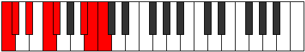

# Mode Daptian

## Links

- [Documentation](index.md)
- [Scales Index](Scales.md)
- [Modes Index](Modes.md)
- [Chords Index](Chords.md)

## Parent Scale

[Zogian](ScaleZogian.md)

## Number

[3179](https://ianring.com/musictheory/scales/3179)

## Perfection

- 5 Perfect notes
- 2 Perfect notes

## Interval Pattern

1, 2, 2, 1, 4, 1, 1

## Perfection Profile

[false false true true true true true]

## Permutations

| Tonic | Notes | Signature | Illustration | Audio |
|-------|-------|-----------|--------------|-------|
| [C](ModeCNaturalDaptian.md) | **C**, **Db**, Eb, F, Gb, A#, B, **C** | C |  | [midi](https://github.com/edipermadi/music/blob/main/docs/ModeCNaturalDaptian.mid?raw=true) |
| [C#](ModeCSharpDaptian.md) | **C#**, **D**, E, F#, G, A##, B#, **C#** | C |  | [midi](https://github.com/edipermadi/music/blob/main/docs/ModeCSharpDaptian.mid?raw=true) |
| [Db](ModeDFlatDaptian.md) | **Db**, **Ebb**, Fb, Gb, Abb, B, C, **Db** | C |  | [midi](https://github.com/edipermadi/music/blob/main/docs/ModeDFlatDaptian.mid?raw=true) |
| [D](ModeDNaturalDaptian.md) | **D**, **Eb**, F, G, Ab, B#, C#, **D** | C |  | [midi](https://github.com/edipermadi/music/blob/main/docs/ModeDNaturalDaptian.mid?raw=true) |
| [D#](ModeDSharpDaptian.md) | **D#**, **E**, F#, G#, A, B##, C##, **D#** | C |  | [midi](https://github.com/edipermadi/music/blob/main/docs/ModeDSharpDaptian.mid?raw=true) |
| [Eb](ModeEFlatDaptian.md) | **Eb**, **Fb**, Gb, Ab, Bbb, C#, D, **Eb** | C |  | [midi](https://github.com/edipermadi/music/blob/main/docs/ModeEFlatDaptian.mid?raw=true) |
| [E](ModeENaturalDaptian.md) | **E**, **F**, G, A, Bb, C##, D#, **E** | C |  | [midi](https://github.com/edipermadi/music/blob/main/docs/ModeENaturalDaptian.mid?raw=true) |
| [F](ModeFNaturalDaptian.md) | **F**, **Gb**, Ab, Bb, Cb, D#, E, **F** | C |  | [midi](https://github.com/edipermadi/music/blob/main/docs/ModeFNaturalDaptian.mid?raw=true) |
| [F#](ModeFSharpDaptian.md) | **F#**, **G**, A, B, C, D##, E#, **F#** | C |  | [midi](https://github.com/edipermadi/music/blob/main/docs/ModeFSharpDaptian.mid?raw=true) |
| [Gb](ModeGFlatDaptian.md) | **Gb**, **Abb**, Bbb, Cb, Dbb, E, F, **Gb** | C |  | [midi](https://github.com/edipermadi/music/blob/main/docs/ModeGFlatDaptian.mid?raw=true) |
| [G](ModeGNaturalDaptian.md) | **G**, **Ab**, Bb, C, Db, E#, F#, **G** | C |  | [midi](https://github.com/edipermadi/music/blob/main/docs/ModeGNaturalDaptian.mid?raw=true) |
| [G#](ModeGSharpDaptian.md) | **G#**, **A**, B, C#, D, E##, F##, **G#** | C |  | [midi](https://github.com/edipermadi/music/blob/main/docs/ModeGSharpDaptian.mid?raw=true) |
| [Ab](ModeAFlatDaptian.md) | **Ab**, **Bbb**, Cb, Db, Ebb, F#, G, **Ab** | C |  | [midi](https://github.com/edipermadi/music/blob/main/docs/ModeAFlatDaptian.mid?raw=true) |
| [A](ModeANaturalDaptian.md) | **A**, **Bb**, C, D, Eb, F##, G#, **A** | C |  | [midi](https://github.com/edipermadi/music/blob/main/docs/ModeANaturalDaptian.mid?raw=true) |
| [A#](ModeASharpDaptian.md) | **A#**, **B**, C#, D#, E, F###, G##, **A#** | C |  | [midi](https://github.com/edipermadi/music/blob/main/docs/ModeASharpDaptian.mid?raw=true) |
| [Bb](ModeBFlatDaptian.md) | **Bb**, **Cb**, Db, Eb, Fb, G#, A, **Bb** | C |  | [midi](https://github.com/edipermadi/music/blob/main/docs/ModeBFlatDaptian.mid?raw=true) |
| [B](ModeBNaturalDaptian.md) | **B**, **C**, D, E, F, G##, A#, **B** | C |  | [midi](https://github.com/edipermadi/music/blob/main/docs/ModeBNaturalDaptian.mid?raw=true) |
