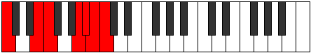
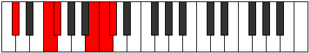
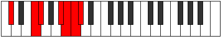
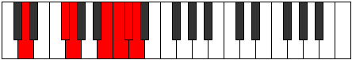
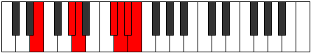
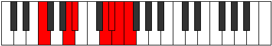
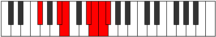
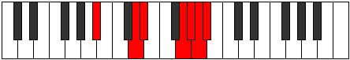
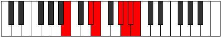

# Mode Daptimic

## Links

- [Documentation](index.md)
- [Scales Index](Scales.md)
- [Modes Index](Modes.md)
- [Chords Index](Chords.md)

## Parent Scale

[Daptimic](ScaleDaptimic.md)

## Number

[3633](https://ianring.com/musictheory/scales/3633)

## Interval Pattern

4, 1, 4, 1, 1, 1

## Chord Pattern

III, iv

## Perfection

- 4 Perfect notes
- 2 Perfect notes

## Perfection Profile

[false true true true true false]

## Permutations

| Tonic | Notes | Signature | Illustration | Audio |
|-------|-------|-----------|--------------|-------|
| [C](ModeCNaturalDaptimic.md) | **C**, D##, E#, Cbbb, Cbb, **Dbbb**, **C** | C |  | [midi](https://github.com/edipermadi/music/blob/main/docs/ModeCNaturalDaptimic.mid?raw=true) |
| [C#](ModeCSharpDaptimic.md) | **C#**, D###, E##, Cbb, Dbbb, **Dbb**, **C#** | C |  | [midi](https://github.com/edipermadi/music/blob/main/docs/ModeCSharpDaptimic.mid?raw=true) |
| [Db](ModeDFlatDaptimic.md) | **Db**, E#, F#, G###, A##, **B#**, **Db** | C |  | [midi](https://github.com/edipermadi/music/blob/main/docs/ModeDFlatDaptimic.mid?raw=true) |
| [D](ModeDNaturalDaptimic.md) | **D**, E##, F##, Cb, Dbb, **Ebbb**, **D** | C |  | [midi](https://github.com/edipermadi/music/blob/main/docs/ModeDNaturalDaptimic.mid?raw=true) |
| [D#](ModeDSharpDaptimic.md) | **D#**, E###, F###, Dbb, Ebbb, **Fbbb**, **D#** | C |  | [midi](https://github.com/edipermadi/music/blob/main/docs/ModeDSharpDaptimic.mid?raw=true) |
| [Eb](ModeEFlatDaptimic.md) | **Eb**, F##, G#, A###, B##, **C##**, **Eb** | C |  | [midi](https://github.com/edipermadi/music/blob/main/docs/ModeEFlatDaptimic.mid?raw=true) |
| [E](ModeENaturalDaptimic.md) | **E**, F###, G##, Db, Ebb, **Fbb**, **E** | C |  | [midi](https://github.com/edipermadi/music/blob/main/docs/ModeENaturalDaptimic.mid?raw=true) |
| [F](ModeFNaturalDaptimic.md) | **F**, G##, A#, B###, C###, **D##**, **F** | C |  | [midi](https://github.com/edipermadi/music/blob/main/docs/ModeFNaturalDaptimic.mid?raw=true) |
| [F#](ModeFSharpDaptimic.md) | **F#**, G###, A##, C###, D##, **E#**, **F#** | C |  | [midi](https://github.com/edipermadi/music/blob/main/docs/ModeFSharpDaptimic.mid?raw=true) |
| [Gb](ModeGFlatDaptimic.md) | **Gb**, A#, B, C###, D##, **E#**, **Gb** | C |  | [midi](https://github.com/edipermadi/music/blob/main/docs/ModeGFlatDaptimic.mid?raw=true) |
| [G](ModeGNaturalDaptimic.md) | **G**, A##, B#, D##, E#, **F#**, **G** | C |  | [midi](https://github.com/edipermadi/music/blob/main/docs/ModeGNaturalDaptimic.mid?raw=true) |
| [G#](ModeGSharpDaptimic.md) | **G#**, A###, B##, D###, E##, **F##**, **G#** | C |  | [midi](https://github.com/edipermadi/music/blob/main/docs/ModeGSharpDaptimic.mid?raw=true) |
| [Ab](ModeAFlatDaptimic.md) | **Ab**, B#, C#, D###, E##, **F##**, **Ab** | C |  | [midi](https://github.com/edipermadi/music/blob/main/docs/ModeAFlatDaptimic.mid?raw=true) |
| [A](ModeANaturalDaptimic.md) | **A**, B##, C##, E##, F##, **G#**, **A** | C |  | [midi](https://github.com/edipermadi/music/blob/main/docs/ModeANaturalDaptimic.mid?raw=true) |
| [A#](ModeASharpDaptimic.md) | **A#**, B###, C###, E###, F###, **G##**, **A#** | C |  | [midi](https://github.com/edipermadi/music/blob/main/docs/ModeASharpDaptimic.mid?raw=true) |
| [Bb](ModeBFlatDaptimic.md) | **Bb**, C##, D#, E###, F###, **G##**, **Bb** | C |  | [midi](https://github.com/edipermadi/music/blob/main/docs/ModeBFlatDaptimic.mid?raw=true) |
| [B](ModeBNaturalDaptimic.md) | **B**, C###, D##, F###, G##, **A#**, **B** | C |  | [midi](https://github.com/edipermadi/music/blob/main/docs/ModeBNaturalDaptimic.mid?raw=true) |
