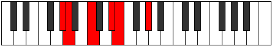
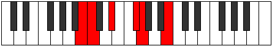

# Mode Daptitonic

## Links

- [Documentation](index.md)
- [Scales Index](Scales.md)
- [Modes Index](Modes.md)
- [Chords Index](Chords.md)

## Parent Scale

[Lycritonic](ScaleLycritonic.md)

## Number

[403](https://ianring.com/musictheory/scales/403)

## Perfection

- 2 Perfect notes
- 3 Perfect notes

## Perfection Profile

[true true false false false]

## Permutations

| Tonic | Notes | Signature | Illustration | Audio |
|-------|-------|-----------|--------------|-------|
| [C](ModeCNaturalDaptitonic.md) | C, C#, **E**, **G**, **G#**, C | C |  | [midi](https://github.com/edipermadi/music/blob/main/docs/ModeCNaturalDaptitonic.mid?raw=true) |
| [C#](ModeCSharpDaptitonic.md) | C#, D, **F**, **G#**, **A**, C# | C |  | [midi](https://github.com/edipermadi/music/blob/main/docs/ModeCSharpDaptitonic.mid?raw=true) |
| [Db](ModeDFlatDaptitonic.md) | Db, D, **F**, **Ab**, **A**, Db | C |  | [midi](https://github.com/edipermadi/music/blob/main/docs/ModeDFlatDaptitonic.mid?raw=true) |
| [D](ModeDNaturalDaptitonic.md) | D, D#, **F#**, **A**, **A#**, D | C |  | [midi](https://github.com/edipermadi/music/blob/main/docs/ModeDNaturalDaptitonic.mid?raw=true) |
| [D#](ModeDSharpDaptitonic.md) | D#, E, **G**, **A#**, **B**, D# | C |  | [midi](https://github.com/edipermadi/music/blob/main/docs/ModeDSharpDaptitonic.mid?raw=true) |
| [Eb](ModeEFlatDaptitonic.md) | Eb, E, **G**, **Bb**, **B**, Eb | C |  | [midi](https://github.com/edipermadi/music/blob/main/docs/ModeEFlatDaptitonic.mid?raw=true) |
| [E](ModeENaturalDaptitonic.md) | E, F, **G#**, **B**, **C**, E | C |  | [midi](https://github.com/edipermadi/music/blob/main/docs/ModeENaturalDaptitonic.mid?raw=true) |
| [F](ModeFNaturalDaptitonic.md) | F, F#, **A**, **C**, **C#**, F | C |  | [midi](https://github.com/edipermadi/music/blob/main/docs/ModeFNaturalDaptitonic.mid?raw=true) |
| [F#](ModeFSharpDaptitonic.md) | F#, G, **A#**, **C#**, **D**, F# | C |  | [midi](https://github.com/edipermadi/music/blob/main/docs/ModeFSharpDaptitonic.mid?raw=true) |
| [Gb](ModeGFlatDaptitonic.md) | Gb, G, **Bb**, **Db**, **D**, Gb | C |  | [midi](https://github.com/edipermadi/music/blob/main/docs/ModeGFlatDaptitonic.mid?raw=true) |
| [G](ModeGNaturalDaptitonic.md) | G, G#, **B**, **D**, **D#**, G | C |  | [midi](https://github.com/edipermadi/music/blob/main/docs/ModeGNaturalDaptitonic.mid?raw=true) |
| [G#](ModeGSharpDaptitonic.md) | G#, A, **C**, **D#**, **E**, G# | C |  | [midi](https://github.com/edipermadi/music/blob/main/docs/ModeGSharpDaptitonic.mid?raw=true) |
| [Ab](ModeAFlatDaptitonic.md) | Ab, A, **C**, **Eb**, **E**, Ab | C |  | [midi](https://github.com/edipermadi/music/blob/main/docs/ModeAFlatDaptitonic.mid?raw=true) |
| [A](ModeANaturalDaptitonic.md) | A, A#, **C#**, **E**, **F**, A | C |  | [midi](https://github.com/edipermadi/music/blob/main/docs/ModeANaturalDaptitonic.mid?raw=true) |
| [A#](ModeASharpDaptitonic.md) | A#, B, **D**, **F**, **F#**, A# | C |  | [midi](https://github.com/edipermadi/music/blob/main/docs/ModeASharpDaptitonic.mid?raw=true) |
| [Bb](ModeBFlatDaptitonic.md) | Bb, B, **D**, **F**, **Gb**, Bb | C |  | [midi](https://github.com/edipermadi/music/blob/main/docs/ModeBFlatDaptitonic.mid?raw=true) |
| [B](ModeBNaturalDaptitonic.md) | B, C, **D#**, **F#**, **G**, B | C |  | [midi](https://github.com/edipermadi/music/blob/main/docs/ModeBNaturalDaptitonic.mid?raw=true) |
