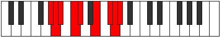

# Mode Daptyllic

## Links

- [Documentation](index.md)
- [Scales Index](Scales.md)
- [Modes Index](Modes.md)
- [Chords Index](Chords.md)

## Parent Scale

[Aeronyllic](ScaleAeronyllic.md)

## Number

[3383](https://ianring.com/musictheory/scales/3383)

## Perfection

- 4 Perfect notes
- 4 Perfect notes

## Perfection Profile

[false true false true true false true false]

## Permutations

| Tonic | Notes | Signature | Illustration | Audio |
|-------|-------|-----------|--------------|-------|
| [C](ModeCNaturalDaptyllic.md) | **C**, C#, **D**, E, F, **G#**, A#, **B**, **C** | C |  | [midi](ModeCNaturalDaptyllic.mid) [ogg](ModeCNaturalDaptyllic.ogg) |
| [C#](ModeCSharpDaptyllic.md) | **C#**, D, **D#**, F, F#, **A**, B, **C**, **C#** | C |  | [midi](ModeCSharpDaptyllic.mid) [ogg](ModeCSharpDaptyllic.ogg) |
| [Db](ModeDFlatDaptyllic.md) | **Db**, D, **Eb**, F, Gb, **A**, B, **C**, **Db** | C |  | [midi](ModeDFlatDaptyllic.mid) [ogg](ModeDFlatDaptyllic.ogg) |
| [D](ModeDNaturalDaptyllic.md) | **D**, D#, **E**, F#, G, **A#**, C, **C#**, **D** | C |  | [midi](ModeDNaturalDaptyllic.mid) [ogg](ModeDNaturalDaptyllic.ogg) |
| [D#](ModeDSharpDaptyllic.md) | **D#**, E, **F**, G, G#, **B**, C#, **D**, **D#** | C |  | [midi](ModeDSharpDaptyllic.mid) [ogg](ModeDSharpDaptyllic.ogg) |
| [Eb](ModeEFlatDaptyllic.md) | **Eb**, E, **F**, G, Ab, **B**, Db, **D**, **Eb** | C |  | [midi](ModeEFlatDaptyllic.mid) [ogg](ModeEFlatDaptyllic.ogg) |
| [E](ModeENaturalDaptyllic.md) | **E**, F, **F#**, G#, A, **C**, D, **D#**, **E** | C |  | [midi](ModeENaturalDaptyllic.mid) [ogg](ModeENaturalDaptyllic.ogg) |
| [F](ModeFNaturalDaptyllic.md) | **F**, F#, **G**, A, A#, **C#**, D#, **E**, **F** | C |  | [midi](ModeFNaturalDaptyllic.mid) [ogg](ModeFNaturalDaptyllic.ogg) |
| [F#](ModeFSharpDaptyllic.md) | **F#**, G, **G#**, A#, B, **D**, E, **F**, **F#** | C |  | [midi](ModeFSharpDaptyllic.mid) [ogg](ModeFSharpDaptyllic.ogg) |
| [Gb](ModeGFlatDaptyllic.md) | **Gb**, G, **Ab**, Bb, B, **D**, E, **F**, **Gb** | C |  | [midi](ModeGFlatDaptyllic.mid) [ogg](ModeGFlatDaptyllic.ogg) |
| [G](ModeGNaturalDaptyllic.md) | **G**, G#, **A**, B, C, **D#**, F, **F#**, **G** | C |  | [midi](ModeGNaturalDaptyllic.mid) [ogg](ModeGNaturalDaptyllic.ogg) |
| [G#](ModeGSharpDaptyllic.md) | **G#**, A, **A#**, C, C#, **E**, F#, **G**, **G#** | C |  | [midi](ModeGSharpDaptyllic.mid) [ogg](ModeGSharpDaptyllic.ogg) |
| [Ab](ModeAFlatDaptyllic.md) | **Ab**, A, **Bb**, C, Db, **E**, Gb, **G**, **Ab** | C |  | [midi](ModeAFlatDaptyllic.mid) [ogg](ModeAFlatDaptyllic.ogg) |
| [A](ModeANaturalDaptyllic.md) | **A**, A#, **B**, C#, D, **F**, G, **G#**, **A** | C |  | [midi](ModeANaturalDaptyllic.mid) [ogg](ModeANaturalDaptyllic.ogg) |
| [A#](ModeASharpDaptyllic.md) | **A#**, B, **C**, D, D#, **F#**, G#, **A**, **A#** | C |  | [midi](ModeASharpDaptyllic.mid) [ogg](ModeASharpDaptyllic.ogg) |
| [Bb](ModeBFlatDaptyllic.md) | **Bb**, B, **C**, D, Eb, **Gb**, Ab, **A**, **Bb** | C |  | [midi](ModeBFlatDaptyllic.mid) [ogg](ModeBFlatDaptyllic.ogg) |
| [B](ModeBNaturalDaptyllic.md) | **B**, C, **C#**, D#, E, **G**, A, **A#**, **B** | C |  | [midi](ModeBNaturalDaptyllic.mid) [ogg](ModeBNaturalDaptyllic.ogg) |
