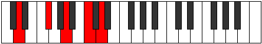
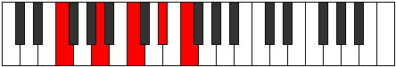
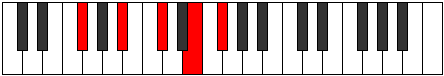
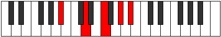

# Mode Daric

## Links

- [Documentation](index.md)
- [Scales Index](Scales.md)
- [Modes Index](Modes.md)
- [Chords Index](Chords.md)

## Parent Scale

[Daric](ScaleDaric.md)

## Number

[1169](https://ianring.com/musictheory/scales/1169)

## Perfection

- 1 Perfect notes
- 3 Perfect notes

## Perfection Profile

[true false false false]

## Permutations

| Tonic | Notes | Signature | Illustration | Audio |
|-------|-------|-----------|--------------|-------|
| [C](ModeCNaturalDaric.md) | C, **E**, **G**, **A#**, C | C |  | [midi](ModeCNaturalDaric.mid) [ogg](ModeCNaturalDaric.ogg) |
| [C#](ModeCSharpDaric.md) | C#, **F**, **G#**, **B**, C# | C |  | [midi](ModeCSharpDaric.mid) [ogg](ModeCSharpDaric.ogg) |
| [Db](ModeDFlatDaric.md) | Db, **F**, **Ab**, **B**, Db | C |  | [midi](ModeDFlatDaric.mid) [ogg](ModeDFlatDaric.ogg) |
| [D](ModeDNaturalDaric.md) | D, **F#**, **A**, **C**, D | C |  | [midi](ModeDNaturalDaric.mid) [ogg](ModeDNaturalDaric.ogg) |
| [D#](ModeDSharpDaric.md) | D#, **G**, **A#**, **C#**, D# | C |  | [midi](ModeDSharpDaric.mid) [ogg](ModeDSharpDaric.ogg) |
| [Eb](ModeEFlatDaric.md) | Eb, **G**, **Bb**, **Db**, Eb | C |  | [midi](ModeEFlatDaric.mid) [ogg](ModeEFlatDaric.ogg) |
| [E](ModeENaturalDaric.md) | E, **G#**, **B**, **D**, E | C |  | [midi](ModeENaturalDaric.mid) [ogg](ModeENaturalDaric.ogg) |
| [F](ModeFNaturalDaric.md) | F, **A**, **C**, **D#**, F | C |  | [midi](ModeFNaturalDaric.mid) [ogg](ModeFNaturalDaric.ogg) |
| [F#](ModeFSharpDaric.md) | F#, **A#**, **C#**, **E**, F# | C |  | [midi](ModeFSharpDaric.mid) [ogg](ModeFSharpDaric.ogg) |
| [Gb](ModeGFlatDaric.md) | Gb, **Bb**, **Db**, **E**, Gb | C |  | [midi](ModeGFlatDaric.mid) [ogg](ModeGFlatDaric.ogg) |
| [G](ModeGNaturalDaric.md) | G, **B**, **D**, **F**, G | C |  | [midi](ModeGNaturalDaric.mid) [ogg](ModeGNaturalDaric.ogg) |
| [G#](ModeGSharpDaric.md) | G#, **C**, **D#**, **F#**, G# | C |  | [midi](ModeGSharpDaric.mid) [ogg](ModeGSharpDaric.ogg) |
| [Ab](ModeAFlatDaric.md) | Ab, **C**, **Eb**, **Gb**, Ab | C |  | [midi](ModeAFlatDaric.mid) [ogg](ModeAFlatDaric.ogg) |
| [A](ModeANaturalDaric.md) | A, **C#**, **E**, **G**, A | C |  | [midi](ModeANaturalDaric.mid) [ogg](ModeANaturalDaric.ogg) |
| [A#](ModeASharpDaric.md) | A#, **D**, **F**, **G#**, A# | C |  | [midi](ModeASharpDaric.mid) [ogg](ModeASharpDaric.ogg) |
| [Bb](ModeBFlatDaric.md) | Bb, **D**, **F**, **Ab**, Bb | C |  | [midi](ModeBFlatDaric.mid) [ogg](ModeBFlatDaric.ogg) |
| [B](ModeBNaturalDaric.md) | B, **D#**, **F#**, **A**, B | C |  | [midi](ModeBNaturalDaric.mid) [ogg](ModeBNaturalDaric.ogg) |
