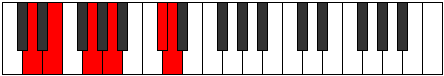
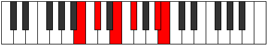

# Mode Daritonic

## Links

- [Documentation](index.md)
- [Scales Index](Scales.md)
- [Modes Index](Modes.md)
- [Chords Index](Chords.md)

## Parent Scale

[Aeracritonic](ScaleAeracritonic.md)

## Number

[2213](https://ianring.com/musictheory/scales/2213)

## Perfection

- 3 Perfect notes
- 2 Perfect notes

## Perfection Profile

[true false true true false]

## Permutations

| Tonic | Notes | Signature | Illustration | Audio |
|-------|-------|-----------|--------------|-------|
| [C](ModeCNaturalDaritonic.md) | C, **D**, F, G, **B**, C | C |  | [midi](https://github.com/edipermadi/music/blob/main/docs/ModeCNaturalDaritonic.mid?raw=true) |
| [C#](ModeCSharpDaritonic.md) | C#, **D#**, F#, G#, **C**, C# | C |  | [midi](https://github.com/edipermadi/music/blob/main/docs/ModeCSharpDaritonic.mid?raw=true) |
| [Db](ModeDFlatDaritonic.md) | Db, **Eb**, Gb, Ab, **C**, Db | C |  | [midi](https://github.com/edipermadi/music/blob/main/docs/ModeDFlatDaritonic.mid?raw=true) |
| [D](ModeDNaturalDaritonic.md) | D, **E**, G, A, **C#**, D | C |  | [midi](https://github.com/edipermadi/music/blob/main/docs/ModeDNaturalDaritonic.mid?raw=true) |
| [D#](ModeDSharpDaritonic.md) | D#, **F**, G#, A#, **D**, D# | C |  | [midi](https://github.com/edipermadi/music/blob/main/docs/ModeDSharpDaritonic.mid?raw=true) |
| [Eb](ModeEFlatDaritonic.md) | Eb, **F**, Ab, Bb, **D**, Eb | C |  | [midi](https://github.com/edipermadi/music/blob/main/docs/ModeEFlatDaritonic.mid?raw=true) |
| [E](ModeENaturalDaritonic.md) | E, **F#**, A, B, **D#**, E | C |  | [midi](https://github.com/edipermadi/music/blob/main/docs/ModeENaturalDaritonic.mid?raw=true) |
| [F](ModeFNaturalDaritonic.md) | F, **G**, A#, C, **E**, F | C |  | [midi](https://github.com/edipermadi/music/blob/main/docs/ModeFNaturalDaritonic.mid?raw=true) |
| [F#](ModeFSharpDaritonic.md) | F#, **G#**, B, C#, **F**, F# | C |  | [midi](https://github.com/edipermadi/music/blob/main/docs/ModeFSharpDaritonic.mid?raw=true) |
| [Gb](ModeGFlatDaritonic.md) | Gb, **Ab**, B, Db, **F**, Gb | C |  | [midi](https://github.com/edipermadi/music/blob/main/docs/ModeGFlatDaritonic.mid?raw=true) |
| [G](ModeGNaturalDaritonic.md) | G, **A**, C, D, **F#**, G | C |  | [midi](https://github.com/edipermadi/music/blob/main/docs/ModeGNaturalDaritonic.mid?raw=true) |
| [G#](ModeGSharpDaritonic.md) | G#, **A#**, C#, D#, **G**, G# | C |  | [midi](https://github.com/edipermadi/music/blob/main/docs/ModeGSharpDaritonic.mid?raw=true) |
| [Ab](ModeAFlatDaritonic.md) | Ab, **Bb**, Db, Eb, **G**, Ab | C |  | [midi](https://github.com/edipermadi/music/blob/main/docs/ModeAFlatDaritonic.mid?raw=true) |
| [A](ModeANaturalDaritonic.md) | A, **B**, D, E, **G#**, A | C |  | [midi](https://github.com/edipermadi/music/blob/main/docs/ModeANaturalDaritonic.mid?raw=true) |
| [A#](ModeASharpDaritonic.md) | A#, **C**, D#, F, **A**, A# | C |  | [midi](https://github.com/edipermadi/music/blob/main/docs/ModeASharpDaritonic.mid?raw=true) |
| [Bb](ModeBFlatDaritonic.md) | Bb, **C**, Eb, F, **A**, Bb | C |  | [midi](https://github.com/edipermadi/music/blob/main/docs/ModeBFlatDaritonic.mid?raw=true) |
| [B](ModeBNaturalDaritonic.md) | B, **C#**, E, F#, **A#**, B | C |  | [midi](https://github.com/edipermadi/music/blob/main/docs/ModeBNaturalDaritonic.mid?raw=true) |
