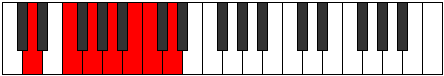
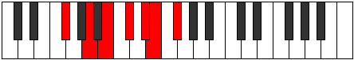

# Mode Darmic

## Links

- [Documentation](README.md)
- [Scales Index](Scales.md)
- [Modes Index](Modes.md)
- [Chords Index](Chords.md)

## Parent Scale

[Darmic](ScaleDarmic.md)

## Number

[1705](https://ianring.com/musictheory/scales/1705)

## Transposition

3, 2, 2, 2, 1, 2

## Chord Pattern

II, III

## Perfection

- 4 Perfect notes
- 2 Perfect notes

## Perfection Profile

[true true true false false true]

## Permutations

| Tonic | Notes | Signature | Illustration | Audio |
|-------|-------|-----------|--------------|-------|
| [C](ModeCNaturalDarmic.md) | C, D#, E#, **F##**, **G##**, A#, C | C |  | [midi](https://github.com/edipermadi/music/blob/main/docs/ModeCNaturalDarmic.mid?raw=true) |
| [C#](ModeCSharpDarmic.md) | C#, D##, E##, **F###**, **G###**, A##, C# | C |  | [midi](https://github.com/edipermadi/music/blob/main/docs/ModeCSharpDarmic.mid?raw=true) |
| [Db](ModeDFlatDarmic.md) | Db, E, F#, **G#**, **A#**, B, Db | C |  | [midi](https://github.com/edipermadi/music/blob/main/docs/ModeDFlatDarmic.mid?raw=true) |
| [D](ModeDNaturalDarmic.md) | D, E#, F##, **G##**, **A##**, B#, D | C |  | [midi](https://github.com/edipermadi/music/blob/main/docs/ModeDNaturalDarmic.mid?raw=true) |
| [D#](ModeDSharpDarmic.md) | D#, E##, F###, **G###**, **A###**, B##, D# | C |  | [midi](https://github.com/edipermadi/music/blob/main/docs/ModeDSharpDarmic.mid?raw=true) |
| [Eb](ModeEFlatDarmic.md) | Eb, F#, G#, **A#**, **B#**, C#, Eb | C |  | [midi](https://github.com/edipermadi/music/blob/main/docs/ModeEFlatDarmic.mid?raw=true) |
| [E](ModeENaturalDarmic.md) | E, F##, G##, **A##**, **B##**, C##, E | C |  | [midi](https://github.com/edipermadi/music/blob/main/docs/ModeENaturalDarmic.mid?raw=true) |
| [F](ModeFNaturalDarmic.md) | F, G#, A#, **B#**, **C##**, D#, F | C |  | [midi](https://github.com/edipermadi/music/blob/main/docs/ModeFNaturalDarmic.mid?raw=true) |
| [F#](ModeFSharpDarmic.md) | F#, G##, A##, **B##**, **C###**, D##, F# | C |  | [midi](https://github.com/edipermadi/music/blob/main/docs/ModeFSharpDarmic.mid?raw=true) |
| [Gb](ModeGFlatDarmic.md) | Gb, A, B, **C#**, **D#**, E, Gb | C |  | [midi](https://github.com/edipermadi/music/blob/main/docs/ModeGFlatDarmic.mid?raw=true) |
| [G](ModeGNaturalDarmic.md) | G, A#, B#, **C##**, **D##**, E#, G | C |  | [midi](https://github.com/edipermadi/music/blob/main/docs/ModeGNaturalDarmic.mid?raw=true) |
| [G#](ModeGSharpDarmic.md) | G#, A##, B##, **C###**, **D###**, E##, G# | C |  | [midi](https://github.com/edipermadi/music/blob/main/docs/ModeGSharpDarmic.mid?raw=true) |
| [Ab](ModeAFlatDarmic.md) | Ab, B, C#, **D#**, **E#**, F#, Ab | C |  | [midi](https://github.com/edipermadi/music/blob/main/docs/ModeAFlatDarmic.mid?raw=true) |
| [A](ModeANaturalDarmic.md) | A, B#, C##, **D##**, **E##**, F##, A | C |  | [midi](https://github.com/edipermadi/music/blob/main/docs/ModeANaturalDarmic.mid?raw=true) |
| [A#](ModeASharpDarmic.md) | A#, B##, C###, **D###**, **E###**, F###, A# | C |  | [midi](https://github.com/edipermadi/music/blob/main/docs/ModeASharpDarmic.mid?raw=true) |
| [Bb](ModeBFlatDarmic.md) | Bb, C#, D#, **E#**, **F##**, G#, Bb | C |  | [midi](https://github.com/edipermadi/music/blob/main/docs/ModeBFlatDarmic.mid?raw=true) |
| [B](ModeBNaturalDarmic.md) | B, C##, D##, **E##**, **F###**, G##, B | C |  | [midi](https://github.com/edipermadi/music/blob/main/docs/ModeBNaturalDarmic.mid?raw=true) |
