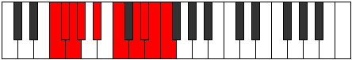

# Mode Darygic

## Links

- [Documentation](index.md)
- [Scales Index](Scales.md)
- [Modes Index](Modes.md)
- [Chords Index](Chords.md)

## Parent Scale

[Kyrygic](ScaleKyrygic.md)

## Number

[3759](https://ianring.com/musictheory/scales/3759)

## Perfection

- 6 Perfect notes
- 3 Perfect notes

## Perfection Profile

[true false true true true true false true false]

## Permutations

| Tonic | Notes | Signature | Illustration | Audio |
|-------|-------|-----------|--------------|-------|
| [C](ModeCNaturalDarygic.md) | C, **C#**, D, D#, F, G, **A**, A#, **B**, C | C |  | [midi](ModeCNaturalDarygic.mid) [ogg](ModeCNaturalDarygic.ogg) |
| [C#](ModeCSharpDarygic.md) | C#, **D**, D#, E, F#, G#, **A#**, B, **C**, C# | C |  | [midi](ModeCSharpDarygic.mid) [ogg](ModeCSharpDarygic.ogg) |
| [Db](ModeDFlatDarygic.md) | Db, **D**, Eb, E, Gb, Ab, **Bb**, B, **C**, Db | C |  | [midi](ModeDFlatDarygic.mid) [ogg](ModeDFlatDarygic.ogg) |
| [D](ModeDNaturalDarygic.md) | D, **D#**, E, F, G, A, **B**, C, **C#**, D | C |  | [midi](ModeDNaturalDarygic.mid) [ogg](ModeDNaturalDarygic.ogg) |
| [D#](ModeDSharpDarygic.md) | D#, **E**, F, F#, G#, A#, **C**, C#, **D**, D# | C |  | [midi](ModeDSharpDarygic.mid) [ogg](ModeDSharpDarygic.ogg) |
| [Eb](ModeEFlatDarygic.md) | Eb, **E**, F, Gb, Ab, Bb, **C**, Db, **D**, Eb | C |  | [midi](ModeEFlatDarygic.mid) [ogg](ModeEFlatDarygic.ogg) |
| [E](ModeENaturalDarygic.md) | E, **F**, F#, G, A, B, **C#**, D, **D#**, E | C |  | [midi](ModeENaturalDarygic.mid) [ogg](ModeENaturalDarygic.ogg) |
| [F](ModeFNaturalDarygic.md) | F, **F#**, G, G#, A#, C, **D**, D#, **E**, F | C |  | [midi](ModeFNaturalDarygic.mid) [ogg](ModeFNaturalDarygic.ogg) |
| [F#](ModeFSharpDarygic.md) | F#, **G**, G#, A, B, C#, **D#**, E, **F**, F# | C |  | [midi](ModeFSharpDarygic.mid) [ogg](ModeFSharpDarygic.ogg) |
| [Gb](ModeGFlatDarygic.md) | Gb, **G**, Ab, A, B, Db, **Eb**, E, **F**, Gb | C |  | [midi](ModeGFlatDarygic.mid) [ogg](ModeGFlatDarygic.ogg) |
| [G](ModeGNaturalDarygic.md) | G, **G#**, A, A#, C, D, **E**, F, **F#**, G | C |  | [midi](ModeGNaturalDarygic.mid) [ogg](ModeGNaturalDarygic.ogg) |
| [G#](ModeGSharpDarygic.md) | G#, **A**, A#, B, C#, D#, **F**, F#, **G**, G# | C |  | [midi](ModeGSharpDarygic.mid) [ogg](ModeGSharpDarygic.ogg) |
| [Ab](ModeAFlatDarygic.md) | Ab, **A**, Bb, B, Db, Eb, **F**, Gb, **G**, Ab | C |  | [midi](ModeAFlatDarygic.mid) [ogg](ModeAFlatDarygic.ogg) |
| [A](ModeANaturalDarygic.md) | A, **A#**, B, C, D, E, **F#**, G, **G#**, A | C |  | [midi](ModeANaturalDarygic.mid) [ogg](ModeANaturalDarygic.ogg) |
| [A#](ModeASharpDarygic.md) | A#, **B**, C, C#, D#, F, **G**, G#, **A**, A# | C |  | [midi](ModeASharpDarygic.mid) [ogg](ModeASharpDarygic.ogg) |
| [Bb](ModeBFlatDarygic.md) | Bb, **B**, C, Db, Eb, F, **G**, Ab, **A**, Bb | C |  | [midi](ModeBFlatDarygic.mid) [ogg](ModeBFlatDarygic.ogg) |
| [B](ModeBNaturalDarygic.md) | B, **C**, C#, D, E, F#, **G#**, A, **A#**, B | C |  | [midi](ModeBNaturalDarygic.mid) [ogg](ModeBNaturalDarygic.ogg) |
