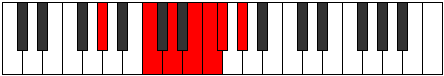

# Mode Dathimic

## Links

- [Documentation](index.md)
- [Scales Index](Scales.md)
- [Modes Index](Modes.md)
- [Chords Index](Chords.md)

## Parent Scale

[Dathimic](ScaleDathimic.md)

## Number

[1873](https://ianring.com/musictheory/scales/1873)

## Perfection

- 1 Perfect notes
- 5 Perfect notes

## Perfection Profile

[false false false false true false]

## Permutations

| Tonic | Notes | Signature | Illustration | Audio |
|-------|-------|-----------|--------------|-------|
| [C](ModeCNaturalDathimic.md) | **C**, **D##**, **E##**, **F###**, G##, **A#**, **C** | C |  | [midi](ModeCNaturalDathimic.mid) [ogg](ModeCNaturalDathimic.ogg) |
| [C#](ModeCSharpDathimic.md) | **C#**, **D###**, **E###**, **Cbbb**, Cbb, **Dbbb**, **C#** | C |  | [midi](ModeCSharpDathimic.mid) [ogg](ModeCSharpDathimic.ogg) |
| [Db](ModeDFlatDathimic.md) | **Db**, **E#**, **F##**, **G##**, A#, **B**, **Db** | C |  | [midi](ModeDFlatDathimic.mid) [ogg](ModeDFlatDathimic.ogg) |
| [D](ModeDNaturalDathimic.md) | **D**, **E##**, **F###**, **G###**, A##, **B#**, **D** | C |  | [midi](ModeDNaturalDathimic.mid) [ogg](ModeDNaturalDathimic.ogg) |
| [D#](ModeDSharpDathimic.md) | **D#**, **E###**, **Cbbb**, **Dbbb**, Dbb, **Ebbb**, **D#** | C |  | [midi](ModeDSharpDathimic.mid) [ogg](ModeDSharpDathimic.ogg) |
| [Eb](ModeEFlatDathimic.md) | **Eb**, **F##**, **G##**, **A##**, B#, **C#**, **Eb** | C |  | [midi](ModeEFlatDathimic.mid) [ogg](ModeEFlatDathimic.ogg) |
| [E](ModeENaturalDathimic.md) | **E**, **F###**, **G###**, **A###**, B##, **C##**, **E** | C |  | [midi](ModeENaturalDathimic.mid) [ogg](ModeENaturalDathimic.ogg) |
| [F](ModeFNaturalDathimic.md) | **F**, **G##**, **A##**, **B##**, C##, **D#**, **F** | C |  | [midi](ModeFNaturalDathimic.mid) [ogg](ModeFNaturalDathimic.ogg) |
| [F#](ModeFSharpDathimic.md) | **F#**, **G###**, **A###**, **B###**, C###, **D##**, **F#** | C |  | [midi](ModeFSharpDathimic.mid) [ogg](ModeFSharpDathimic.ogg) |
| [Gb](ModeGFlatDathimic.md) | **Gb**, **A#**, **B#**, **C##**, D#, **E**, **Gb** | C |  | [midi](ModeGFlatDathimic.mid) [ogg](ModeGFlatDathimic.ogg) |
| [G](ModeGNaturalDathimic.md) | **G**, **A##**, **B##**, **C###**, D##, **E#**, **G** | C |  | [midi](ModeGNaturalDathimic.mid) [ogg](ModeGNaturalDathimic.ogg) |
| [G#](ModeGSharpDathimic.md) | **G#**, **A###**, **B###**, **D##**, E#, **F#**, **G#** | C |  | [midi](ModeGSharpDathimic.mid) [ogg](ModeGSharpDathimic.ogg) |
| [Ab](ModeAFlatDathimic.md) | **Ab**, **B#**, **C##**, **D##**, E#, **F#**, **Ab** | C |  | [midi](ModeAFlatDathimic.mid) [ogg](ModeAFlatDathimic.ogg) |
| [A](ModeANaturalDathimic.md) | **A**, **B##**, **C###**, **D###**, E##, **F##**, **A** | C |  | [midi](ModeANaturalDathimic.mid) [ogg](ModeANaturalDathimic.ogg) |
| [A#](ModeASharpDathimic.md) | **A#**, **B###**, **D##**, **E##**, F##, **G#**, **A#** | C |  | [midi](ModeASharpDathimic.mid) [ogg](ModeASharpDathimic.ogg) |
| [Bb](ModeBFlatDathimic.md) | **Bb**, **C##**, **D##**, **E##**, F##, **G#**, **Bb** | C |  | [midi](ModeBFlatDathimic.mid) [ogg](ModeBFlatDathimic.ogg) |
| [B](ModeBNaturalDathimic.md) | **B**, **C###**, **D###**, **E###**, F###, **G##**, **B** | C |  | [midi](ModeBNaturalDathimic.mid) [ogg](ModeBNaturalDathimic.ogg) |
