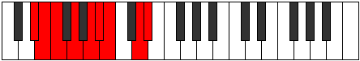

# Mode Dathyllic

## Links

- [Documentation](index.md)
- [Scales Index](Scales.md)
- [Modes Index](Modes.md)
- [Chords Index](Chords.md)

## Parent Scale

[Bacryllic](ScaleBacryllic.md)

## Number

[2519](https://ianring.com/musictheory/scales/2519)

## Perfection

- 6 Perfect notes
- 2 Perfect notes

## Perfection Profile

[true true false true true true false true]

## Permutations

| Tonic | Notes | Signature | Illustration | Audio |
|-------|-------|-----------|--------------|-------|
| [C](ModeCNaturalDathyllic.md) | C, C#, **D**, E, F#, G, **G#**, B, C | C |  | [midi](ModeCNaturalDathyllic.mid) [ogg](ModeCNaturalDathyllic.ogg) |
| [C#](ModeCSharpDathyllic.md) | C#, D, **D#**, F, G, G#, **A**, C, C# | C |  | [midi](ModeCSharpDathyllic.mid) [ogg](ModeCSharpDathyllic.ogg) |
| [Db](ModeDFlatDathyllic.md) | Db, D, **Eb**, F, G, Ab, **A**, C, Db | C |  | [midi](ModeDFlatDathyllic.mid) [ogg](ModeDFlatDathyllic.ogg) |
| [D](ModeDNaturalDathyllic.md) | D, D#, **E**, F#, G#, A, **A#**, C#, D | C |  | [midi](ModeDNaturalDathyllic.mid) [ogg](ModeDNaturalDathyllic.ogg) |
| [D#](ModeDSharpDathyllic.md) | D#, E, **F**, G, A, A#, **B**, D, D# | C |  | [midi](ModeDSharpDathyllic.mid) [ogg](ModeDSharpDathyllic.ogg) |
| [Eb](ModeEFlatDathyllic.md) | Eb, E, **F**, G, A, Bb, **B**, D, Eb | C |  | [midi](ModeEFlatDathyllic.mid) [ogg](ModeEFlatDathyllic.ogg) |
| [E](ModeENaturalDathyllic.md) | E, F, **F#**, G#, A#, B, **C**, D#, E | C |  | [midi](ModeENaturalDathyllic.mid) [ogg](ModeENaturalDathyllic.ogg) |
| [F](ModeFNaturalDathyllic.md) | F, F#, **G**, A, B, C, **C#**, E, F | C |  | [midi](ModeFNaturalDathyllic.mid) [ogg](ModeFNaturalDathyllic.ogg) |
| [F#](ModeFSharpDathyllic.md) | F#, G, **G#**, A#, C, C#, **D**, F, F# | C |  | [midi](ModeFSharpDathyllic.mid) [ogg](ModeFSharpDathyllic.ogg) |
| [Gb](ModeGFlatDathyllic.md) | Gb, G, **Ab**, Bb, C, Db, **D**, F, Gb | C |  | [midi](ModeGFlatDathyllic.mid) [ogg](ModeGFlatDathyllic.ogg) |
| [G](ModeGNaturalDathyllic.md) | G, G#, **A**, B, C#, D, **D#**, F#, G | C |  | [midi](ModeGNaturalDathyllic.mid) [ogg](ModeGNaturalDathyllic.ogg) |
| [G#](ModeGSharpDathyllic.md) | G#, A, **A#**, C, D, D#, **E**, G, G# | C |  | [midi](ModeGSharpDathyllic.mid) [ogg](ModeGSharpDathyllic.ogg) |
| [Ab](ModeAFlatDathyllic.md) | Ab, A, **Bb**, C, D, Eb, **E**, G, Ab | C |  | [midi](ModeAFlatDathyllic.mid) [ogg](ModeAFlatDathyllic.ogg) |
| [A](ModeANaturalDathyllic.md) | A, A#, **B**, C#, D#, E, **F**, G#, A | C |  | [midi](ModeANaturalDathyllic.mid) [ogg](ModeANaturalDathyllic.ogg) |
| [A#](ModeASharpDathyllic.md) | A#, B, **C**, D, E, F, **F#**, A, A# | C |  | [midi](ModeASharpDathyllic.mid) [ogg](ModeASharpDathyllic.ogg) |
| [Bb](ModeBFlatDathyllic.md) | Bb, B, **C**, D, E, F, **Gb**, A, Bb | C |  | [midi](ModeBFlatDathyllic.mid) [ogg](ModeBFlatDathyllic.ogg) |
| [B](ModeBNaturalDathyllic.md) | B, C, **C#**, D#, F, F#, **G**, A#, B | C |  | [midi](ModeBNaturalDathyllic.mid) [ogg](ModeBNaturalDathyllic.ogg) |
