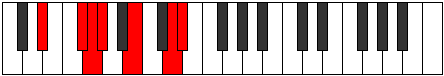
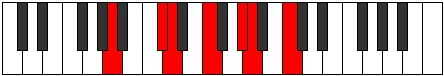

# Mode Docrimic

## Links

- [Documentation](README.md)
- [Scales Index](Scales.md)
- [Modes Index](Modes.md)
- [Chords Index](Chords.md)

## Parent Scale

[Ionodimic](ScaleIonodimic.md)

## Number

[2361](https://ianring.com/musictheory/scales/2361)

## Transposition

3, 1, 1, 3, 3, 1

## Chord Pattern

I⁺, III⁺, V⁺, VIb5

## Perfection

- 3 Perfect notes
- 3 Perfect notes

## Perfection Profile

false, false, true, true, true, false

## Permutations

| Tonic | Notes | Signature | Illustration | Audio |
|-------|-------|-----------|--------------|-------|
| [C](ModeCNaturalDocrimic.md) | **C**, **D#**, E, F, G#, **A##**, **C** | C |  | [midi](https://github.com/edipermadi/music/blob/main/docs/ModeCNaturalDocrimic.mid?raw=true) |
| [C#](ModeCSharpDocrimic.md) | **C#**, **D##**, E#, F#, G##, **A###**, **C#** | C |  | [midi](https://github.com/edipermadi/music/blob/main/docs/ModeCSharpDocrimic.mid?raw=true) |
| [Db](ModeDFlatDocrimic.md) | **Db**, **E**, F, Gb, A, **B#**, **Db** | C |  | [midi](https://github.com/edipermadi/music/blob/main/docs/ModeDFlatDocrimic.mid?raw=true) |
| [D](ModeDNaturalDocrimic.md) | **D**, **E#**, F#, G, A#, **B##**, **D** | C |  | [midi](https://github.com/edipermadi/music/blob/main/docs/ModeDNaturalDocrimic.mid?raw=true) |
| [D#](ModeDSharpDocrimic.md) | **D#**, **E##**, F##, G#, A##, **B###**, **D#** | C |  | [midi](https://github.com/edipermadi/music/blob/main/docs/ModeDSharpDocrimic.mid?raw=true) |
| [Eb](ModeEFlatDocrimic.md) | **Eb**, **F#**, G, Ab, B, **C##**, **Eb** | C |  | [midi](https://github.com/edipermadi/music/blob/main/docs/ModeEFlatDocrimic.mid?raw=true) |
| [E](ModeENaturalDocrimic.md) | **E**, **F##**, G#, A, B#, **C###**, **E** | C |  | [midi](https://github.com/edipermadi/music/blob/main/docs/ModeENaturalDocrimic.mid?raw=true) |
| [F](ModeFNaturalDocrimic.md) | **F**, **G#**, A, Bb, C#, **D##**, **F** | C |  | [midi](https://github.com/edipermadi/music/blob/main/docs/ModeFNaturalDocrimic.mid?raw=true) |
| [F#](ModeFSharpDocrimic.md) | **F#**, **G##**, A#, B, C##, **D###**, **F#** | C |  | [midi](https://github.com/edipermadi/music/blob/main/docs/ModeFSharpDocrimic.mid?raw=true) |
| [Gb](ModeGFlatDocrimic.md) | **Gb**, **A**, Bb, Cb, D, **E#**, **Gb** | C |  | [midi](https://github.com/edipermadi/music/blob/main/docs/ModeGFlatDocrimic.mid?raw=true) |
| [G](ModeGNaturalDocrimic.md) | **G**, **A#**, B, C, D#, **E##**, **G** | C |  | [midi](https://github.com/edipermadi/music/blob/main/docs/ModeGNaturalDocrimic.mid?raw=true) |
| [G#](ModeGSharpDocrimic.md) | **G#**, **A##**, B#, C#, D##, **E###**, **G#** | C |  | [midi](https://github.com/edipermadi/music/blob/main/docs/ModeGSharpDocrimic.mid?raw=true) |
| [Ab](ModeAFlatDocrimic.md) | **Ab**, **B**, C, Db, E, **F##**, **Ab** | C |  | [midi](https://github.com/edipermadi/music/blob/main/docs/ModeAFlatDocrimic.mid?raw=true) |
| [A](ModeANaturalDocrimic.md) | **A**, **B#**, C#, D, E#, **F###**, **A** | C |  | [midi](https://github.com/edipermadi/music/blob/main/docs/ModeANaturalDocrimic.mid?raw=true) |
| [A#](ModeASharpDocrimic.md) | **A#**, **B##**, C##, D#, E##, **Cbbb**, **A#** | C |  | [midi](https://github.com/edipermadi/music/blob/main/docs/ModeASharpDocrimic.mid?raw=true) |
| [Bb](ModeBFlatDocrimic.md) | **Bb**, **C#**, D, Eb, F#, **G##**, **Bb** | C |  | [midi](https://github.com/edipermadi/music/blob/main/docs/ModeBFlatDocrimic.mid?raw=true) |
| [B](ModeBNaturalDocrimic.md) | **B**, **C##**, D#, E, F##, **G###**, **B** | C |  | [midi](https://github.com/edipermadi/music/blob/main/docs/ModeBNaturalDocrimic.mid?raw=true) |
