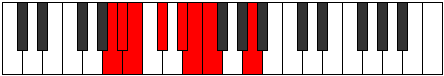

# Mode Dodian

## Links

- [Documentation](index.md)
- [Scales Index](Scales.md)
- [Modes Index](Modes.md)
- [Chords Index](Chords.md)

## Parent Scale

[Thacrian](ScaleThacrian.md)

## Number

[471](https://ianring.com/musictheory/scales/471)

## Perfection

- 4 Perfect notes
- 3 Perfect notes

## Perfection Profile

[true true false false true true false]

## Permutations

| Tonic | Notes | Signature | Illustration | Audio |
|-------|-------|-----------|--------------|-------|
| [C](ModeCNaturalDodian.md) | C, Db, **Ebb**, **Fb**, Gb, Abb, **Bbbb**, C | C |  | [midi](ModeCNaturalDodian.mid) [ogg](ModeCNaturalDodian.ogg) |
| [C#](ModeCSharpDodian.md) | C#, D, **Eb**, **F**, G, Ab, **Bbb**, C# | C |  | [midi](ModeCSharpDodian.mid) [ogg](ModeCSharpDodian.ogg) |
| [Db](ModeDFlatDodian.md) | Db, Ebb, **Fbb**, **Gbb**, Abb, Bbbb, **Cbbb**, Db | C |  | [midi](ModeDFlatDodian.mid) [ogg](ModeDFlatDodian.ogg) |
| [D](ModeDNaturalDodian.md) | D, Eb, **Fb**, **Gb**, Ab, Bbb, **Cbb**, D | C |  | [midi](ModeDNaturalDodian.mid) [ogg](ModeDNaturalDodian.ogg) |
| [D#](ModeDSharpDodian.md) | D#, E, **F**, **G**, A, Bb, **Cb**, D# | C |  | [midi](ModeDSharpDodian.mid) [ogg](ModeDSharpDodian.ogg) |
| [Eb](ModeEFlatDodian.md) | Eb, Fb, **Gbb**, **Abb**, Bbb, Cbb, **Dbbb**, Eb | C |  | [midi](ModeEFlatDodian.mid) [ogg](ModeEFlatDodian.ogg) |
| [E](ModeENaturalDodian.md) | E, F, **Gb**, **Ab**, Bb, Cb, **Dbb**, E | C |  | [midi](ModeENaturalDodian.mid) [ogg](ModeENaturalDodian.ogg) |
| [F](ModeFNaturalDodian.md) | F, Gb, **Abb**, **Bbb**, Cb, Dbb, **Ebbb**, F | C |  | [midi](ModeFNaturalDodian.mid) [ogg](ModeFNaturalDodian.ogg) |
| [F#](ModeFSharpDodian.md) | F#, G, **Ab**, **Bb**, C, Db, **Ebb**, F# | C |  | [midi](ModeFSharpDodian.mid) [ogg](ModeFSharpDodian.ogg) |
| [Gb](ModeGFlatDodian.md) | Gb, Abb, **Bbbb**, **Cbb**, Dbb, Ebbb, **Fbbb**, Gb | C |  | [midi](ModeGFlatDodian.mid) [ogg](ModeGFlatDodian.ogg) |
| [G](ModeGNaturalDodian.md) | G, Ab, **Bbb**, **Cb**, Db, Ebb, **Fbb**, G | C |  | [midi](ModeGNaturalDodian.mid) [ogg](ModeGNaturalDodian.ogg) |
| [G#](ModeGSharpDodian.md) | G#, A, **Bb**, **C**, D, Eb, **Fb**, G# | C |  | [midi](ModeGSharpDodian.mid) [ogg](ModeGSharpDodian.ogg) |
| [Ab](ModeAFlatDodian.md) | Ab, Bbb, **Cbb**, **Dbb**, Ebb, Fbb, **Gbbb**, Ab | C |  | [midi](ModeAFlatDodian.mid) [ogg](ModeAFlatDodian.ogg) |
| [A](ModeANaturalDodian.md) | A, Bb, **Cb**, **Db**, Eb, Fb, **Gbb**, A | C |  | [midi](ModeANaturalDodian.mid) [ogg](ModeANaturalDodian.ogg) |
| [A#](ModeASharpDodian.md) | A#, B, **C**, **D**, E, F, **Gb**, A# | C |  | [midi](ModeASharpDodian.mid) [ogg](ModeASharpDodian.ogg) |
| [Bb](ModeBFlatDodian.md) | Bb, Cb, **Dbb**, **Ebb**, Fb, Gbb, **Abbb**, Bb | C |  | [midi](ModeBFlatDodian.mid) [ogg](ModeBFlatDodian.ogg) |
| [B](ModeBNaturalDodian.md) | B, C, **Db**, **Eb**, F, Gb, **Abb**, B | C |  | [midi](ModeBNaturalDodian.mid) [ogg](ModeBNaturalDodian.ogg) |
