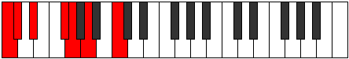

# Mode Dodimic

## Links

- [Documentation](index.md)
- [Scales Index](Scales.md)
- [Modes Index](Modes.md)
- [Chords Index](Chords.md)

## Parent Scale

[Lythimic](ScaleLythimic.md)

## Number

[715](https://ianring.com/musictheory/scales/715)

## Perfection

- 2 Perfect notes
- 4 Perfect notes

## Perfection Profile

[true false false true false false]

## Permutations

| Tonic | Notes | Signature | Illustration | Audio |
|-------|-------|-----------|--------------|-------|
| [C](ModeCNaturalDodimic.md) | C, **Db**, **Eb**, F#, **G**, **A**, C | C |  | [midi](ModeCNaturalDodimic.mid) [ogg](ModeCNaturalDodimic.ogg) |
| [C#](ModeCSharpDodimic.md) | C#, **D**, **E**, F##, **G#**, **A#**, C# | C |  | [midi](ModeCSharpDodimic.mid) [ogg](ModeCSharpDodimic.ogg) |
| [Db](ModeDFlatDodimic.md) | Db, **Ebb**, **Fb**, G, **Ab**, **Bb**, Db | C |  | [midi](ModeDFlatDodimic.mid) [ogg](ModeDFlatDodimic.ogg) |
| [D](ModeDNaturalDodimic.md) | D, **Eb**, **F**, G#, **A**, **B**, D | C |  | [midi](ModeDNaturalDodimic.mid) [ogg](ModeDNaturalDodimic.ogg) |
| [D#](ModeDSharpDodimic.md) | D#, **E**, **F#**, G##, **A#**, **B#**, D# | C |  | [midi](ModeDSharpDodimic.mid) [ogg](ModeDSharpDodimic.ogg) |
| [Eb](ModeEFlatDodimic.md) | Eb, **Fb**, **Gb**, A, **Bb**, **C**, Eb | C |  | [midi](ModeEFlatDodimic.mid) [ogg](ModeEFlatDodimic.ogg) |
| [E](ModeENaturalDodimic.md) | E, **F**, **G**, A#, **B**, **C#**, E | C |  | [midi](ModeENaturalDodimic.mid) [ogg](ModeENaturalDodimic.ogg) |
| [F](ModeFNaturalDodimic.md) | F, **Gb**, **Ab**, B, **C**, **D**, F | C |  | [midi](ModeFNaturalDodimic.mid) [ogg](ModeFNaturalDodimic.ogg) |
| [F#](ModeFSharpDodimic.md) | F#, **G**, **A**, B#, **C#**, **D#**, F# | C |  | [midi](ModeFSharpDodimic.mid) [ogg](ModeFSharpDodimic.ogg) |
| [Gb](ModeGFlatDodimic.md) | Gb, **Abb**, **Bbb**, C, **Db**, **Eb**, Gb | C |  | [midi](ModeGFlatDodimic.mid) [ogg](ModeGFlatDodimic.ogg) |
| [G](ModeGNaturalDodimic.md) | G, **Ab**, **Bb**, C#, **D**, **E**, G | C |  | [midi](ModeGNaturalDodimic.mid) [ogg](ModeGNaturalDodimic.ogg) |
| [G#](ModeGSharpDodimic.md) | G#, **A**, **B**, C##, **D#**, **E#**, G# | C |  | [midi](ModeGSharpDodimic.mid) [ogg](ModeGSharpDodimic.ogg) |
| [Ab](ModeAFlatDodimic.md) | Ab, **Bbb**, **Cb**, D, **Eb**, **F**, Ab | C |  | [midi](ModeAFlatDodimic.mid) [ogg](ModeAFlatDodimic.ogg) |
| [A](ModeANaturalDodimic.md) | A, **Bb**, **C**, D#, **E**, **F#**, A | C |  | [midi](ModeANaturalDodimic.mid) [ogg](ModeANaturalDodimic.ogg) |
| [A#](ModeASharpDodimic.md) | A#, **B**, **C#**, D##, **E#**, **F##**, A# | C |  | [midi](ModeASharpDodimic.mid) [ogg](ModeASharpDodimic.ogg) |
| [Bb](ModeBFlatDodimic.md) | Bb, **Cb**, **Db**, E, **F**, **G**, Bb | C |  | [midi](ModeBFlatDodimic.mid) [ogg](ModeBFlatDodimic.ogg) |
| [B](ModeBNaturalDodimic.md) | B, **C**, **D**, E#, **F#**, **G#**, B | C |  | [midi](ModeBNaturalDodimic.mid) [ogg](ModeBNaturalDodimic.ogg) |
