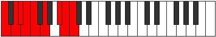

# Mode Dodyllic

## Links

- [Documentation](index.md)
- [Scales Index](Scales.md)
- [Modes Index](Modes.md)
- [Chords Index](Chords.md)

## Parent Scale

[Dagyllic](ScaleDagyllic.md)

## Number

[3261](https://ianring.com/musictheory/scales/3261)

## Perfection

- 6 Perfect notes
- 2 Perfect notes

## Perfection Profile

[true false true true true true true false]

## Permutations

| Tonic | Notes | Signature | Illustration | Audio |
|-------|-------|-----------|--------------|-------|
| [C](ModeCNaturalDodyllic.md) | C, **D**, D#, E, F, G, A#, **B**, C | C |  | [midi](ModeCNaturalDodyllic.mid) [ogg](ModeCNaturalDodyllic.ogg) |
| [C#](ModeCSharpDodyllic.md) | C#, **D#**, E, F, F#, G#, B, **C**, C# | C |  | [midi](ModeCSharpDodyllic.mid) [ogg](ModeCSharpDodyllic.ogg) |
| [Db](ModeDFlatDodyllic.md) | Db, **Eb**, E, F, Gb, Ab, B, **C**, Db | C |  | [midi](ModeDFlatDodyllic.mid) [ogg](ModeDFlatDodyllic.ogg) |
| [D](ModeDNaturalDodyllic.md) | D, **E**, F, F#, G, A, C, **C#**, D | C |  | [midi](ModeDNaturalDodyllic.mid) [ogg](ModeDNaturalDodyllic.ogg) |
| [D#](ModeDSharpDodyllic.md) | D#, **F**, F#, G, G#, A#, C#, **D**, D# | C |  | [midi](ModeDSharpDodyllic.mid) [ogg](ModeDSharpDodyllic.ogg) |
| [Eb](ModeEFlatDodyllic.md) | Eb, **F**, Gb, G, Ab, Bb, Db, **D**, Eb | C |  | [midi](ModeEFlatDodyllic.mid) [ogg](ModeEFlatDodyllic.ogg) |
| [E](ModeENaturalDodyllic.md) | E, **F#**, G, G#, A, B, D, **D#**, E | C |  | [midi](ModeENaturalDodyllic.mid) [ogg](ModeENaturalDodyllic.ogg) |
| [F](ModeFNaturalDodyllic.md) | F, **G**, G#, A, A#, C, D#, **E**, F | C |  | [midi](ModeFNaturalDodyllic.mid) [ogg](ModeFNaturalDodyllic.ogg) |
| [F#](ModeFSharpDodyllic.md) | F#, **G#**, A, A#, B, C#, E, **F**, F# | C |  | [midi](ModeFSharpDodyllic.mid) [ogg](ModeFSharpDodyllic.ogg) |
| [Gb](ModeGFlatDodyllic.md) | Gb, **Ab**, A, Bb, B, Db, E, **F**, Gb | C |  | [midi](ModeGFlatDodyllic.mid) [ogg](ModeGFlatDodyllic.ogg) |
| [G](ModeGNaturalDodyllic.md) | G, **A**, A#, B, C, D, F, **F#**, G | C |  | [midi](ModeGNaturalDodyllic.mid) [ogg](ModeGNaturalDodyllic.ogg) |
| [G#](ModeGSharpDodyllic.md) | G#, **A#**, B, C, C#, D#, F#, **G**, G# | C |  | [midi](ModeGSharpDodyllic.mid) [ogg](ModeGSharpDodyllic.ogg) |
| [Ab](ModeAFlatDodyllic.md) | Ab, **Bb**, B, C, Db, Eb, Gb, **G**, Ab | C |  | [midi](ModeAFlatDodyllic.mid) [ogg](ModeAFlatDodyllic.ogg) |
| [A](ModeANaturalDodyllic.md) | A, **B**, C, C#, D, E, G, **G#**, A | C |  | [midi](ModeANaturalDodyllic.mid) [ogg](ModeANaturalDodyllic.ogg) |
| [A#](ModeASharpDodyllic.md) | A#, **C**, C#, D, D#, F, G#, **A**, A# | C |  | [midi](ModeASharpDodyllic.mid) [ogg](ModeASharpDodyllic.ogg) |
| [Bb](ModeBFlatDodyllic.md) | Bb, **C**, Db, D, Eb, F, Ab, **A**, Bb | C |  | [midi](ModeBFlatDodyllic.mid) [ogg](ModeBFlatDodyllic.ogg) |
| [B](ModeBNaturalDodyllic.md) | B, **C#**, D, D#, E, F#, A, **A#**, B | C |  | [midi](ModeBNaturalDodyllic.mid) [ogg](ModeBNaturalDodyllic.ogg) |
