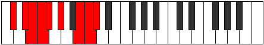

# Mode Dodyllic

## Links

- [Documentation](README.md)
- [Scales Index](Scales.md)
- [Modes Index](Modes.md)
- [Chords Index](Chords.md)

## Parent Scale

[Dagyllic](ScaleDagyllic.md)

## Number

[3261](https://ianring.com/musictheory/scales/3261)

## Interval Pattern

2, 1, 1, 1, 2, 3, 1, 1

## Chord Pattern

iv, VI

## Perfection

- 6 Perfect notes
- 2 Perfect notes

## Perfection Profile

[true false true true true true true false]

## Permutations

| Tonic | Notes | Signature | Illustration | Audio |
|-------|-------|-----------|--------------|-------|
| [C](ModeCNaturalDodyllic.md) | C, **D**, D#, E, F, G, A#, **B**, C | C |  | [midi](https://github.com/edipermadi/music/blob/main/docs/ModeCNaturalDodyllic.mid?raw=true) |
| [C#](ModeCSharpDodyllic.md) | C#, **D#**, E, F, F#, G#, B, **C**, C# | C |  | [midi](https://github.com/edipermadi/music/blob/main/docs/ModeCSharpDodyllic.mid?raw=true) |
| [Db](ModeDFlatDodyllic.md) | Db, **Eb**, E, F, Gb, Ab, B, **C**, Db | C |  | [midi](https://github.com/edipermadi/music/blob/main/docs/ModeDFlatDodyllic.mid?raw=true) |
| [D](ModeDNaturalDodyllic.md) | D, **E**, F, F#, G, A, C, **C#**, D | C |  | [midi](https://github.com/edipermadi/music/blob/main/docs/ModeDNaturalDodyllic.mid?raw=true) |
| [D#](ModeDSharpDodyllic.md) | D#, **F**, F#, G, G#, A#, C#, **D**, D# | C |  | [midi](https://github.com/edipermadi/music/blob/main/docs/ModeDSharpDodyllic.mid?raw=true) |
| [Eb](ModeEFlatDodyllic.md) | Eb, **F**, Gb, G, Ab, Bb, Db, **D**, Eb | C |  | [midi](https://github.com/edipermadi/music/blob/main/docs/ModeEFlatDodyllic.mid?raw=true) |
| [E](ModeENaturalDodyllic.md) | E, **F#**, G, G#, A, B, D, **D#**, E | C |  | [midi](https://github.com/edipermadi/music/blob/main/docs/ModeENaturalDodyllic.mid?raw=true) |
| [F](ModeFNaturalDodyllic.md) | F, **G**, G#, A, A#, C, D#, **E**, F | C |  | [midi](https://github.com/edipermadi/music/blob/main/docs/ModeFNaturalDodyllic.mid?raw=true) |
| [F#](ModeFSharpDodyllic.md) | F#, **G#**, A, A#, B, C#, E, **F**, F# | C |  | [midi](https://github.com/edipermadi/music/blob/main/docs/ModeFSharpDodyllic.mid?raw=true) |
| [Gb](ModeGFlatDodyllic.md) | Gb, **Ab**, A, Bb, B, Db, E, **F**, Gb | C |  | [midi](https://github.com/edipermadi/music/blob/main/docs/ModeGFlatDodyllic.mid?raw=true) |
| [G](ModeGNaturalDodyllic.md) | G, **A**, A#, B, C, D, F, **F#**, G | C |  | [midi](https://github.com/edipermadi/music/blob/main/docs/ModeGNaturalDodyllic.mid?raw=true) |
| [G#](ModeGSharpDodyllic.md) | G#, **A#**, B, C, C#, D#, F#, **G**, G# | C |  | [midi](https://github.com/edipermadi/music/blob/main/docs/ModeGSharpDodyllic.mid?raw=true) |
| [Ab](ModeAFlatDodyllic.md) | Ab, **Bb**, B, C, Db, Eb, Gb, **G**, Ab | C |  | [midi](https://github.com/edipermadi/music/blob/main/docs/ModeAFlatDodyllic.mid?raw=true) |
| [A](ModeANaturalDodyllic.md) | A, **B**, C, C#, D, E, G, **G#**, A | C |  | [midi](https://github.com/edipermadi/music/blob/main/docs/ModeANaturalDodyllic.mid?raw=true) |
| [A#](ModeASharpDodyllic.md) | A#, **C**, C#, D, D#, F, G#, **A**, A# | C |  | [midi](https://github.com/edipermadi/music/blob/main/docs/ModeASharpDodyllic.mid?raw=true) |
| [Bb](ModeBFlatDodyllic.md) | Bb, **C**, Db, D, Eb, F, Ab, **A**, Bb | C |  | [midi](https://github.com/edipermadi/music/blob/main/docs/ModeBFlatDodyllic.mid?raw=true) |
| [B](ModeBNaturalDodyllic.md) | B, **C#**, D, D#, E, F#, A, **A#**, B | C |  | [midi](https://github.com/edipermadi/music/blob/main/docs/ModeBNaturalDodyllic.mid?raw=true) |
