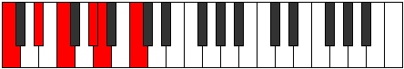

# Mode Dogitonic

## Links

- [Documentation](README.md)
- [Scales Index](Scales.md)
- [Modes Index](Modes.md)
- [Chords Index](Chords.md)

## Parent Scale

[Thoditonic](ScaleThoditonic.md)

## Number

[809](https://ianring.com/musictheory/scales/809)

## Interval Pattern

3, 2, 3, 1, 3

## Chord Pattern

## Perfection

- 2 Perfect notes
- 3 Perfect notes

## Perfection Profile

[false false true true false]

## Permutations

| Tonic | Notes | Signature | Illustration | Audio |
|-------|-------|-----------|--------------|-------|
| [C](ModeCNaturalDogitonic.md) | **C**, **D#**, F, G#, **A**, **C** | C |  | [midi](https://github.com/edipermadi/music/blob/main/docs/ModeCNaturalDogitonic.mid?raw=true) |
| [C#](ModeCSharpDogitonic.md) | **C#**, **E**, F#, A, **A#**, **C#** | C |  | [midi](https://github.com/edipermadi/music/blob/main/docs/ModeCSharpDogitonic.mid?raw=true) |
| [Db](ModeDFlatDogitonic.md) | **Db**, **E**, Gb, A, **Bb**, **Db** | C |  | [midi](https://github.com/edipermadi/music/blob/main/docs/ModeDFlatDogitonic.mid?raw=true) |
| [D](ModeDNaturalDogitonic.md) | **D**, **F**, G, A#, **B**, **D** | C |  | [midi](https://github.com/edipermadi/music/blob/main/docs/ModeDNaturalDogitonic.mid?raw=true) |
| [D#](ModeDSharpDogitonic.md) | **D#**, **F#**, G#, B, **C**, **D#** | C |  | [midi](https://github.com/edipermadi/music/blob/main/docs/ModeDSharpDogitonic.mid?raw=true) |
| [Eb](ModeEFlatDogitonic.md) | **Eb**, **Gb**, Ab, B, **C**, **Eb** | C |  | [midi](https://github.com/edipermadi/music/blob/main/docs/ModeEFlatDogitonic.mid?raw=true) |
| [E](ModeENaturalDogitonic.md) | **E**, **G**, A, C, **C#**, **E** | C |  | [midi](https://github.com/edipermadi/music/blob/main/docs/ModeENaturalDogitonic.mid?raw=true) |
| [F](ModeFNaturalDogitonic.md) | **F**, **G#**, A#, C#, **D**, **F** | C |  | [midi](https://github.com/edipermadi/music/blob/main/docs/ModeFNaturalDogitonic.mid?raw=true) |
| [F#](ModeFSharpDogitonic.md) | **F#**, **A**, B, D, **D#**, **F#** | C |  | [midi](https://github.com/edipermadi/music/blob/main/docs/ModeFSharpDogitonic.mid?raw=true) |
| [Gb](ModeGFlatDogitonic.md) | **Gb**, **A**, B, D, **Eb**, **Gb** | C |  | [midi](https://github.com/edipermadi/music/blob/main/docs/ModeGFlatDogitonic.mid?raw=true) |
| [G](ModeGNaturalDogitonic.md) | **G**, **A#**, C, D#, **E**, **G** | C |  | [midi](https://github.com/edipermadi/music/blob/main/docs/ModeGNaturalDogitonic.mid?raw=true) |
| [G#](ModeGSharpDogitonic.md) | **G#**, **B**, C#, E, **F**, **G#** | C |  | [midi](https://github.com/edipermadi/music/blob/main/docs/ModeGSharpDogitonic.mid?raw=true) |
| [Ab](ModeAFlatDogitonic.md) | **Ab**, **B**, Db, E, **F**, **Ab** | C |  | [midi](https://github.com/edipermadi/music/blob/main/docs/ModeAFlatDogitonic.mid?raw=true) |
| [A](ModeANaturalDogitonic.md) | **A**, **C**, D, F, **F#**, **A** | C |  | [midi](https://github.com/edipermadi/music/blob/main/docs/ModeANaturalDogitonic.mid?raw=true) |
| [A#](ModeASharpDogitonic.md) | **A#**, **C#**, D#, F#, **G**, **A#** | C |  | [midi](https://github.com/edipermadi/music/blob/main/docs/ModeASharpDogitonic.mid?raw=true) |
| [Bb](ModeBFlatDogitonic.md) | **Bb**, **Db**, Eb, Gb, **G**, **Bb** | C |  | [midi](https://github.com/edipermadi/music/blob/main/docs/ModeBFlatDogitonic.mid?raw=true) |
| [B](ModeBNaturalDogitonic.md) | **B**, **D**, E, G, **G#**, **B** | C |  | [midi](https://github.com/edipermadi/music/blob/main/docs/ModeBNaturalDogitonic.mid?raw=true) |
