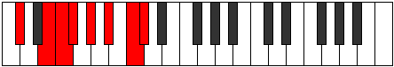
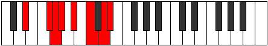

# Mode Dolian

## Links

- [Documentation](index.md)
- [Scales Index](Scales.md)
- [Modes Index](Modes.md)
- [Chords Index](Chords.md)

## Parent Scale

[Dolian](ScaleDolian.md)

## Number

[2745](https://ianring.com/musictheory/scales/2745)

## Interval Pattern

3, 1, 1, 2, 2, 2, 1

## Chord Pattern

I, iii, IV, V⁺, vi

## Perfection

- 4 Perfect notes
- 3 Perfect notes

## Perfection Profile

[true false true true false true false]

## Permutations

| Tonic | Notes | Signature | Illustration | Audio |
|-------|-------|-----------|--------------|-------|
| [C](ModeCNaturalDolian.md) | C, **D#**, E, F, **G**, A, **B**, C | C |  | [midi](https://github.com/edipermadi/music/blob/main/docs/ModeCNaturalDolian.mid?raw=true) |
| [C#](ModeCSharpDolian.md) | C#, **D##**, E#, F#, **G#**, A#, **B#**, C# | C |  | [midi](https://github.com/edipermadi/music/blob/main/docs/ModeCSharpDolian.mid?raw=true) |
| [Db](ModeDFlatDolian.md) | Db, **E**, F, Gb, **Ab**, Bb, **C**, Db | C |  | [midi](https://github.com/edipermadi/music/blob/main/docs/ModeDFlatDolian.mid?raw=true) |
| [D](ModeDNaturalDolian.md) | D, **E#**, F#, G, **A**, B, **C#**, D | C |  | [midi](https://github.com/edipermadi/music/blob/main/docs/ModeDNaturalDolian.mid?raw=true) |
| [D#](ModeDSharpDolian.md) | D#, **E##**, F##, G#, **A#**, B#, **C##**, D# | C |  | [midi](https://github.com/edipermadi/music/blob/main/docs/ModeDSharpDolian.mid?raw=true) |
| [Eb](ModeEFlatDolian.md) | Eb, **F#**, G, Ab, **Bb**, C, **D**, Eb | C |  | [midi](https://github.com/edipermadi/music/blob/main/docs/ModeEFlatDolian.mid?raw=true) |
| [E](ModeENaturalDolian.md) | E, **F##**, G#, A, **B**, C#, **D#**, E | C |  | [midi](https://github.com/edipermadi/music/blob/main/docs/ModeENaturalDolian.mid?raw=true) |
| [F](ModeFNaturalDolian.md) | F, **G#**, A, Bb, **C**, D, **E**, F | C |  | [midi](https://github.com/edipermadi/music/blob/main/docs/ModeFNaturalDolian.mid?raw=true) |
| [F#](ModeFSharpDolian.md) | F#, **G##**, A#, B, **C#**, D#, **E#**, F# | C |  | [midi](https://github.com/edipermadi/music/blob/main/docs/ModeFSharpDolian.mid?raw=true) |
| [Gb](ModeGFlatDolian.md) | Gb, **A**, Bb, Cb, **Db**, Eb, **F**, Gb | C |  | [midi](https://github.com/edipermadi/music/blob/main/docs/ModeGFlatDolian.mid?raw=true) |
| [G](ModeGNaturalDolian.md) | G, **A#**, B, C, **D**, E, **F#**, G | C |  | [midi](https://github.com/edipermadi/music/blob/main/docs/ModeGNaturalDolian.mid?raw=true) |
| [G#](ModeGSharpDolian.md) | G#, **A##**, B#, C#, **D#**, E#, **F##**, G# | C |  | [midi](https://github.com/edipermadi/music/blob/main/docs/ModeGSharpDolian.mid?raw=true) |
| [Ab](ModeAFlatDolian.md) | Ab, **B**, C, Db, **Eb**, F, **G**, Ab | C |  | [midi](https://github.com/edipermadi/music/blob/main/docs/ModeAFlatDolian.mid?raw=true) |
| [A](ModeANaturalDolian.md) | A, **B#**, C#, D, **E**, F#, **G#**, A | C |  | [midi](https://github.com/edipermadi/music/blob/main/docs/ModeANaturalDolian.mid?raw=true) |
| [A#](ModeASharpDolian.md) | A#, **B##**, C##, D#, **E#**, F##, **G##**, A# | C |  | [midi](https://github.com/edipermadi/music/blob/main/docs/ModeASharpDolian.mid?raw=true) |
| [Bb](ModeBFlatDolian.md) | Bb, **C#**, D, Eb, **F**, G, **A**, Bb | C |  | [midi](https://github.com/edipermadi/music/blob/main/docs/ModeBFlatDolian.mid?raw=true) |
| [B](ModeBNaturalDolian.md) | B, **C##**, D#, E, **F#**, G#, **A#**, B | C |  | [midi](https://github.com/edipermadi/music/blob/main/docs/ModeBNaturalDolian.mid?raw=true) |
