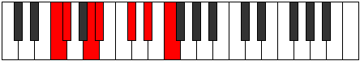

# Mode Dolimic

## Links

- [Documentation](README.md)
- [Scales Index](Scales.md)
- [Modes Index](Modes.md)
- [Chords Index](Chords.md)

## Parent Scale

[Mothimic](ScaleMothimic.md)

## Number

[1331](https://ianring.com/musictheory/scales/1331)

## Luminosity

-1

## Transposition

1, 3, 1, 3, 2, 2

## Chord Pattern

I⁺, III⁺, V⁺, vi

## Perfection

- 3 Perfect notes
- 3 Perfect notes

## Perfection Profile

false, true, false, true, false, true

## Permutations

| Tonic | Notes | Signature | Illustration | Audio |
|-------|-------|-----------|--------------|-------|
| [C](ModeCNaturalDolimic.md) | **C**, Db, **E**, F, **G#**, A#, **C** | C |  | [midi](https://github.com/edipermadi/music/blob/main/docs/ModeCNaturalDolimic.mid?raw=true) |
| [C#](ModeCSharpDolimic.md) | **C#**, D, **E#**, F#, **G##**, A##, **C#** | C |  | [midi](https://github.com/edipermadi/music/blob/main/docs/ModeCSharpDolimic.mid?raw=true) |
| [Db](ModeDFlatDolimic.md) | **Db**, Ebb, **F**, Gb, **A**, B, **Db** | C |  | [midi](https://github.com/edipermadi/music/blob/main/docs/ModeDFlatDolimic.mid?raw=true) |
| [D](ModeDNaturalDolimic.md) | **D**, Eb, **F#**, G, **A#**, B#, **D** | C |  | [midi](https://github.com/edipermadi/music/blob/main/docs/ModeDNaturalDolimic.mid?raw=true) |
| [D#](ModeDSharpDolimic.md) | **D#**, E, **F##**, G#, **A##**, B##, **D#** | C |  | [midi](https://github.com/edipermadi/music/blob/main/docs/ModeDSharpDolimic.mid?raw=true) |
| [Eb](ModeEFlatDolimic.md) | **Eb**, Fb, **G**, Ab, **B**, C#, **Eb** | C |  | [midi](https://github.com/edipermadi/music/blob/main/docs/ModeEFlatDolimic.mid?raw=true) |
| [E](ModeENaturalDolimic.md) | **E**, F, **G#**, A, **B#**, C##, **E** | C |  | [midi](https://github.com/edipermadi/music/blob/main/docs/ModeENaturalDolimic.mid?raw=true) |
| [F](ModeFNaturalDolimic.md) | **F**, Gb, **A**, Bb, **C#**, D#, **F** | C |  | [midi](https://github.com/edipermadi/music/blob/main/docs/ModeFNaturalDolimic.mid?raw=true) |
| [F#](ModeFSharpDolimic.md) | **F#**, G, **A#**, B, **C##**, D##, **F#** | C |  | [midi](https://github.com/edipermadi/music/blob/main/docs/ModeFSharpDolimic.mid?raw=true) |
| [Gb](ModeGFlatDolimic.md) | **Gb**, Abb, **Bb**, Cb, **D**, E, **Gb** | C |  | [midi](https://github.com/edipermadi/music/blob/main/docs/ModeGFlatDolimic.mid?raw=true) |
| [G](ModeGNaturalDolimic.md) | **G**, Ab, **B**, C, **D#**, E#, **G** | C |  | [midi](https://github.com/edipermadi/music/blob/main/docs/ModeGNaturalDolimic.mid?raw=true) |
| [G#](ModeGSharpDolimic.md) | **G#**, A, **B#**, C#, **D##**, E##, **G#** | C |  | [midi](https://github.com/edipermadi/music/blob/main/docs/ModeGSharpDolimic.mid?raw=true) |
| [Ab](ModeAFlatDolimic.md) | **Ab**, Bbb, **C**, Db, **E**, F#, **Ab** | C |  | [midi](https://github.com/edipermadi/music/blob/main/docs/ModeAFlatDolimic.mid?raw=true) |
| [A](ModeANaturalDolimic.md) | **A**, Bb, **C#**, D, **E#**, F##, **A** | C |  | [midi](https://github.com/edipermadi/music/blob/main/docs/ModeANaturalDolimic.mid?raw=true) |
| [A#](ModeASharpDolimic.md) | **A#**, B, **C##**, D#, **E##**, F###, **A#** | C |  | [midi](https://github.com/edipermadi/music/blob/main/docs/ModeASharpDolimic.mid?raw=true) |
| [Bb](ModeBFlatDolimic.md) | **Bb**, Cb, **D**, Eb, **F#**, G#, **Bb** | C |  | [midi](https://github.com/edipermadi/music/blob/main/docs/ModeBFlatDolimic.mid?raw=true) |
| [B](ModeBNaturalDolimic.md) | **B**, C, **D#**, E, **F##**, G##, **B** | C |  | [midi](https://github.com/edipermadi/music/blob/main/docs/ModeBNaturalDolimic.mid?raw=true) |
