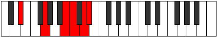
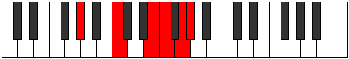

# Mode Dolitonic

## Links

- [Documentation](index.md)
- [Scales Index](Scales.md)
- [Modes Index](Modes.md)
- [Chords Index](Chords.md)

## Parent Scale

[Dolitonic](ScaleDolitonic.md)

## Number

[2833](https://ianring.com/musictheory/scales/2833)

## Perfection

- 2 Perfect notes
- 3 Perfect notes

## Perfection Profile

[false true false true false]

## Permutations

| Tonic | Notes | Signature | Illustration | Audio |
|-------|-------|-----------|--------------|-------|
| [C](ModeCNaturalDolitonic.md) | **C**, E, **G#**, A, **B**, **C** | C |  | [midi](ModeCNaturalDolitonic.mid) [ogg](ModeCNaturalDolitonic.ogg) |
| [C#](ModeCSharpDolitonic.md) | **C#**, F, **A**, A#, **C**, **C#** | C |  | [midi](ModeCSharpDolitonic.mid) [ogg](ModeCSharpDolitonic.ogg) |
| [Db](ModeDFlatDolitonic.md) | **Db**, F, **A**, Bb, **C**, **Db** | C |  | [midi](ModeDFlatDolitonic.mid) [ogg](ModeDFlatDolitonic.ogg) |
| [D](ModeDNaturalDolitonic.md) | **D**, F#, **A#**, B, **C#**, **D** | C |  | [midi](ModeDNaturalDolitonic.mid) [ogg](ModeDNaturalDolitonic.ogg) |
| [D#](ModeDSharpDolitonic.md) | **D#**, G, **B**, C, **D**, **D#** | C |  | [midi](ModeDSharpDolitonic.mid) [ogg](ModeDSharpDolitonic.ogg) |
| [Eb](ModeEFlatDolitonic.md) | **Eb**, G, **B**, C, **D**, **Eb** | C |  | [midi](ModeEFlatDolitonic.mid) [ogg](ModeEFlatDolitonic.ogg) |
| [E](ModeENaturalDolitonic.md) | **E**, G#, **C**, C#, **D#**, **E** | C |  | [midi](ModeENaturalDolitonic.mid) [ogg](ModeENaturalDolitonic.ogg) |
| [F](ModeFNaturalDolitonic.md) | **F**, A, **C#**, D, **E**, **F** | C |  | [midi](ModeFNaturalDolitonic.mid) [ogg](ModeFNaturalDolitonic.ogg) |
| [F#](ModeFSharpDolitonic.md) | **F#**, A#, **D**, D#, **F**, **F#** | C |  | [midi](ModeFSharpDolitonic.mid) [ogg](ModeFSharpDolitonic.ogg) |
| [Gb](ModeGFlatDolitonic.md) | **Gb**, Bb, **D**, Eb, **F**, **Gb** | C |  | [midi](ModeGFlatDolitonic.mid) [ogg](ModeGFlatDolitonic.ogg) |
| [G](ModeGNaturalDolitonic.md) | **G**, B, **D#**, E, **F#**, **G** | C |  | [midi](ModeGNaturalDolitonic.mid) [ogg](ModeGNaturalDolitonic.ogg) |
| [G#](ModeGSharpDolitonic.md) | **G#**, C, **E**, F, **G**, **G#** | C |  | [midi](ModeGSharpDolitonic.mid) [ogg](ModeGSharpDolitonic.ogg) |
| [Ab](ModeAFlatDolitonic.md) | **Ab**, C, **E**, F, **G**, **Ab** | C |  | [midi](ModeAFlatDolitonic.mid) [ogg](ModeAFlatDolitonic.ogg) |
| [A](ModeANaturalDolitonic.md) | **A**, C#, **F**, F#, **G#**, **A** | C |  | [midi](ModeANaturalDolitonic.mid) [ogg](ModeANaturalDolitonic.ogg) |
| [A#](ModeASharpDolitonic.md) | **A#**, D, **F#**, G, **A**, **A#** | C |  | [midi](ModeASharpDolitonic.mid) [ogg](ModeASharpDolitonic.ogg) |
| [Bb](ModeBFlatDolitonic.md) | **Bb**, D, **Gb**, G, **A**, **Bb** | C |  | [midi](ModeBFlatDolitonic.mid) [ogg](ModeBFlatDolitonic.ogg) |
| [B](ModeBNaturalDolitonic.md) | **B**, D#, **G**, G#, **A#**, **B** | C |  | [midi](ModeBNaturalDolitonic.mid) [ogg](ModeBNaturalDolitonic.ogg) |
