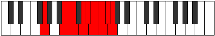

# Mode Dolyllic

## Links

- [Documentation](index.md)
- [Scales Index](Scales.md)
- [Modes Index](Modes.md)
- [Chords Index](Chords.md)

## Parent Scale

[Dolyllic](ScaleDolyllic.md)

## Number

[4017](https://ianring.com/musictheory/scales/4017)

## Interval Pattern

4, 1, 2, 1, 1, 1, 1, 1

## Chord Pattern

I, I⁺, II⁺, ii⁰, ii, II, iii, III, iii⁰, V⁺, vi

## Perfection

- 5 Perfect notes
- 3 Perfect notes

## Perfection Profile

[true true true false false true true false]

## Permutations

| Tonic | Notes | Signature | Illustration | Audio |
|-------|-------|-----------|--------------|-------|
| [C](ModeCNaturalDolyllic.md) | C, E, F, **G**, **G#**, A, A#, **B**, C | C |  | [midi](https://github.com/edipermadi/music/blob/main/docs/ModeCNaturalDolyllic.mid?raw=true) |
| [C#](ModeCSharpDolyllic.md) | C#, F, F#, **G#**, **A**, A#, B, **C**, C# | C |  | [midi](https://github.com/edipermadi/music/blob/main/docs/ModeCSharpDolyllic.mid?raw=true) |
| [Db](ModeDFlatDolyllic.md) | Db, F, Gb, **Ab**, **A**, Bb, B, **C**, Db | C |  | [midi](https://github.com/edipermadi/music/blob/main/docs/ModeDFlatDolyllic.mid?raw=true) |
| [D](ModeDNaturalDolyllic.md) | D, F#, G, **A**, **A#**, B, C, **C#**, D | C |  | [midi](https://github.com/edipermadi/music/blob/main/docs/ModeDNaturalDolyllic.mid?raw=true) |
| [D#](ModeDSharpDolyllic.md) | D#, G, G#, **A#**, **B**, C, C#, **D**, D# | C |  | [midi](https://github.com/edipermadi/music/blob/main/docs/ModeDSharpDolyllic.mid?raw=true) |
| [Eb](ModeEFlatDolyllic.md) | Eb, G, Ab, **Bb**, **B**, C, Db, **D**, Eb | C |  | [midi](https://github.com/edipermadi/music/blob/main/docs/ModeEFlatDolyllic.mid?raw=true) |
| [E](ModeENaturalDolyllic.md) | E, G#, A, **B**, **C**, C#, D, **D#**, E | C |  | [midi](https://github.com/edipermadi/music/blob/main/docs/ModeENaturalDolyllic.mid?raw=true) |
| [F](ModeFNaturalDolyllic.md) | F, A, A#, **C**, **C#**, D, D#, **E**, F | C |  | [midi](https://github.com/edipermadi/music/blob/main/docs/ModeFNaturalDolyllic.mid?raw=true) |
| [F#](ModeFSharpDolyllic.md) | F#, A#, B, **C#**, **D**, D#, E, **F**, F# | C |  | [midi](https://github.com/edipermadi/music/blob/main/docs/ModeFSharpDolyllic.mid?raw=true) |
| [Gb](ModeGFlatDolyllic.md) | Gb, Bb, B, **Db**, **D**, Eb, E, **F**, Gb | C |  | [midi](https://github.com/edipermadi/music/blob/main/docs/ModeGFlatDolyllic.mid?raw=true) |
| [G](ModeGNaturalDolyllic.md) | G, B, C, **D**, **D#**, E, F, **F#**, G | C |  | [midi](https://github.com/edipermadi/music/blob/main/docs/ModeGNaturalDolyllic.mid?raw=true) |
| [G#](ModeGSharpDolyllic.md) | G#, C, C#, **D#**, **E**, F, F#, **G**, G# | C |  | [midi](https://github.com/edipermadi/music/blob/main/docs/ModeGSharpDolyllic.mid?raw=true) |
| [Ab](ModeAFlatDolyllic.md) | Ab, C, Db, **Eb**, **E**, F, Gb, **G**, Ab | C |  | [midi](https://github.com/edipermadi/music/blob/main/docs/ModeAFlatDolyllic.mid?raw=true) |
| [A](ModeANaturalDolyllic.md) | A, C#, D, **E**, **F**, F#, G, **G#**, A | C |  | [midi](https://github.com/edipermadi/music/blob/main/docs/ModeANaturalDolyllic.mid?raw=true) |
| [A#](ModeASharpDolyllic.md) | A#, D, D#, **F**, **F#**, G, G#, **A**, A# | C |  | [midi](https://github.com/edipermadi/music/blob/main/docs/ModeASharpDolyllic.mid?raw=true) |
| [Bb](ModeBFlatDolyllic.md) | Bb, D, Eb, **F**, **Gb**, G, Ab, **A**, Bb | C |  | [midi](https://github.com/edipermadi/music/blob/main/docs/ModeBFlatDolyllic.mid?raw=true) |
| [B](ModeBNaturalDolyllic.md) | B, D#, E, **F#**, **G**, G#, A, **A#**, B | C |  | [midi](https://github.com/edipermadi/music/blob/main/docs/ModeBNaturalDolyllic.mid?raw=true) |
