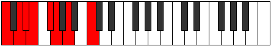
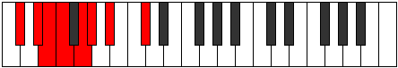

# Mode Donian

## Links

- [Documentation](README.md)
- [Scales Index](Scales.md)
- [Modes Index](Modes.md)
- [Chords Index](Chords.md)

## Parent Scale

[Rythian](ScaleRythian.md)

## Number

[733](https://ianring.com/musictheory/scales/733)

## Interval Pattern

2, 1, 1, 2, 1, 2, 3

## Chord Pattern

i⁰, iii⁰

## Perfection

- 4 Perfect notes
- 3 Perfect notes

## Perfection Profile

[true true false false false true true]

## Permutations

| Tonic | Notes | Signature | Illustration | Audio |
|-------|-------|-----------|--------------|-------|
| [C](ModeCNaturalDonian.md) | C, D, **Eb**, **Fb**, **Gb**, Abb, Bbb, C | C |  | [midi](https://github.com/edipermadi/music/blob/main/docs/ModeCNaturalDonian.mid?raw=true) |
| [C#](ModeCSharpDonian.md) | C#, D#, **E**, **F**, **G**, Ab, Bb, C# | C |  | [midi](https://github.com/edipermadi/music/blob/main/docs/ModeCSharpDonian.mid?raw=true) |
| [Db](ModeDFlatDonian.md) | Db, Eb, **Fb**, **Gbb**, **Abb**, Bbbb, Cbb, Db | C |  | [midi](https://github.com/edipermadi/music/blob/main/docs/ModeDFlatDonian.mid?raw=true) |
| [D](ModeDNaturalDonian.md) | D, E, **F**, **Gb**, **Ab**, Bbb, Cb, D | C |  | [midi](https://github.com/edipermadi/music/blob/main/docs/ModeDNaturalDonian.mid?raw=true) |
| [D#](ModeDSharpDonian.md) | D#, E#, **F#**, **G**, **A**, Bb, C, D# | C |  | [midi](https://github.com/edipermadi/music/blob/main/docs/ModeDSharpDonian.mid?raw=true) |
| [Eb](ModeEFlatDonian.md) | Eb, F, **Gb**, **Abb**, **Bbb**, Cbb, Dbb, Eb | C |  | [midi](https://github.com/edipermadi/music/blob/main/docs/ModeEFlatDonian.mid?raw=true) |
| [E](ModeENaturalDonian.md) | E, F#, **G**, **Ab**, **Bb**, Cb, Db, E | C |  | [midi](https://github.com/edipermadi/music/blob/main/docs/ModeENaturalDonian.mid?raw=true) |
| [F](ModeFNaturalDonian.md) | F, G, **Ab**, **Bbb**, **Cb**, Dbb, Ebb, F | C |  | [midi](https://github.com/edipermadi/music/blob/main/docs/ModeFNaturalDonian.mid?raw=true) |
| [F#](ModeFSharpDonian.md) | F#, G#, **A**, **Bb**, **C**, Db, Eb, F# | C |  | [midi](https://github.com/edipermadi/music/blob/main/docs/ModeFSharpDonian.mid?raw=true) |
| [Gb](ModeGFlatDonian.md) | Gb, Ab, **Bbb**, **Cbb**, **Dbb**, Ebbb, Fbb, Gb | C |  | [midi](https://github.com/edipermadi/music/blob/main/docs/ModeGFlatDonian.mid?raw=true) |
| [G](ModeGNaturalDonian.md) | G, A, **Bb**, **Cb**, **Db**, Ebb, Fb, G | C |  | [midi](https://github.com/edipermadi/music/blob/main/docs/ModeGNaturalDonian.mid?raw=true) |
| [G#](ModeGSharpDonian.md) | G#, A#, **B**, **C**, **D**, Eb, F, G# | C |  | [midi](https://github.com/edipermadi/music/blob/main/docs/ModeGSharpDonian.mid?raw=true) |
| [Ab](ModeAFlatDonian.md) | Ab, Bb, **Cb**, **Dbb**, **Ebb**, Fbb, Gbb, Ab | C |  | [midi](https://github.com/edipermadi/music/blob/main/docs/ModeAFlatDonian.mid?raw=true) |
| [A](ModeANaturalDonian.md) | A, B, **C**, **Db**, **Eb**, Fb, Gb, A | C |  | [midi](https://github.com/edipermadi/music/blob/main/docs/ModeANaturalDonian.mid?raw=true) |
| [A#](ModeASharpDonian.md) | A#, B#, **C#**, **D**, **E**, F, G, A# | C |  | [midi](https://github.com/edipermadi/music/blob/main/docs/ModeASharpDonian.mid?raw=true) |
| [Bb](ModeBFlatDonian.md) | Bb, C, **Db**, **Ebb**, **Fb**, Gbb, Abb, Bb | C |  | [midi](https://github.com/edipermadi/music/blob/main/docs/ModeBFlatDonian.mid?raw=true) |
| [B](ModeBNaturalDonian.md) | B, C#, **D**, **Eb**, **F**, Gb, Ab, B | C |  | [midi](https://github.com/edipermadi/music/blob/main/docs/ModeBNaturalDonian.mid?raw=true) |
