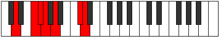
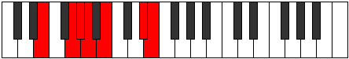

# Mode Donimic

## Links

- [Documentation](index.md)
- [Scales Index](Scales.md)
- [Modes Index](Modes.md)
- [Chords Index](Chords.md)

## Parent Scale

[Thogimic](ScaleThogimic.md)

## Number

[2233](https://ianring.com/musictheory/scales/2233)

## Perfection

- 3 Perfect notes
- 3 Perfect notes

## Perfection Profile

[true false true true false false]

## Permutations

| Tonic | Notes | Signature | Illustration | Audio |
|-------|-------|-----------|--------------|-------|
| [C](ModeCNaturalDonimic.md) | C, **D#**, E, F, **G**, **A##**, C | C |  | [midi](ModeCNaturalDonimic.mid) [ogg](ModeCNaturalDonimic.ogg) |
| [C#](ModeCSharpDonimic.md) | C#, **D##**, E#, F#, **G#**, **A###**, C# | C |  | [midi](ModeCSharpDonimic.mid) [ogg](ModeCSharpDonimic.ogg) |
| [Db](ModeDFlatDonimic.md) | Db, **E**, F, Gb, **Ab**, **B#**, Db | C |  | [midi](ModeDFlatDonimic.mid) [ogg](ModeDFlatDonimic.ogg) |
| [D](ModeDNaturalDonimic.md) | D, **E#**, F#, G, **A**, **B##**, D | C |  | [midi](ModeDNaturalDonimic.mid) [ogg](ModeDNaturalDonimic.ogg) |
| [D#](ModeDSharpDonimic.md) | D#, **E##**, F##, G#, **A#**, **B###**, D# | C |  | [midi](ModeDSharpDonimic.mid) [ogg](ModeDSharpDonimic.ogg) |
| [Eb](ModeEFlatDonimic.md) | Eb, **F#**, G, Ab, **Bb**, **C##**, Eb | C |  | [midi](ModeEFlatDonimic.mid) [ogg](ModeEFlatDonimic.ogg) |
| [E](ModeENaturalDonimic.md) | E, **F##**, G#, A, **B**, **C###**, E | C |  | [midi](ModeENaturalDonimic.mid) [ogg](ModeENaturalDonimic.ogg) |
| [F](ModeFNaturalDonimic.md) | F, **G#**, A, Bb, **C**, **D##**, F | C |  | [midi](ModeFNaturalDonimic.mid) [ogg](ModeFNaturalDonimic.ogg) |
| [F#](ModeFSharpDonimic.md) | F#, **G##**, A#, B, **C#**, **D###**, F# | C |  | [midi](ModeFSharpDonimic.mid) [ogg](ModeFSharpDonimic.ogg) |
| [Gb](ModeGFlatDonimic.md) | Gb, **A**, Bb, Cb, **Db**, **E#**, Gb | C |  | [midi](ModeGFlatDonimic.mid) [ogg](ModeGFlatDonimic.ogg) |
| [G](ModeGNaturalDonimic.md) | G, **A#**, B, C, **D**, **E##**, G | C |  | [midi](ModeGNaturalDonimic.mid) [ogg](ModeGNaturalDonimic.ogg) |
| [G#](ModeGSharpDonimic.md) | G#, **A##**, B#, C#, **D#**, **E###**, G# | C |  | [midi](ModeGSharpDonimic.mid) [ogg](ModeGSharpDonimic.ogg) |
| [Ab](ModeAFlatDonimic.md) | Ab, **B**, C, Db, **Eb**, **F##**, Ab | C |  | [midi](ModeAFlatDonimic.mid) [ogg](ModeAFlatDonimic.ogg) |
| [A](ModeANaturalDonimic.md) | A, **B#**, C#, D, **E**, **F###**, A | C |  | [midi](ModeANaturalDonimic.mid) [ogg](ModeANaturalDonimic.ogg) |
| [A#](ModeASharpDonimic.md) | A#, **B##**, C##, D#, **E#**, **Cbbb**, A# | C |  | [midi](ModeASharpDonimic.mid) [ogg](ModeASharpDonimic.ogg) |
| [Bb](ModeBFlatDonimic.md) | Bb, **C#**, D, Eb, **F**, **G##**, Bb | C |  | [midi](ModeBFlatDonimic.mid) [ogg](ModeBFlatDonimic.ogg) |
| [B](ModeBNaturalDonimic.md) | B, **C##**, D#, E, **F#**, **G###**, B | C |  | [midi](ModeBNaturalDonimic.mid) [ogg](ModeBNaturalDonimic.ogg) |
