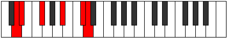
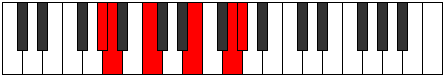

# Mode Doptitonic

## Links

- [Documentation](index.md)
- [Scales Index](Scales.md)
- [Modes Index](Modes.md)
- [Chords Index](Chords.md)

## Parent Scale

[Aeolyritonic](ScaleAeolyritonic.md)

## Number

[2323](https://ianring.com/musictheory/scales/2323)

## Perfection

- 2 Perfect notes
- 3 Perfect notes

## Perfection Profile

[false true true false false]

## Permutations

| Tonic | Notes | Signature | Illustration | Audio |
|-------|-------|-----------|--------------|-------|
| [C](ModeCNaturalDoptitonic.md) | **C**, C#, E, **G#**, **B**, **C** | C |  | [midi](ModeCNaturalDoptitonic.mid) [ogg](ModeCNaturalDoptitonic.ogg) |
| [C#](ModeCSharpDoptitonic.md) | **C#**, D, F, **A**, **C**, **C#** | C |  | [midi](ModeCSharpDoptitonic.mid) [ogg](ModeCSharpDoptitonic.ogg) |
| [Db](ModeDFlatDoptitonic.md) | **Db**, D, F, **A**, **C**, **Db** | C |  | [midi](ModeDFlatDoptitonic.mid) [ogg](ModeDFlatDoptitonic.ogg) |
| [D](ModeDNaturalDoptitonic.md) | **D**, D#, F#, **A#**, **C#**, **D** | C |  | [midi](ModeDNaturalDoptitonic.mid) [ogg](ModeDNaturalDoptitonic.ogg) |
| [D#](ModeDSharpDoptitonic.md) | **D#**, E, G, **B**, **D**, **D#** | C |  | [midi](ModeDSharpDoptitonic.mid) [ogg](ModeDSharpDoptitonic.ogg) |
| [Eb](ModeEFlatDoptitonic.md) | **Eb**, E, G, **B**, **D**, **Eb** | C |  | [midi](ModeEFlatDoptitonic.mid) [ogg](ModeEFlatDoptitonic.ogg) |
| [E](ModeENaturalDoptitonic.md) | **E**, F, G#, **C**, **D#**, **E** | C |  | [midi](ModeENaturalDoptitonic.mid) [ogg](ModeENaturalDoptitonic.ogg) |
| [F](ModeFNaturalDoptitonic.md) | **F**, F#, A, **C#**, **E**, **F** | C |  | [midi](ModeFNaturalDoptitonic.mid) [ogg](ModeFNaturalDoptitonic.ogg) |
| [F#](ModeFSharpDoptitonic.md) | **F#**, G, A#, **D**, **F**, **F#** | C |  | [midi](ModeFSharpDoptitonic.mid) [ogg](ModeFSharpDoptitonic.ogg) |
| [Gb](ModeGFlatDoptitonic.md) | **Gb**, G, Bb, **D**, **F**, **Gb** | C |  | [midi](ModeGFlatDoptitonic.mid) [ogg](ModeGFlatDoptitonic.ogg) |
| [G](ModeGNaturalDoptitonic.md) | **G**, G#, B, **D#**, **F#**, **G** | C |  | [midi](ModeGNaturalDoptitonic.mid) [ogg](ModeGNaturalDoptitonic.ogg) |
| [G#](ModeGSharpDoptitonic.md) | **G#**, A, C, **E**, **G**, **G#** | C |  | [midi](ModeGSharpDoptitonic.mid) [ogg](ModeGSharpDoptitonic.ogg) |
| [Ab](ModeAFlatDoptitonic.md) | **Ab**, A, C, **E**, **G**, **Ab** | C |  | [midi](ModeAFlatDoptitonic.mid) [ogg](ModeAFlatDoptitonic.ogg) |
| [A](ModeANaturalDoptitonic.md) | **A**, A#, C#, **F**, **G#**, **A** | C |  | [midi](ModeANaturalDoptitonic.mid) [ogg](ModeANaturalDoptitonic.ogg) |
| [A#](ModeASharpDoptitonic.md) | **A#**, B, D, **F#**, **A**, **A#** | C |  | [midi](ModeASharpDoptitonic.mid) [ogg](ModeASharpDoptitonic.ogg) |
| [Bb](ModeBFlatDoptitonic.md) | **Bb**, B, D, **Gb**, **A**, **Bb** | C |  | [midi](ModeBFlatDoptitonic.mid) [ogg](ModeBFlatDoptitonic.ogg) |
| [B](ModeBNaturalDoptitonic.md) | **B**, C, D#, **G**, **A#**, **B** | C |  | [midi](ModeBNaturalDoptitonic.mid) [ogg](ModeBNaturalDoptitonic.ogg) |
