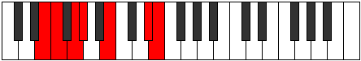
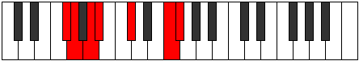
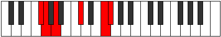
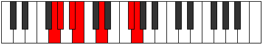
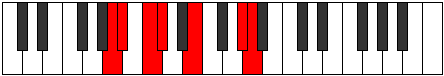

# Mode Dorimic

## Links

- [Documentation](README.md)
- [Scales Index](Scales.md)
- [Modes Index](Modes.md)
- [Chords Index](Chords.md)

## Parent Scale

[Aerothimic](ScaleAerothimic.md)

## Number

[2203](https://ianring.com/musictheory/scales/2203)

## Luminosity

6

## Transposition

1, 2, 1, 3, 4, 1

## Chord Pattern

i

## Perfection

- 2 Perfect notes
- 4 Perfect notes

## Perfection Profile

true, false, false, true, false, false

## Permutations

| Tonic | Notes | Signature | Illustration | Audio |
|-------|-------|-----------|--------------|-------|
| [C](ModeCNaturalDorimic.md) | C, **Db**, **Eb**, Fb, **G**, **A##**, C | C |  | [midi](https://github.com/edipermadi/music/blob/main/docs/ModeCNaturalDorimic.mid?raw=true) |
| [C#](ModeCSharpDorimic.md) | C#, **D**, **E**, F, **G#**, **A###**, C# | C |  | [midi](https://github.com/edipermadi/music/blob/main/docs/ModeCSharpDorimic.mid?raw=true) |
| [Db](ModeDFlatDorimic.md) | Db, **Ebb**, **Fb**, Gbb, **Ab**, **B#**, Db | C |  | [midi](https://github.com/edipermadi/music/blob/main/docs/ModeDFlatDorimic.mid?raw=true) |
| [D](ModeDNaturalDorimic.md) | D, **Eb**, **F**, Gb, **A**, **B##**, D | C |  | [midi](https://github.com/edipermadi/music/blob/main/docs/ModeDNaturalDorimic.mid?raw=true) |
| [D#](ModeDSharpDorimic.md) | D#, **E**, **F#**, G, **A#**, **B###**, D# | C |  | [midi](https://github.com/edipermadi/music/blob/main/docs/ModeDSharpDorimic.mid?raw=true) |
| [Eb](ModeEFlatDorimic.md) | Eb, **Fb**, **Gb**, Abb, **Bb**, **C##**, Eb | C |  | [midi](https://github.com/edipermadi/music/blob/main/docs/ModeEFlatDorimic.mid?raw=true) |
| [E](ModeENaturalDorimic.md) | E, **F**, **G**, Ab, **B**, **C###**, E | C |  | [midi](https://github.com/edipermadi/music/blob/main/docs/ModeENaturalDorimic.mid?raw=true) |
| [F](ModeFNaturalDorimic.md) | F, **Gb**, **Ab**, Bbb, **C**, **D##**, F | C |  | [midi](https://github.com/edipermadi/music/blob/main/docs/ModeFNaturalDorimic.mid?raw=true) |
| [F#](ModeFSharpDorimic.md) | F#, **G**, **A**, Bb, **C#**, **D###**, F# | C |  | [midi](https://github.com/edipermadi/music/blob/main/docs/ModeFSharpDorimic.mid?raw=true) |
| [Gb](ModeGFlatDorimic.md) | Gb, **Abb**, **Bbb**, Cbb, **Db**, **E#**, Gb | C |  | [midi](https://github.com/edipermadi/music/blob/main/docs/ModeGFlatDorimic.mid?raw=true) |
| [G](ModeGNaturalDorimic.md) | G, **Ab**, **Bb**, Cb, **D**, **E##**, G | C |  | [midi](https://github.com/edipermadi/music/blob/main/docs/ModeGNaturalDorimic.mid?raw=true) |
| [G#](ModeGSharpDorimic.md) | G#, **A**, **B**, C, **D#**, **E###**, G# | C |  | [midi](https://github.com/edipermadi/music/blob/main/docs/ModeGSharpDorimic.mid?raw=true) |
| [Ab](ModeAFlatDorimic.md) | Ab, **Bbb**, **Cb**, Dbb, **Eb**, **F##**, Ab | C |  | [midi](https://github.com/edipermadi/music/blob/main/docs/ModeAFlatDorimic.mid?raw=true) |
| [A](ModeANaturalDorimic.md) | A, **Bb**, **C**, Db, **E**, **F###**, A | C |  | [midi](https://github.com/edipermadi/music/blob/main/docs/ModeANaturalDorimic.mid?raw=true) |
| [A#](ModeASharpDorimic.md) | A#, **B**, **C#**, D, **E#**, **Cbbb**, A# | C |  | [midi](https://github.com/edipermadi/music/blob/main/docs/ModeASharpDorimic.mid?raw=true) |
| [Bb](ModeBFlatDorimic.md) | Bb, **Cb**, **Db**, Ebb, **F**, **G##**, Bb | C |  | [midi](https://github.com/edipermadi/music/blob/main/docs/ModeBFlatDorimic.mid?raw=true) |
| [B](ModeBNaturalDorimic.md) | B, **C**, **D**, Eb, **F#**, **G###**, B | C |  | [midi](https://github.com/edipermadi/music/blob/main/docs/ModeBNaturalDorimic.mid?raw=true) |
