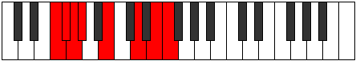

# Mode Dothian

## Links

- [Documentation](index.md)
- [Scales Index](Scales.md)
- [Modes Index](Modes.md)
- [Chords Index](Chords.md)

## Parent Scale

[Bonian](ScaleBonian.md)

## Number

[2639](https://ianring.com/musictheory/scales/2639)

## Perfection

- 3 Perfect notes
- 4 Perfect notes

## Interval Pattern

1, 1, 1, 3, 3, 2, 1

## Perfection Profile

[false false true false true false true]

## Permutations

| Tonic | Notes | Signature | Illustration | Audio |
|-------|-------|-----------|--------------|-------|
| [C](ModeCNaturalDothian.md) | **C**, **Db**, Ebb, **Fbb**, Gb, **A**, B, **C** | C |  | [midi](https://github.com/edipermadi/music/blob/main/docs/ModeCNaturalDothian.mid?raw=true) |
| [C#](ModeCSharpDothian.md) | **C#**, **D**, Eb, **Fb**, G, **A#**, B#, **C#** | C |  | [midi](https://github.com/edipermadi/music/blob/main/docs/ModeCSharpDothian.mid?raw=true) |
| [Db](ModeDFlatDothian.md) | **Db**, **Ebb**, Fbb, **Gbbb**, Abb, **Bb**, C, **Db** | C |  | [midi](https://github.com/edipermadi/music/blob/main/docs/ModeDFlatDothian.mid?raw=true) |
| [D](ModeDNaturalDothian.md) | **D**, **Eb**, Fb, **Gbb**, Ab, **B**, C#, **D** | C |  | [midi](https://github.com/edipermadi/music/blob/main/docs/ModeDNaturalDothian.mid?raw=true) |
| [D#](ModeDSharpDothian.md) | **D#**, **E**, F, **Gb**, A, **B#**, C##, **D#** | C |  | [midi](https://github.com/edipermadi/music/blob/main/docs/ModeDSharpDothian.mid?raw=true) |
| [Eb](ModeEFlatDothian.md) | **Eb**, **Fb**, Gbb, **Abbb**, Bbb, **C**, D, **Eb** | C |  | [midi](https://github.com/edipermadi/music/blob/main/docs/ModeEFlatDothian.mid?raw=true) |
| [E](ModeENaturalDothian.md) | **E**, **F**, Gb, **Abb**, Bb, **C#**, D#, **E** | C |  | [midi](https://github.com/edipermadi/music/blob/main/docs/ModeENaturalDothian.mid?raw=true) |
| [F](ModeFNaturalDothian.md) | **F**, **Gb**, Abb, **Bbbb**, Cb, **D**, E, **F** | C |  | [midi](https://github.com/edipermadi/music/blob/main/docs/ModeFNaturalDothian.mid?raw=true) |
| [F#](ModeFSharpDothian.md) | **F#**, **G**, Ab, **Bbb**, C, **D#**, E#, **F#** | C |  | [midi](https://github.com/edipermadi/music/blob/main/docs/ModeFSharpDothian.mid?raw=true) |
| [Gb](ModeGFlatDothian.md) | **Gb**, **Abb**, Bbbb, **Cbbb**, Dbb, **Eb**, F, **Gb** | C |  | [midi](https://github.com/edipermadi/music/blob/main/docs/ModeGFlatDothian.mid?raw=true) |
| [G](ModeGNaturalDothian.md) | **G**, **Ab**, Bbb, **Cbb**, Db, **E**, F#, **G** | C |  | [midi](https://github.com/edipermadi/music/blob/main/docs/ModeGNaturalDothian.mid?raw=true) |
| [G#](ModeGSharpDothian.md) | **G#**, **A**, Bb, **Cb**, D, **E#**, F##, **G#** | C |  | [midi](https://github.com/edipermadi/music/blob/main/docs/ModeGSharpDothian.mid?raw=true) |
| [Ab](ModeAFlatDothian.md) | **Ab**, **Bbb**, Cbb, **Dbbb**, Ebb, **F**, G, **Ab** | C |  | [midi](https://github.com/edipermadi/music/blob/main/docs/ModeAFlatDothian.mid?raw=true) |
| [A](ModeANaturalDothian.md) | **A**, **Bb**, Cb, **Dbb**, Eb, **F#**, G#, **A** | C |  | [midi](https://github.com/edipermadi/music/blob/main/docs/ModeANaturalDothian.mid?raw=true) |
| [A#](ModeASharpDothian.md) | **A#**, **B**, C, **Db**, E, **F##**, G##, **A#** | C |  | [midi](https://github.com/edipermadi/music/blob/main/docs/ModeASharpDothian.mid?raw=true) |
| [Bb](ModeBFlatDothian.md) | **Bb**, **Cb**, Dbb, **Ebbb**, Fb, **G**, A, **Bb** | C |  | [midi](https://github.com/edipermadi/music/blob/main/docs/ModeBFlatDothian.mid?raw=true) |
| [B](ModeBNaturalDothian.md) | **B**, **C**, Db, **Ebb**, F, **G#**, A#, **B** | C |  | [midi](https://github.com/edipermadi/music/blob/main/docs/ModeBNaturalDothian.mid?raw=true) |
