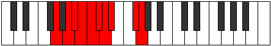

# Mode Dothygic

## Links

- [Documentation](index.md)
- [Scales Index](Scales.md)
- [Modes Index](Modes.md)
- [Chords Index](Chords.md)

## Parent Scale

[Phrygic](ScalePhrygic.md)

## Number

[2557](https://ianring.com/musictheory/scales/2557)

## Perfection

- 6 Perfect notes
- 3 Perfect notes

## Perfection Profile

[true false false true true false true true true]

## Permutations

| Tonic | Notes | Signature | Illustration | Audio |
|-------|-------|-----------|--------------|-------|
| [C](ModeCNaturalDothygic.md) | C, **D**, **D#**, E, F, **F#**, G, G#, B, C | C |  | [midi](ModeCNaturalDothygic.mid) [ogg](ModeCNaturalDothygic.ogg) |
| [C#](ModeCSharpDothygic.md) | C#, **D#**, **E**, F, F#, **G**, G#, A, C, C# | C |  | [midi](ModeCSharpDothygic.mid) [ogg](ModeCSharpDothygic.ogg) |
| [Db](ModeDFlatDothygic.md) | Db, **Eb**, **E**, F, Gb, **G**, Ab, A, C, Db | C |  | [midi](ModeDFlatDothygic.mid) [ogg](ModeDFlatDothygic.ogg) |
| [D](ModeDNaturalDothygic.md) | D, **E**, **F**, F#, G, **G#**, A, A#, C#, D | C |  | [midi](ModeDNaturalDothygic.mid) [ogg](ModeDNaturalDothygic.ogg) |
| [D#](ModeDSharpDothygic.md) | D#, **F**, **F#**, G, G#, **A**, A#, B, D, D# | C |  | [midi](ModeDSharpDothygic.mid) [ogg](ModeDSharpDothygic.ogg) |
| [Eb](ModeEFlatDothygic.md) | Eb, **F**, **Gb**, G, Ab, **A**, Bb, B, D, Eb | C |  | [midi](ModeEFlatDothygic.mid) [ogg](ModeEFlatDothygic.ogg) |
| [E](ModeENaturalDothygic.md) | E, **F#**, **G**, G#, A, **A#**, B, C, D#, E | C |  | [midi](ModeENaturalDothygic.mid) [ogg](ModeENaturalDothygic.ogg) |
| [F](ModeFNaturalDothygic.md) | F, **G**, **G#**, A, A#, **B**, C, C#, E, F | C |  | [midi](ModeFNaturalDothygic.mid) [ogg](ModeFNaturalDothygic.ogg) |
| [F#](ModeFSharpDothygic.md) | F#, **G#**, **A**, A#, B, **C**, C#, D, F, F# | C |  | [midi](ModeFSharpDothygic.mid) [ogg](ModeFSharpDothygic.ogg) |
| [Gb](ModeGFlatDothygic.md) | Gb, **Ab**, **A**, Bb, B, **C**, Db, D, F, Gb | C |  | [midi](ModeGFlatDothygic.mid) [ogg](ModeGFlatDothygic.ogg) |
| [G](ModeGNaturalDothygic.md) | G, **A**, **A#**, B, C, **C#**, D, D#, F#, G | C |  | [midi](ModeGNaturalDothygic.mid) [ogg](ModeGNaturalDothygic.ogg) |
| [G#](ModeGSharpDothygic.md) | G#, **A#**, **B**, C, C#, **D**, D#, E, G, G# | C |  | [midi](ModeGSharpDothygic.mid) [ogg](ModeGSharpDothygic.ogg) |
| [Ab](ModeAFlatDothygic.md) | Ab, **Bb**, **B**, C, Db, **D**, Eb, E, G, Ab | C |  | [midi](ModeAFlatDothygic.mid) [ogg](ModeAFlatDothygic.ogg) |
| [A](ModeANaturalDothygic.md) | A, **B**, **C**, C#, D, **D#**, E, F, G#, A | C |  | [midi](ModeANaturalDothygic.mid) [ogg](ModeANaturalDothygic.ogg) |
| [A#](ModeASharpDothygic.md) | A#, **C**, **C#**, D, D#, **E**, F, F#, A, A# | C |  | [midi](ModeASharpDothygic.mid) [ogg](ModeASharpDothygic.ogg) |
| [Bb](ModeBFlatDothygic.md) | Bb, **C**, **Db**, D, Eb, **E**, F, Gb, A, Bb | C |  | [midi](ModeBFlatDothygic.mid) [ogg](ModeBFlatDothygic.ogg) |
| [B](ModeBNaturalDothygic.md) | B, **C#**, **D**, D#, E, **F**, F#, G, A#, B | C |  | [midi](ModeBNaturalDothygic.mid) [ogg](ModeBNaturalDothygic.ogg) |
