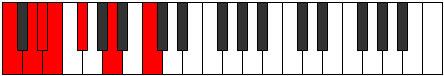

# Mode Dycrimic

## Links

- [Documentation](index.md)
- [Scales Index](Scales.md)
- [Modes Index](Modes.md)
- [Chords Index](Chords.md)

## Parent Scale

[Thagimic](ScaleThagimic.md)

## Number

[605](https://ianring.com/musictheory/scales/605)

## Perfection

- 2 Perfect notes
- 4 Perfect notes

## Perfection Profile

[false true false false false true]

## Permutations

| Tonic | Notes | Signature | Illustration | Audio |
|-------|-------|-----------|--------------|-------|
| [C](ModeCNaturalDycrimic.md) | **C**, D, **Eb**, **Fb**, **Gb**, A, **C** | C |  | [midi](ModeCNaturalDycrimic.mid) [ogg](ModeCNaturalDycrimic.ogg) |
| [C#](ModeCSharpDycrimic.md) | **C#**, D#, **E**, **F**, **G**, A#, **C#** | C |  | [midi](ModeCSharpDycrimic.mid) [ogg](ModeCSharpDycrimic.ogg) |
| [Db](ModeDFlatDycrimic.md) | **Db**, Eb, **Fb**, **Gbb**, **Abb**, Bb, **Db** | C |  | [midi](ModeDFlatDycrimic.mid) [ogg](ModeDFlatDycrimic.ogg) |
| [D](ModeDNaturalDycrimic.md) | **D**, E, **F**, **Gb**, **Ab**, B, **D** | C |  | [midi](ModeDNaturalDycrimic.mid) [ogg](ModeDNaturalDycrimic.ogg) |
| [D#](ModeDSharpDycrimic.md) | **D#**, E#, **F#**, **G**, **A**, B#, **D#** | C |  | [midi](ModeDSharpDycrimic.mid) [ogg](ModeDSharpDycrimic.ogg) |
| [Eb](ModeEFlatDycrimic.md) | **Eb**, F, **Gb**, **Abb**, **Bbb**, C, **Eb** | C |  | [midi](ModeEFlatDycrimic.mid) [ogg](ModeEFlatDycrimic.ogg) |
| [E](ModeENaturalDycrimic.md) | **E**, F#, **G**, **Ab**, **Bb**, C#, **E** | C |  | [midi](ModeENaturalDycrimic.mid) [ogg](ModeENaturalDycrimic.ogg) |
| [F](ModeFNaturalDycrimic.md) | **F**, G, **Ab**, **Bbb**, **Cb**, D, **F** | C |  | [midi](ModeFNaturalDycrimic.mid) [ogg](ModeFNaturalDycrimic.ogg) |
| [F#](ModeFSharpDycrimic.md) | **F#**, G#, **A**, **Bb**, **C**, D#, **F#** | C |  | [midi](ModeFSharpDycrimic.mid) [ogg](ModeFSharpDycrimic.ogg) |
| [Gb](ModeGFlatDycrimic.md) | **Gb**, Ab, **Bbb**, **Cbb**, **Dbb**, Eb, **Gb** | C |  | [midi](ModeGFlatDycrimic.mid) [ogg](ModeGFlatDycrimic.ogg) |
| [G](ModeGNaturalDycrimic.md) | **G**, A, **Bb**, **Cb**, **Db**, E, **G** | C |  | [midi](ModeGNaturalDycrimic.mid) [ogg](ModeGNaturalDycrimic.ogg) |
| [G#](ModeGSharpDycrimic.md) | **G#**, A#, **B**, **C**, **D**, E#, **G#** | C |  | [midi](ModeGSharpDycrimic.mid) [ogg](ModeGSharpDycrimic.ogg) |
| [Ab](ModeAFlatDycrimic.md) | **Ab**, Bb, **Cb**, **Dbb**, **Ebb**, F, **Ab** | C |  | [midi](ModeAFlatDycrimic.mid) [ogg](ModeAFlatDycrimic.ogg) |
| [A](ModeANaturalDycrimic.md) | **A**, B, **C**, **Db**, **Eb**, F#, **A** | C |  | [midi](ModeANaturalDycrimic.mid) [ogg](ModeANaturalDycrimic.ogg) |
| [A#](ModeASharpDycrimic.md) | **A#**, B#, **C#**, **D**, **E**, F##, **A#** | C |  | [midi](ModeASharpDycrimic.mid) [ogg](ModeASharpDycrimic.ogg) |
| [Bb](ModeBFlatDycrimic.md) | **Bb**, C, **Db**, **Ebb**, **Fb**, G, **Bb** | C |  | [midi](ModeBFlatDycrimic.mid) [ogg](ModeBFlatDycrimic.ogg) |
| [B](ModeBNaturalDycrimic.md) | **B**, C#, **D**, **Eb**, **F**, G#, **B** | C |  | [midi](ModeBNaturalDycrimic.mid) [ogg](ModeBNaturalDycrimic.ogg) |
